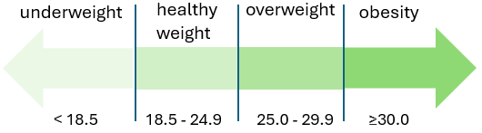
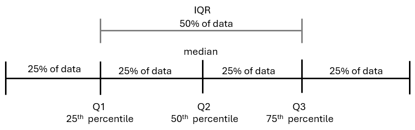
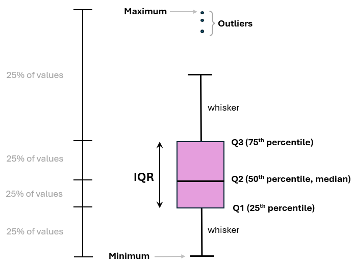

# Descriptive Statistics {#sec-descriptive}

```{r setup_probability, include=FALSE}

knitr::opts_chunk$set(fig.pos = 'H')
```

Descriptive statistics are used to summarize and describe the basic characteristics of a dataset. In this chapter, we explore classical descriptive statistics, including frequencies and percentages for categorical variables, and mean, median, mode, standard deviation, and interquartile range for continuous variables. These measures provide a concise overview of the central tendency, which indicates the center of a data distribution, and dispersion, which reveals the spread of values within the dataset. By analyzing these statistics along with data visualizations like bar plots, histograms, and box plots, we gain valuable insights into the underlying patterns and variability in the data.

```{r}
#| message: true
#| warning: false

# Required packages for this chapter
library(questionr)
library(ggsci)
library(ggpubr)
library(ggrain)
library(DescTools)
library(dlookr)
library(EnvStats)
library(MESS)
library(descriptr)
library(here)
library(readxl)
library(tidyverse)
```

 

## Importing the Data

We will work with the "*arrhythmia*" dataset, stored in an Excel file. Assuming we are using RStudio Projects and the dataset is located in a subfolder named "*data*" within our RStudio Project directory, we can load the dataset using a relative path with the following R code:

```{r}
#| message: true
#| warning: false

arrhythmia <- read_excel(here("data", "arrhythmia.xlsx"))
head(arrhythmia)
```

The *"arrhythmia"* dataset consists of 428 observations (rows), each representing an adult patient with heart arrhythmia, and includes 6 variables (columns) that describe the patients' demographic and physiological characteristics of interest. Below is the meta-data for the variables:

1.  **age:** Age of the patient (yrs)
2.  **sex:** Sex of the patient (male, female)
3.  **height:** Height of the patient (cm)
4.  **weight:** Weight of the patient (kg)
5.  **QRS:** Duration of the QRS complex in the patient's electrocardiogram (ms)
6.  **heart_rate:** Heart rate of the patient (beats/min)

To obtain basic summary measures for each variable, we can use the **`summary()`** function:

```{r}
summary(arrhythmia)
```

Note that the `age` variable includes three missing values, which are denoted as `NA's`.

Next, let's calculate the Body Mass Index (BMI) of the participants using their weight (in kilograms) and height (in meters) with the following formula:

$$
BMI = \frac{weight}{height^2}
$$ {#eq-bmiquation}

The resulting BMI values are interpreted according to standard weight status categories for adults, which are shown in @fig-bmicat.

```{r}
#| message: false
#| warning: false
#| out-width: "50%"
#| label: fig-bmicat
#| fig-align: center
#| fig-cap: Adult Body Mass Index (BMI) classification.
#| echo: false


```

In R, we use the **`mutate()`** function to perform several tasks. First, we calculate the BMI (when typing the formula, be sure to divide the height by 100 to convert centimeters to meters) and round it to one decimal place. Next, we apply the **`case_when()`** function to categorize BMI based on the standard adult weight status categories, as shown in @fig-bmicat. Finally, within the same **`mutate()`** call, we convert the `sex` and `bmi` variables into factors using the **`factor()`** function.

```{r}
arrhythmia <- arrhythmia |> 
  mutate(bmi = round(weight / (height / 100)^ 2, digits=1),
         bmi_cat = case_when(bmi < 18.5 ~ "underweight",
                             bmi < 25.0 ~ "healthy",
                             bmi < 30.0 ~ "overweight",
                             TRUE ~ "obesity"),
         sex = factor(sex),
         bmi_cat = factor(bmi_cat, levels = c("underweight", "healthy",
                                            "overweight", "obesity")))
```

 

Let's review the data with the `glipmse()` function:

```{r}
glimpse(arrhythmia)
```

Note that both variables, `sex` and `bmi_cat`, have been converted to factors.

 

## Summarizing Categorical Data (Frequency Statistics)

The first step in analyzing a categorical variable is to count the occurrences of each label and calculate their **frequencies**. The resulting collection of these frequencies for all possible categories is known as the **frequency distribution**\index{frequency distribution} of the variable. We can also express the frequencies as **proportions** of the total number of observations, which are called relative frequencies or percentages (%).

 

**A. Frequency Table with One Variable**

To generate a frequency table\index{frequency table} for the `sex` variable, we can use the **`freq()`** function from the ***questionr*** package:

```{r}
freq(arrhythmia$sex, cum = T, total = T, valid = F)
```

 

The table displays the following:

-   **Absolute frequency (n):**\index{absolute frequency} The number of patients in each category (female: 237, male: 191).

-   **Percentage (%):**\index{percentage} The proportion of patients in each category relative to the total number of patients (relative frequency) multiplied by $100\%$ (female: $237/428 \times 100\% = 55.4\%$, male: $191/428 \times 100\% = 44.6\%$). Note that the percentages sum up to 100% (55.4% + 44.6% =100%).

-   **Cumulative percentage (%cum):**\index{cumulative percentage} The sum of the percentage contributions of all categories up to and including the current one. For example, for the female category, the cumulative percentage is 55.4%. When combining female and male categories, the cumulative percentage is 55.4% + 44.6% = 100%. Therefore, the final cumulative percentage must equal 100%.

 

Similarly, we can create a frequency table for the `bmi_cat` variable:

```{r}
freq(arrhythmia$bmi_cat, cum = T, total = T, valid = F)
```

 

We can also sort the BMI categories in decreasing order of frequencies:

```{r}
freq(arrhythmia$bmi_cat, cum = T, total = T, valid = F, sort = "dec")
```

In the resulting table, we observe that healthy weight category occurs most frequently, making it the **mode** of this dataset. However, it's notable that overweight and obese individuals together represent more than half of the patients. Specifically, they constitute 54.5% of the total sample, with 40.2% classified as overweight and 14.3% as obese.

 

**B. Frequency Table with Two Variables (Contingency Table)**

In addition to tabulating each variable separately, we might also be interested in exploring the association between two categorical variables. In this case, the resulting frequency table is a cross-tabulation, where each combination of levels from both variables is displayed. This type of table is called a **contingency table**\index{contingency table} because it shows the frequency of each category in one variable, contingent upon the specific level of the other variable.

We can create a **frequency contingency** table with row and column totals, also known as marginal totals (represented by the 'Sum' values in the table), using the following code:

```{r}
tab <- table(arrhythmia$sex, arrhythmia$bmi_cat)
addmargins(tab)
```

 

Now, suppose we are interested in the distribution of BMI categories within each sex group, meaning we want to examine how BMI varies among males and females. Starting from the frequency contingency table, we can create a table of row proportions.

To calculate these proportions, we divide each cell's frequency by the total for its corresponding row. For example, to determine the proportion of individuals who are underweight among females, we divide the number of underweight females by the total number of females, $P(BMI=underweight \ | \ gender=female)=7/237 \approx 0.03$ or $3\%$ (@sec-probability).

This process computes the conditional probability of each BMI category given the sex. The resulting table, where each row sums to 1, is called a (row) **conditional probability** table\index{conditional probability table}. Such tables allow us to meaningfully compare the distribution of BMI across sex groups while accounting for differences in group sizes.

```{r}
round(prop.table(tab, 1), 3)
```

 

To obtain the above table in percentages, we can use the **`rprop()`** function from the ***questionr*** package:

```{r}
rprop(tab, percent = T, total = F)  #or 100*round(prop.table(tab, 1), 3)
```

The data reveal that a smaller proportion of female patients are overweight (33.3%, 79/237) compared to male patients (48.7%, 93/191), whereas a larger proportion of females are obese (17.7%, 42/237) than males (9.9%, 19/191).

## Displaying Categorical Data

While frequency tables are very useful, plotting is often the most effective way to present data. For categorical variables, such as `sex` and `bmi_cat`, bar plots provide a clear and straightforward representation.

### Simple Bar Plot

A simple bar plot\index{bar plot} is a common data visualization for comparing categories in a single variable. @fig-simplebar0 illustrates the frequency distribution of BMI categories. The horizontal axis (*x-axis*) displays the different BMI categories, ordered according to increasing BMI levels, while the vertical axis (y-axis) shows the frequency of each category.

```{r}
#| message: false
#| warning: false
#| fig-height: 3
#| fig-width: 4
#| label: fig-simplebar0
#| fig-align: center
#| fig-cap: Bar plot showing the frequency distribution of BMI categorical variable.


# create a data frame with BMI categories and their counts
dat0 <- arrhythmia |> count(bmi_cat)

# plot the data
ggplot(dat0, aes(x = bmi_cat, y = n)) +
  geom_col(width = 0.65, fill = "gray60") +
  geom_text(aes(label=n), vjust = 1.6, color = "white", size = 6.0) +
  labs(x = "BMI category", y = "Frequency") + 
  theme_minimal(base_size = 16)
```

 

If the y-axis represents percentages (%), then each bar's height corresponds to the percentage of patients in that category (@fig-simplebar). For example, the percentage of patients classified as overweight is 40.2% (172/428).

```{r}
#| message: false
#| warning: false
#| fig-height: 4
#| fig-width: 5
#| label: fig-simplebar
#| fig-align: center
#| fig-cap: Bar plot showing the percentage of patients in each BMI category.


dat1 <- dat0 |> mutate(pct = round_percent(n, 1))

ggplot(dat1, aes(x = bmi_cat, y = pct)) + 
  geom_col(width = 0.65, fill = "gray60") +
  geom_text(aes(label=paste0(pct, "%")), vjust = 1.6, 
            color = "white", size = 6.0) +
  labs(x = "BMI category", y = "Percent") +
  scale_y_continuous(labels = scales::percent_format(scale = 1)) +
  theme_minimal(base_size = 16)
```

::: content-box-gray
**Simple bar plot**

-   All bars should have equal width and equal spacing between them.
-   The height of each bar should correspond to the data it represents.
-   The bars should be plotted against a common zero-valued baseline.
:::

### Side-by-Side Grouped Bar Plot

If the data are further classified based on the participant's sex, it becomes impractical to present this information to a simple bar plot. In such cases, a side-by-side grouped bar plot\index{side-by-side grouped bar plot} (@fig-groupbar) can facilitate easier visual comparisons.

```{r}
#| message: false
#| warning: false
#| fig-height: 5
#| fig-width: 9
#| label: fig-groupbar
#| fig-align: center
#| fig-cap: Side-by-side grouped bar plot showing BMI category by sex.


# Create a data frame with counts of each BMI category by sex
dat2 <- arrhythmia |> group_by(sex) |> count(bmi_cat) |> 
  mutate(pct = round_percent(n, 1)) |> ungroup()

ggplot(dat2, aes(x = sex, y = pct, fill = bmi_cat)) +
  geom_bar(stat = "identity", position = "dodge", width = 0.7) +
  geom_text(aes(label = paste0(pct, "%")), 
            position = position_dodge(width = 0.7), 
            vjust = 1.2, hjust = 0.5, size = 6.0) +
  scale_fill_manual(values = rev(pal_simpsons()(4))) +
  scale_y_continuous(labels = scales::percent_format(scale = 1)) +
  labs(x = "Sex", y = "Percent", fill = "BMI Category") +
  theme_minimal(base_size = 16)
```

### Stacked Bar Plot

Alternatively, we can create a stacked bar plot, where the bars are segmented by BMI categories. @fig-stackbar illustrates a 100% stacked bar plot\index{stacked bar plot}, which displays the percentage of each BMI category among male and female patients, emphasizing the relative differences within each group.

```{r}
#| message: false
#| warning: false
#| fig-height: 2.5
#| fig-width: 8.5
#| label: fig-stackbar
#| fig-align: center
#| fig-cap: A horizontal 100% stacked bar plot showing the distribution of BMI, stratified by sex.


ggplot(dat2, aes(x = sex, y = pct, fill = forcats::fct_rev(bmi_cat)))+
  geom_bar(stat = "identity", width = 0.8)+
  geom_text(aes(label = paste0(round(pct, 1), "%"), y = pct), 
            size = 6.0, position = position_stack(vjust = 0.5)) +
  coord_flip()+
  scale_fill_simpsons() + 
  scale_y_continuous(labels = scales::percent_format(scale = 1))+
  labs(x = "Sex", y = "Percent", fill = "BMI category") +
  theme_minimal(base_size = 16)
```

::: content-box-gray
**CAUTION!**

One consideration when using stacked bar plots is the number of variable levels: with many categories, stacked bar plots can become confusing.
:::

 

## Summarizing Numerical Data (Summary Statistics)

Summary measures are **single numerical values** that describe or summarize a set of data from a sample (a sample is a subset of the population; see also @sec-sampling). Numeric data can be described using two main types of summary measures (@tbl-measures).

1.  Measures of **central location** (also known as measures of central tendency) are summary statistics that describe the central point of a data distribution. Common examples include the sample mean, median, and mode.

2.  Measures of **dispersion** (also known as measures of spread) are summary statistics that quantify the spread of values around the central point. Examples include the sample range, interquartile range (IQR), variance, and standard deviation.

Note that R functions for some of these summary measures (e.g., mean, median, standard deviation) have already been presented in the Chapter @sec-rvectors.

+------------------------------+-------------------------------------------------+
| Measures of central location | Measures of dispersion                          |
+:=============================+:================================================+
| -   mean                     | -   range (minimum, maximum)                    |
| -   median                   | -   interquartile range (1st and 3rd quartiles) |
| -   mode                     | -   variance                                    |
|                              | -   standard deviation                          |
+------------------------------+-------------------------------------------------+

: Common summary measures of central location and dispersion. {#tbl-measures .latex-table}

Additionally, **measures of shape** such as the sample coefficients of skewness and kurtosis offer further insights by revealing the overall shape and characteristics of the distribution.

 

### Measures of Central Location

#### *Arithmetic Mean of the Sample*

Let $x_1, x_2,...,x_{n-1}, x_n$ be a set of *n* observations in a sample. The arithmetic mean\index{mean}, $\bar{x}$, is the sum of the observations divided by their number *n*:

$$ 
\bar{x}= \frac{x_1 + x_2 + ... + x_{n-1} + x_n}{n} = \frac{1}{n}\sum_{i=1}^{n}x_{i}
$$ {#eq-meanequation}

where $x_{i}$ represents the data values and ${\sum_{i=1}^{n}x_{i}}$ their sum.

##### Example

Let's calculate the sample mean of `age` and `QRS` variables in our dataset.

-   1st way: **base R**

```{r}
# mean of age
mean(arrhythmia$age, na.rm = TRUE) 
```

```{r}
# mean of QRS
mean(arrhythmia$QRS, na.rm = TRUE) 
```

 

-   2nd way: **dplyr**

The **`summarize()`** function allows us to calculate the means of both variables simultaneously and present them in a tibble.

```{r}
# calculate the mean of age and QRS
arrhythmia |>  
  summarize(mean_age = mean(age, na.rm = TRUE),
            mean_QRS = mean(QRS, na.rm = TRUE))
```

 

::: content-box-gray
**Arithmetic sample mean**

**Advantages**

-   It uses all the data values in the calculation and is the balance point of the data.
-   It is algebraically defined and thus mathematically manageable.

\vspace{15pt}

**Disadvantages**

-   For a continuous, unimodal skewed distribution, the mean is usually pulled in the direction of the longer tail. Therefore, it is an inappropriate summary measure for highly skewed (asymmetrical) distributions.
-   It is highly influenced by the presence of outliers—values that are abnormally high or low—making it a non-resistant summary measure.
-   It cannot be easily determined by simply inspecting the data and is usually not equal to any of the individual values in the sample.
:::

#### *Median of the Sample*

The **sample median**\index{median}, denoted as *md*, is a robust measure of location that is less sensitive to outliers than the mean. To determine it, we first sort the observed values in ascending order: $x_{(1)} \le x_{(2)} \le \cdots \le x_{(n)}$. If the number of observations *n* is **odd**, the median is the single middle value in the sorted list. If *n* is **even**, the median is the average of the two middle values. Formally, this can be expressed as:

$$
md={\begin{cases}x_{(\frac{n+1}{2})},&for\ n \ odd\\ \frac{1}{2}(x_{(\frac{n}{2})}+x_{(\frac{n}{2}+1)}),&for\ n \ even \end{cases}}
$$ {#eq-medianquation}

where $x_{(1)}$, $x_{(2)}$...$x_{(\nu)}$ are known as "order statistics". For example, $x_{(1)}$ is the "first order statistic", meaning the smallest observed value, and $x_{(\nu)}$ is the $\nu$-th order statistic, meaning the largest observed value.

\vspace{5pt}

##### Example

Ignoring any `NA` values, the *n* for the `age` variable is 425, which is an odd number. According to @eq-medianquation, the median of `age` is:

$$md = x_{(\frac{425+1}{2})} = x_{(\frac{426}{2})} = x_{(213)}$$

In R, we can use the **`sort()`** function to arrange the values of `age` in ascending order. Then, we select the value located at index position 213 using the \[ \] operator, as follows:

```{r}
sort(arrhythmia$age)[213]
```

 

The *n* for the `QRS` variable is 428 which is an even number. According to @eq-medianquation, the median of `QRS` is:

$$md = \frac{1}{2} (x_{(\frac{428}{2})} + x_{(\frac{428}{2} + 1)})  = \frac{1}{2}(x_{(214)} + x_{(215)})$$

```{r}
(sort(arrhythmia$QRS)[214] + sort(arrhythmia$QRS)[215])/2
```

 

We have already discussed that R provides a convenient function to compute the median in a dataset.

-   1st way: **base R**

```{r}
# median of age
median(arrhythmia$age, na.rm = TRUE)
```

```{r}
# median of QRS
median(arrhythmia$QRS, na.rm = TRUE) 
```

 

-   2nd way: **dplyr**

The same results can be obtained in a tibble by using the **`median()`** within the **`summarize()`** function.

```{r}
# median of age and QRS
arrhythmia |>  
  summarize(median_age = median(age, na.rm = TRUE),
            median_QRS = median(QRS, na.rm = TRUE))
```

 

::: content-box-gray
**Sample Median**

**Advantages**

-   It is resistant to outliers compared to the mean.
-   For ranking data, the median is often more meaningful than the mean.

\vspace{15pt}

**Disadvantage**

-   It ignores the actual values of the data points, potentially losing some information about the data.
:::

#### *Mode of the Sample*

Another measure of location is the sample **mode**\index{mode}, which represents the value that occurs **most frequently** in a set of data values. It's important to note that some datasets may not have a mode if each value occurs only once, while others may have multiple modes.

Base R does not include a function for calculating the mode of a numeric variable. However, we can use the **`Mode()`** function from the ***DeskTools*** package, which calculates the mode(s) and provides the modal frequency as an attribute named "freq".

##### Example

```{r}
# mode for age
Mode(arrhythmia$age, na.rm = TRUE)
```

The most common age value is 47 years, occurring 15 times in our dataset.

```{r}
# mode for QRS
Mode(arrhythmia$QRS, na.rm = TRUE)
```

The most common QRS duration is 78 ms, occurring 20 times in our dataset.

\vspace{10pt}

::: content-box-white
**INFO**

-   When a distribution has two modes (peaks) is called **bimodal** distribution. This can occur when two distinct populations are combined. For example, the distribution of height may appear bimodal if both men and women are participated in the study.

-   While the mode is less commonly used for continuous data, it is an important measure of central tendency for categorical data.\
:::

 

### Measures of Dispersion

\vspace{5pt}

#### *Range of the Sample*

The **range**\index{range} represents the difference between the maximum and minimum values in a set of sorted observations.

$$
Range = max - min =  x_{(n)} - x_{(1)}
$$ {#eq-rangequation}

The **minimum (min) value**\index{minimum value} represents the lowest value observed in a dataset ($x_{(1)}$), while the **maximum (max) value**\index{maximum value} represents the highest value ($x_{(n)}$). These values provide valuable insights into the range and potential outliers within the dataset.

\vspace{10pt}

##### Example

-   1st way: **base R**

A straightforward approach is to calculate the minimum and maximum values using the **`min()`** and **`max()`** functions, respectively. Then, we use the @eq-rangequation as follows:

```{r, results='hold'}
min_age <- min(arrhythmia$age, na.rm = TRUE)
min_age
max_age <- max(arrhythmia$age, na.rm = TRUE)
max_age
range_age <- max_age - min_age
range_age
```

The minimum value of the `age` variable is 20, and the maximum value is 83. This means that the ages of the individuals in the dataset vary from 20 to 83 years, resulting in a range of 63 years.

 

```{r, results='hold'}

min_QRS <- min(arrhythmia$QRS, na.rm = TRUE)
min_QRS
max_QRS <- max(arrhythmia$QRS, na.rm = TRUE)
max_QRS
range_QRS <- max_QRS - min_QRS
range_QRS
```

The QRS of the individuals vary from 55 to 178 ms, resulting in a range of 123 ms.

 

-   2nd way: **dplyr**

```{r}
# minimum, maximum, and range of age
arrhythmia |> 
  summarize(
    min_age = min(age, na.rm = TRUE),
    max_age = max(age, na.rm = TRUE),
    range_age = max_age - min_age
    )
```

Here, the expression `range_age = max_age - min_age` calculates the range of the `age` variable using the previously calculated minimum and maximum of `age` within the **`summarize()`** function.

\vspace{10pt}

```{r}
# minimum, maximum, and range of QRS
arrhythmia |> 
  summarize(
    min_QRS = min(QRS, na.rm = TRUE),
    max_QRS = max(QRS, na.rm = TRUE),
    range_QRS = max_QRS - min_QRS
    )
```

In a similar manner, the expression `range_QRS = max_QRS - min_QRS` calculates the range of the `QRS` variable.

\vspace{5pt}

::: content-box-white
**IMPORTANT**

The main disadvantages of the range as a measure of dispersion are its sensitivity to outliers and the fact that it uses only the extreme values, ignoring all other data points.
:::

 

#### *Inter-Quartile Range of the Sample*

In the presence of outliers, the **interquartile range (IQR)** can provide a more accurate measure of the spread of the majority of the data. Before we define the interquartile range (IQR), let’s first clarify some basic concepts, specifically quantiles, quartiles, and percentiles.

\vspace{10pt}

A quantile\index{quantile} is a value in a sorted dataset that divides the data into specific proportions. The most commonly used quantiles are the three **quartiles**\index{quartile}, which divide the data into four equal-proportion parts (@fig-quartiles):

-   $Q_1$ is the first (lower) quartile, with 25% of observations below it and 75% above.

-   $Q_2$ is the second (median) quartile, with 50% of observations below it and 50% above.

-   $Q_3$ is the third (upper) quartile, with 75% of observations below it and 25% above.

\vspace{10pt}

Similarly, ninety-nine **percentiles**\index{percentiles} divide the sorted data into 100 equal-proportion parts. In this case, $Q_1$, $Q_2$, and $Q_3$ correspond to the 25th, 50th, and 75th percentiles, respectively.

 

```{r}
#| message: false
#| warning: false
#| out-width: "90%"
#| label: fig-quartiles
#| fig-align: center
#| fig-cap: Three quartiles split the sorted data into four equal-proportion parts. The first quartile, $Q_1$, is the $25^{th}$ percentile; the second quartile, $Q_2$, is the $50^{th}$ percentile, which is the median; and the third quartile, $Q_3$, is the $75^{th}$ percentile.
#| echo: false



```

 

**Interquartile range**\index{interquartile range} is the difference between the third quartile ($Q_3$) and the first quartile ($Q_1$) of the sorted observations.

$$
IQR = Q_3 - Q_1
$$ {#eq-iqrequation}

Consequently, the IQR represents the central 50% of the data, effectively excluding extreme values.

 

##### Example

-   1st way: **base R**

The **`quantile()`** function can help us to calculate the three quartiles. By specifying the `prob` parameter as `c(0.25, 0.50, 0.75)`, we can calculate the quartiles $Q_1$, $Q_2$, and $Q_3$, which correspond to the 25th, 50th (median), and 75th percentiles of the data, respectively.

```{r}
# Q1, Q2 (median), Q3 of age
quantile(arrhythmia$age, prob=c(0.25, 0.50, 0.75), na.rm = T, type=1)
```

\vspace{10pt}

To calculate the IQR in R, we can either subtract the first quartile value from the third quartile value or use the **`IQR()`** function:

```{r}
# IQR of age
IQR(arrhythmia$age, na.rm = TRUE)
```

 

```{r}
# Q1, Q2 (median), Q3 of QRS
quantile(arrhythmia$QRS, prob=c(0.25, 0.50, 0.75), na.rm = T, type=1)
```

\vspace{10pt}

```{r}
# IQR of QRS
IQR(arrhythmia$QRS, na.rm = TRUE)
```

 

-   2nd way: **dplyr**

```{r}
# Q1, Q2 (median), Q3, and IQR of age
arrhythmia |> 
  summarize(
    Q1_age = quantile(age, 0.25, na.rm = TRUE),
    median_age = quantile(age, 0.5, na.rm = TRUE),
    Q3_age = quantile(age, 0.75, na.rm = TRUE),
    IQR_age = Q3_age - Q1_age
    )
```

<br>

```{r}
# Q1, Q2 (median), Q3, and IQR of QRS
arrhythmia |> 
  summarize(
    Q1_QRS = quantile(QRS, 0.25, na.rm = TRUE),
    median_QRS = quantile(QRS, 0.5, na.rm = TRUE),
    Q3_QRS = quantile(QRS, 0.75, na.rm = TRUE),
    IQR_QRS = Q3_QRS - Q1_QRS
    )
```

 

::: content-box-gray
**IMPORTANT**

As with the range, greater variability in the data typically leads to a larger IQR. However, unlike the range, the IQR is resistant to outliers, as it is not influenced by observations below the first quartile or above the third quartile.
:::

 

#### *Sample Variance*

Sample variance\index{variance}, denoted as $s^2$, is a measure of spread of the data based on the deviations of the values from the mean, $x_i- \bar x$. However, when we average these deviations, the sum always equals zero. This occurs because the mean acts as a balance point where the total positive and negative deviations cancel each other out. To resolve this issue, we calculate the variance using squared deviations, $(x_i- \bar x)^2$, which ensures that all values contribute positively to the measure of spread.

Mathematically, the sample variance is expressed as the sum of the **squared** deviations from the sample mean, divided by $n-1$:

$$
variance = s^2 = \frac{\sum\limits_{i=1}^n (x -\bar{x})^2}{n-1}
$$ {#eq-varquation}

\vspace{5pt}

##### Example

-   1st way: **base R**

```{r}
# variance of age
var(arrhythmia$age, na.rm = TRUE)
```

\vspace{10pt}

```{r}
# variance of QRS
var(arrhythmia$QRS, na.rm = TRUE)
```

 

-   2nd way: **dplyr**

We use the **`var()`** function within **`summarize()`** to calculate the variance for each variable.

```{r}
# variance of age and QRS
arrhythmia |>  
  summarize(var_age = var(age, na.rm = TRUE),
            var_QRS = var(QRS, na.rm = TRUE))
```

Variance is highly sensitive to outliers because it relies on squared deviations. Additionally, since it is expressed in square units, it is not the preferred metric for reporting data variability.

 

#### Standard Deviation of the Sample

Standard deviation\index{standard deviation} (denoted as *sd* or *s*) is the square root of the sample variance:

$$
sd= s = \sqrt{s^2} = \sqrt\frac{\sum_{i=1}^{n}(x_{i}-\bar{x})^2}{n-1}
$$ {#eq-vsdquation}

Standard deviation is a typical distance of observations from the mean and is expressed in the same units as the original values.

 

##### Example

-   1st way: **base R**

```{r}
# standard deviation of age
sd(arrhythmia$age, na.rm = TRUE)
```

\vspace{10pt}

```{r}
# standard deviation of QRS
sd(arrhythmia$QRS, na.rm = TRUE)
```

 

-   2nd way: **dplyr**

```{r}
# standard deviation of age and QRS
arrhythmia |>  
  summarize(sd_age = sd(age, na.rm = TRUE),
            sd_QRS = sd(QRS, na.rm = TRUE))
```

 

::: content-box-gray
**IMPORTANT**

The standard deviation uses all observations in a dataset for its calculation and is expressed in the same units as the original data. However, it is sensitive to outliers, which can substantially influence its value.
:::

 

### Measures of Shape

#### *Sample Coefficient of Skewness*

Skewness\index{skewness} is usually described as a measure of a distribution's symmetry -- or lack of symmetry.

Let $X$ be a random variable with $E(X) = \mu$ and $Var(X) = \sigma^2$. The coefficient of skewness of a distribution (using the method of moments) is defined as:

$$
skweness= \eta_3 = \frac{E[(X-\mu)^3]}{\sigma^3}
$$ {#eq-skewnesseq}

The sample coefficient of skewness using the Fisher method is estimated as:

$$\hat{\eta}_3 = \frac{n}{(n-1)(n-2)} \frac{\sum_{i=1}^{n} (x_i - \bar{x})^3}{s^3}$$

where $s$ is the sample standard deviation (@eq-vsdquation).

Skewness values that are **negative** indicate a tail to the **left** (@fig-skew a), **zero** value indicate a **symmetric** distribution (@fig-skew b), while values that are **positive** indicate a tail to the **right** (@fig-skew c). In continuous, unimodal skewed distributions, the mean typically lies toward the direction of skewness (the longer tail), while the median, being resistant, usually remains closer to the center.[^descriptive-1]

[^descriptive-1]: This rule may not hold for discrete or multimodal distributions, or for distributions in which one tail is longer but the other is heavy [@vonhippel2005].

```{r}
#| message: false
#| warning: false
#| fig-height: 2.7
#| fig-width: 8.5
#| label: fig-skew
#| fig-align: center
#| fig-cap: "Types of distribution according to the summetry. (a) Left skewed distribution (negatively skewed). (b) Symmetric distribution (zero skewness). (c) Right skewed distribution (positively skewed). (NOTE: The relative positions of the mean, median, and mode shown here are typical of unimodal, continuous distributions)."
#| echo: false


# Create a data frame with x values and three beta distributions
x <- seq(0, 1, length = 200)
y1 <- dbeta(x, 7, 2)    # Left-skewed
y2 <- dbeta(x, 7, 7)    # Symmetric
y3 <- dbeta(x, 2, 7)    # Right-skewed
df3 <- data.frame(x, y1, y2, y3)

# Define label size for consistency
label_size <- 5

# Plot: Left-skewed distribution
p1 <- ggplot(df3, aes(x, y1)) +
  geom_line(color = "black", linewidth = 0.8) +
  geom_segment(aes(x = 0.7, y = 0, xend = 0.7, yend = 1.98), color = "black", linetype = "dashed", linewidth = 0.7) +
  annotate('text', x = 0.67, y = 2.1, label = 'Mean', size = label_size, color = "black") +
  geom_segment(aes(x = 0.78, y = 0, xend = 0.78, yend = 2.78), color = "black", linetype = "dashed", linewidth = 0.7) +
  annotate('text', x = 0.75, y = 2.9, label = 'Median', size = label_size, color = "black") +
  geom_segment(aes(x = 0.86, y = 0, xend = 0.86, yend = 3.17), color = "black", linetype = "dashed", linewidth = 0.7) +
  annotate('text', x = 0.81, y = 3.13, label = 'Mode', size = label_size, color = "black") +
  theme_minimal(base_size = 12) +
  coord_cartesian(expand = FALSE, xlim = c(0, NA), ylim = c(0, NA)) +
  labs(title = "Left-Skewed Distribution", x = "Variable X", y = "Probability Density", tag = "(a)")

# Plot: Symmetric distribution
p2 <- ggplot(df3, aes(x, y2)) +
  geom_line(color = "black", linewidth = 0.8) +
  geom_segment(aes(x = 0.51, y = 0, xend = 0.51, yend = 2.9), color = "black", linetype = "dashed", linewidth = 0.7) +
  annotate('text', x = 0.5, y = 2.9, label = 'Mean', size = label_size, color = "black") +
  geom_segment(aes(x = 0.5, y = 0, xend = 0.5, yend = 2.9), color = "black", linetype = "dashed", linewidth = 0.7) +
  annotate('text', x = 0.5, y = 2.7, label = 'Median', size = label_size, color = "black") +
  geom_segment(aes(x = 0.49, y = 0, xend = 0.49, yend = 2.9), color = "black", linetype = "dashed", linewidth = 0.7) +
  annotate('text', x = 0.5, y = 2.5, label = 'Mode', size = label_size, color = "black") +
  theme_minimal(base_size = 12) +
  coord_cartesian(expand = FALSE, xlim = c(0, NA), ylim = c(0, NA)) +
  labs(title = "Symmetric Distribution", x = "Variable X", tag = "(b)") +
  theme(axis.title.y = element_blank())

# Plot: Right-skewed distribution
p3 <- ggplot(df3, aes(x, y3)) +
  geom_line(color = "black", linewidth = 0.8) +
  geom_segment(aes(x = 0.15, y = 0, xend = 0.15, yend = 3.17), color = "black", linetype = "dashed", linewidth = 0.7) +
  annotate('text', x = 0.2, y = 3.1, label = 'Mode', size = label_size, color = "black") +
  geom_segment(aes(x = 0.25, y = 0, xend = 0.25, yend = 2.5), color = "black", linetype = "dashed", linewidth = 0.7) +
  annotate('text', x = 0.25, y = 2.55, label = 'Median', size = label_size, color = "black") +
  geom_segment(aes(x = 0.3, y = 0, xend = 0.3, yend = 1.9), color = "black", linetype = "dashed", linewidth = 0.7) +
  annotate('text', x = 0.32, y = 2.0, label = 'Mean', size = label_size, color = "black") +
  theme_minimal(base_size = 12) +
  coord_cartesian(expand = FALSE, xlim = c(0, NA), ylim = c(0, NA)) +
  labs(title = "Right-Skewed Distribution", x = "Variable X", tag = "(c)") +
  theme(axis.title.y = element_blank())

gridExtra::grid.arrange(p1, p2, p3, ncol=3)
```

The skewness of a normal distribution is **zero**, reflecting perfect symmetry. Bell-shaped curves generally have skewness values between -1 and +1. Values beyond ±1 indicate moderate skewness, while values beyond ±2 indicate severe skewness. Skewness **below -3** or **above +3** suggests that the distribution is **not symmetric**, indicating that the variable is unlikely to follow a normal distribution.

\vspace{10pt}

##### Example

Many R packages are available for calculating the coefficient of skewness. In this textbook, we use the function **`skewness()`** from the ***EnvStats*** package, which by default applies the Fisher method.

-   1st way: **base R** and **EnvStats**

```{r}

# skewness of age
EnvStats::skewness(arrhythmia$age, na.rm = TRUE)

# skewness of QRS
EnvStats::skewness(arrhythmia$QRS, na.rm = TRUE)
```

 

-   2nd way: **dplyr** and **EnvStats**

```{r}

# skewness of age and QRS
arrhythmia |>  
  dplyr::summarize(skewness_age = EnvStats::skewness(age, na.rm = TRUE),
                   skewness_QRS = EnvStats::skewness(QRS, na.rm = TRUE))
```

 

#### *Sample Coefficient of Excess Kurtosis*

**Kurtosis**\index{kurtosis} measures the weight of the tails in relation to the rest of the distribution, often referred to as "tailedness." It is indirectly related to the peak of the distribution, indicating whether the peak is sharper or flatter compared to a normal distribution. The coefficient of kurtosis of a distribution (using the method of moments) is defined as:

$$
kurtosis = \eta_4=\frac{E[(X-\mu)^4]}{\sigma^4}
$$ {#eq-curt}

The kurtosis for a normal distribution is 3, and "excess" kurtosis\index{excess kurtosis} is commonly preferred because it sets the value to zero. The excess kurtosis is defined as kurtosis minus 3:

$$ 
 ex.kurt = \eta_4 -3 = \frac{E[(X-\mu)^4]}{\sigma^4} - 3
$$ {#eq-excurt}

The sample coefficient of excess kurtosis using the Fisher-Pearson bias-corrected formula is:

$$
\hat{ex.kurt} = \frac{n(n+1)}{(n-1)(n-2)(n-3)} \sum_{i=1}^{n}\left(\frac{x_i - \bar{x}}{s}\right)^4 - \frac{3(n-1)^2}{(n-2)(n-3)}
$$ {#eq-excurt2}

where $s$ is the sample standard deviation (Eq.\@ref(eq:vsdquation)).

\vspace{5pt}

Distributions with **negative** excess kurtosis are called ***platykurtic***\index{platykurtic distribution} (@fig-kurt a). If the excess kurtosis is **zero** the distribution is **mesokurtic**\index{mesokurtic distribution} (@fig-kurt b). Lastly, distributions with **positive** excess kurtosis are called ***leptokurtic***\index{leptokurtic distribution} (@fig-kurt c).

```{r}
#| message: false
#| warning: false
#| fig-height: 2.8
#| fig-width: 8.5
#| label: fig-kurt
#| fig-align: center
#| fig-cap: Types of distribution according to the excess kurtosis. (a) Platykurtic distribution (negative excess kurtosis). (b) Mesokurtic distribution (zero excess kurtosis). (c) Leptokurtic distribution (positive excess kurtosis).
#| echo: false


# create a data frame
x <- seq(-6, 6, length=200)
y1 <- dnorm(x)
y2 <- dnorm(x, sd= 2)
y3 <- dnorm(x, sd= 0.5)
df4 <- data.frame(x, y1, y2, y3)

# platykurtic distribution
p4 <- ggplot(df4, aes(x, y1)) +
  geom_line(color="black", linewidth = 0.8, linetype = "dashed") +
  geom_line(aes(x, y2), color="gray60", linewidth = 0.8) +
  annotate('text', x = 2.5, y = 0.3, label = 'normal', size = 5, color = "black") +
  annotate('text', x = 4.2, y = 0.1, label = 'platykurtic', size = 5, color = "gray60") +
  theme_minimal(base_size = 12) +
  labs(title = "Platykurtic distribution",
       x = "Variable X", 
       y = "Probability density",
       tag = "(a)") +
  theme(axis.title.y = element_blank())

# mesokurtic distribution
p5 <- ggplot(df4, aes(x, y1)) +
  geom_line(color="gray60", linewidth = 0.8) +
  annotate('text', x = 0, y = 0.20, label = 'normal is a', size = 5, color = "black") +
  theme_minimal(base_size = 12) +
  annotate('text', x = 0, y = 0.15, label = 'mesokurtic distribution', size = 5, color = "gray60") +
  labs(title = "Mesokurtic distribution",
       x = "Variable X", tag = "(b)") +
  theme(axis.title.y = element_blank())

# leptokurtic distribution
p6 <- ggplot(df4, aes(x, y1)) +
  geom_line(color="black", linewidth = 0.8, linetype = "dashed") +
  geom_line(aes(x, y3), color="gray60", linewidth = 0.8) +
  annotate('text', x = 3.2, y = 0.20, label = 'normal', size = 5, color = "black") +
  annotate('text', x = 2.4, y = 0.75, label = 'leptokurtic', size = 5, color = "gray60") +
  theme_minimal(base_size = 12) +
  labs(title = "Leptokurtic distribution",
       x = "Variable X", tag = "(c)") +
  theme(axis.title.y = element_blank())


gridExtra::grid.arrange(p4, p5, p6, ncol=3)
```

The excess kurtosis of a normal distribution is **zero**. Bell-shaped curves typically have excess kurtosis values between -1 and +1. Values between -1 and -3 or +1 and +3 suggest a departure from mesokurtic distribution. Values **below -3** or **above +3** strongly indicate that the distribution is not mesokurtic, suggesting that the variable is unlikely to follow a normal distribution.

\vspace{5pt}

#### Example

In this case, we will use the function **`kurtosis()`** from the ***EnvStats*** package, which applies the Fisher method to calculate excess kurtosis by default and provides detailed documentation.

-   1st way: **base R** and **EnvStats**

```{r}
# excess kurtosis of age
EnvStats::kurtosis(arrhythmia$age, na.rm = TRUE)

# excess kurtosis of QRS
EnvStats::kurtosis(arrhythmia$QRS, na.rm = TRUE)
```

 

-   2nd way: **dplyr** and **EnvStats**

```{r}
# excess kurtosis of age and QRS
arrhythmia |>  
  dplyr::summarize(kurtosis_age = EnvStats::kurtosis(age, na.rm = TRUE),
                   kurtosis_QRS = EnvStats::kurtosis(QRS, na.rm = TRUE))
```

 

::: content-box-gray
**CAUTION!**

There are various formulas for estimating sample skewness and kurtosis, so different R packages may produce slightly different results. Additionally, be cautious whether the function calculates kurtosis or excess kurtosis.
:::

 

### R packages Designed for Descriptive Statistics

Several R packages have been designed for descriptive statistics, each providing a variety of functions and methods to summarize and analyze data. We will generate descriptive statistics for the `age` and `QRS` variables simultaneously using functions from the **_dplyr_** package, followed by the **_dlookr_** and **_descriptr_** packages.

 

#### *dplyr*

\vspace{10pt}

-   Age variable

```{r}
# descriptive statistics of age
arrhythmia |> 
  dplyr::summarize(
    n = n(),
    na = sum(is.na(age)),
    min = min(age, na.rm = TRUE),
    q1 = quantile(age, 0.25, na.rm = TRUE),
    median = quantile(age, 0.5, na.rm = TRUE),
    q3 = quantile(age, 0.75, na.rm = TRUE),
    max = max(age, na.rm = TRUE),
    mean = mean(age, na.rm = TRUE),
    sd = sd(age, na.rm = TRUE),
    skewness = EnvStats::skewness(age, na.rm = TRUE),
    kurtosis= EnvStats::kurtosis(age, na.rm = TRUE)
  )
```

 

-   QRS variable

```{r}
# descriptive statistics of QRS
arrhythmia |> 
  dplyr::summarize(
    n = n(),
    na = sum(is.na(QRS)),
    min = min(QRS, na.rm = TRUE),
    q1 = quantile(QRS, 0.25, na.rm = TRUE),
    median = quantile(QRS, 0.5, na.rm = TRUE),
    q3 = quantile(QRS, 0.75, na.rm = TRUE),
    max = max(QRS, na.rm = TRUE),
    mean = mean(QRS, na.rm = TRUE),
    sd = sd(QRS, na.rm = TRUE),
    skewness = EnvStats::skewness(QRS, na.rm = TRUE),
    kurtosis= EnvStats::kurtosis(QRS, na.rm = TRUE)
  )
```

 

Note that we can also use the **`across()`** function within the **`summarize()`** to apply statistical calculations to multiple columns (see also @sec-rtransformations) using the following syntax:

```{r, eval=FALSE}
arrhythmia |> 
  dplyr::summarize(across(
    .cols = c(age, QRS),
    .fns = list(
    n = ~ n(), na = ~ sum(is.na(.x)),
    min = \(x) min(x, na.rm = TRUE),
    q1 = \(x) quantile(x, 0.25, na.rm = TRUE),
    median = \(x) quantile(x, 0.5, na.rm = TRUE),
    q3 = \(x) quantile(x, 0.75, na.rm = TRUE),
    max = \(x) max(x, na.rm = TRUE),
    mean = \(x) mean(x, na.rm = TRUE),
    sd = \(x) sd(x, na.rm = TRUE),
    skewness = \(x) EnvStats::skewness(x, na.rm = TRUE),
    kurtosis= \(x) EnvStats::kurtosis(x, na.rm = TRUE)),
    .names = "{col}_{fn}"))
```

 

#### *dlookr*

```{r}
# descriptive statistics of age and QRS
arrhythmia |>  
  dlookr::describe(age, QRS) |>  
  dplyr::select(described_variables, n, na, mean, sd, p25, p50, p75,
                skewness, kurtosis)
```

Here, $n$ denotes the number of observations after the exclusion of of missing values (`NA`).

 

#### *descriptr*

```{r}
# descriptive statistics of age and QRS
arrhythmia |> 
  ds_tidy_stats(age, QRS) |>
  dplyr::select(-c(5, 9, 13)) |> 
  arrange(desc(vars))
```

 

Based on the summary statistics, the mean (48.8), median (48), and mode (47) of `age` are closely aligned. The low skewness suggests symmetry, and the excess kurtosis, falling within the acceptable range of (-1, 1), indicates a mesokurtic distribution.

In contrast, the mean (91.8), median (87), and mode (78) of `QRS` differ. Additionally, both the skewness (1.88) and the excess kurtosis (3.95) fall outside the acceptable range of (-1, 1), indicating a right-skewed and leptokurtic distribution.

 

::: content-box-gray
**IMPORTANT**

Reporting summary statistics for numerical data:

\vspace{5pt}

-   **Mean (sd)** for data with \textbf{symmetric} distribution. A distribution is symmetric if its left and right sides are mirror images.


-   **Median (Q1, Q3)** for data with \textbf{skewed} (or asymmetrical) distribution.
:::

 

In our example, the `age` should be reported as 48.8 (13.9) years, indicating a mean of 48.8 years with a standard deviation of 13.9 years. For QRS, report it as 87 (80, 89) ms, indicating a median of 87 ms with an interquartile range (IQR) from $Q_1$=80 ms to $Q_3$=89 ms.

 

### Summary Statistics by Group

If we are interested in computing the mean and standard deviation of `age` and `QRS` for female and male participants separately, we will stratify the data by `sex` using the **`group_by()`** function.


#### *dplyr*

-   Age stratified by sex

\vspace{15pt}

```{r}
arrhythmia |> 
  group_by(sex) |> 
  dplyr::summarize(
    n = n(),
    na = sum(is.na(age)),
    min = min(age, na.rm = TRUE),
    q1 = quantile(age, 0.25, na.rm = TRUE),
    median = quantile(age, 0.5, na.rm = TRUE),
    q3 = quantile(age, 0.75, na.rm = TRUE),
    max = max(age, na.rm = TRUE),
    mean = mean(age, na.rm = TRUE),
    sd = sd(age, na.rm = TRUE),
    skewness = EnvStats::skewness(age, na.rm = TRUE),
    kurtosis= EnvStats::kurtosis(age, na.rm = TRUE)
  ) |>  
  ungroup()
```

 

-   QRS stratified by sex

\vspace{15pt}

```{r}
arrhythmia |> 
  dplyr::group_by(sex) |> 
  dplyr::summarize(
    n = n(),
    na = sum(is.na(QRS)),
    min = min(QRS, na.rm = TRUE),
    q1 = quantile(QRS, 0.25, na.rm = TRUE),
    median = quantile(QRS, 0.5, na.rm = TRUE),
    q3 = quantile(QRS, 0.75, na.rm = TRUE),
    max = max(QRS, na.rm = TRUE),
    mean = mean(QRS, na.rm = TRUE),
    sd = sd(QRS, na.rm = TRUE),
    skewness = EnvStats::skewness(QRS, na.rm = TRUE),
    kurtosis= EnvStats::kurtosis(QRS, na.rm = TRUE)
  ) |>  
  ungroup()
```

 

#### *dlookr*

\vspace{10pt}

```{r}
arrhythmia |>  
  dplyr::group_by(sex) |>  
  dlookr::describe(age, QRS) |>  
  dplyr::select(described_variables, sex, n, na, mean, sd, p25, p50, p75,
                skewness, kurtosis) |> 
  ungroup()
```

\vspace{10pt}

#### *descriptr*

We can obtain similar summary measures using the **`ds_group_summary()`** function from the ***descriptr*** package with the following code:

```{r, eval=FALSE}
# age stratified by sex
arrhythmia |> 
  drop_na(age) |> 
  ds_group_summary(sex, age)
```

```{r, eval=FALSE}
# QRS stratified by sex
arrhythmia |> 
  ds_group_summary(sex, QRS)
```

Note that dropping any missing values (`NA`) from the `age` variable before using the **`ds_group_summary()`** is crucial for its proper functioning.

## Displaying Numerical Data

### Frequency Histogram

The most common way to present the frequency distribution of numerical data, especially when there are many observations, is through a histogram\index{histogram}. Histograms visualize the data distribution as a series of bars without gaps between them (unless a particular bin has zero frequency). Each bar typically represents a range of numeric values known as a bin (or class), with the height of the bar indicating the frequency of observations (counts) within that particular bin (@fig-histogbin). The **`geom_histogram()`** function in ***ggplot2*** allows us to plot frequency histograms for `age` and `QRS`, with the option to specify the number of bins for dividing the data, as shown below:

```{r}
#| label: fig-histogbin
#| fig-height: 4.5
#| fig-align: center
#| fig-cap: "Histograms of age and QRS variables."
#| fig-subcap: 
#|   - "Histogram of age."
#|   - "Histogram of QRS."
#| layout-ncol: 2
#| warning: false
#| message: false


# histogram of age
ggplot(arrhythmia, aes(x = age)) +
  geom_histogram(bins = 10, fill="gray70", color="black", alpha=0.6) +
  scale_x_continuous(breaks = seq(20, 80, by = 10)) +
  theme_minimal(base_size = 14) + 
  labs(title = "Histogram: age", y = "Frequency")

# histogram of QRS
ggplot(arrhythmia, aes(x = QRS)) +
  geom_histogram(bins = 29, fill="gray70", color="black", alpha=0.6) +
  scale_x_continuous(breaks = seq(40, 200, by = 20)) +
  theme_minimal(base_size = 14) + 
  labs(title = "Histogram: QRS", y = "Frequency")
```

Note that, instead of directly specifying the number of bins in **`geom_histogram()`**, we can control the bin width using the `binwidth` argument (e.g., `binwidth = 8`). The number of bins (or bin width) greatly affects the histogram's appearance, so experimenting with different values is essential for creating the most informative visualization.

 

### Density Plot

A **density plot**\index{density plot} is an alternative way to represent the distribution of numerical data, often viewed as a smoother version of a histogram (@fig-density1). It is typically scaled so that the area under the curve equals one. In ***ggplot2***, the **`geom_density()`** function is used to generate a **density** plot.

```{r}
#| label: fig-density1
#| fig-height: 4.5
#| fig-align: center
#| fig-cap: "Density plots of age and QRS variables."
#| fig-subcap: 
#|   - "Density plot of age."
#|   - "Density plot of QRS."
#| layout-ncol: 2
#| warning: false
#| message: false


# density plot of age
ggplot(arrhythmia, aes(x = age)) +
  geom_density(fill="gray70", color="gray60", adjust=1.5, alpha=0.6) +
  theme_minimal(base_size = 14) + 
  labs(title = "Density Plot: age", y = "Density")

# density plot of QRS
ggplot(arrhythmia, aes(x = QRS)) +
  geom_density(fill="gray70", color="gray60", adjust=1.5, alpha=0.6) +
  theme_minimal(base_size = 14) + 
  labs(title = "Density Plot: QRS", y = "Density")
```

In @fig-density1 a, the `age` distribution exhibits a symmetrical bell-shaped form, with the highest frequency occurring around 50 years old. The patients’ ages range approximately from 20 to 80 years. In @fig-density1 b, the `QRS` variable follows a right-skewed distribution, with a higher frequency occurring around 80 ms and a range roughly from 50 to 180 ms.

 

### Normal Q-Q plot

The **normal Q-Q plot**\index{Q-Q plot}, or normal quantile-quantile plot, provides an easy way to visually check whether or not a variable is normally distributed. The values in the plot are the **quantiles** of the variable distribution (sample quantiles) plotted against the quantiles of a standard normal distribution (theoretical quantiles). If the points fall close to a **straight** reference line, then the data are normally distributed (although the ends of the Q-Q plot often deviate from the straight line).

It is straightforward to generate a normal Q-Q plot in R using the **`ggqqplot()`** function from the ***ggpubr*** package. By default, the reference line in the plot is based on the first and third quartiles, which helps visually assess the normality of the data.

```{r}
#| label: fig-normalqq
#| fig-height: 5.5
#| fig-align: center
#| fig-cap: "Normal Q-Q plots of age and QRS variables."
#| fig-subcap: 
#|   - "Normal Q-Q plot of age."
#|   - "Normal Q-Q plot of QRS."
#| layout-ncol: 2
#| warning: false
#| message: false


# q-q plot of age
ggqqplot(arrhythmia, "age", conf.int = F) +
  theme_minimal(base_size = 14)

# q-q plot of QRS
ggqqplot(arrhythmia, "QRS", conf.int = F) +
  theme_minimal(base_size = 14)
```

As expected, in @fig-normalqq a, the points on the Q-Q plot align closely with a straight line, indicating that the age variable approximates a normal distribution, although there are slight deviations at the tails. In contrast, in @fig-normalqq b, the points primarily deviate at the high end, suggesting a right-skewed distribution for the QRS variable.

 

### Box Plots

Box plots\index{box plot} are useful for visualizing the central tendency and dispersion of numerical data, especially when comparing distributions across multiple groups. They represent data using a box-and-whisker format, as demonstrated in @fig-boxplot. The edges of the box represent the interquartile range (IQR), which contains the middle 50% of the data, while a line inside the box indicates the median. The whiskers extend to include most of the remaining data points, and any points beyond the whiskers are displayed as individual dots, marking potential outliers. According to Tukey’s method, any value outside the interval (Q1 - 1.5 × IQR, Q3 + 1.5 × IQR) is considered an outlier.

```{r}
#| message: false
#| warning: false
#| out-height: "50%"
#| label: fig-boxplot
#| fig-align: center
#| fig-cap: Anatomy of a box plot in the style of Tukey.
#| echo: false


```

In @fig-boxplot1, the box plots for `age` exhibit approximately symmetric distributions around the median for both female and male patients.

```{r}
#| label: fig-boxplot1
#| fig-width: 3.5
#| fig-height: 3.0
#| fig-align: center
#| fig-cap: "Box plot of age stratified by sex."
#| warning: false
#| message: false


# box plot of age stratified by sex
ggplot(arrhythmia, aes(x = sex, y = age, fill = sex)) +
  geom_boxplot(alpha = 0.6, width = 0.3) +
  theme_minimal(base_size = 14) +
  scale_fill_grey() + theme(legend.position = "none")
```

In contrast, in @fig-boxplot2, the distributions of QRS data exhibit positive skewness. The box plots display that the medians are closer to the lower quartiles ($Q_1$), and several outliers are present at the upper end of the data range for both female and male patients.

```{r}
#| label: fig-boxplot2
#| fig-width: 3.0
#| fig-height: 3.0
#| fig-align: center
#| fig-cap: "Box plot of QRS stratified by sex."
#| warning: false
#| message: false


# box plot of QRS stratified by sex
ggplot(arrhythmia, aes(x = sex, y = QRS, fill = sex)) +
  geom_boxplot(alpha = 0.6, width = 0.3) +
  theme_minimal(base_size = 14) +
  scale_fill_grey() + theme(legend.position = "none")
```

 

::: content-box-gray
**Outliers**

Outliers are unusually large or small observations in a data set, often due to measurement errors (e.g. data entry errors, instrument malfunctions) or because they represent "rare" events from a different population.

\vspace{10pt}

To assess the influence of outliers, a **sensitivity analysis** can be conducted, systematically examining how including or excluding these outliers impacts the results and the overall robustness of the conclusions [@thabane2013].
:::

 

### Raincloud Plot

Although a box plot provides a useful summary of a distribution, it does not capture finer details, such as multimodal patterns. To overcome this limitation, several adaptations have been developed. A notable example is the **raincloud plot**\index{raincloud plot}, which combines multiple visualizations into a single graph, providing a more comprehensive view of the distribution’s shape and spread.

We will use the package ***ggrain*** which provides the **`geom_rain()`** function for generating raincloud plots. This geometry extends beyond standard ***ggplot2*** geoms by combining multiple plot types into a single visualization: a density distribution of the data (the "cloud"), a traditional box plot, and raw jittered data points (the "rain", also known as strip plot). Each component can be customized using the arguments `violin.args`, `boxplot.args`, and `point.args`.

```{r}
#| label: fig-raincloud1
#| fig-width: 4.5
#| fig-height: 3.5
#| fig-align: center
#| fig-cap: "Raincloud plot of age stratified by sex."
#| warning: false
#| message: false


# raincloud plot of age stratified by sex
ggplot(arrhythmia, aes(sex, age, fill = sex)) +
  geom_rain(violin.args = list(alpha = 0.6), 
            point.args = list(size = 1, alpha = 0.3), 
            rain.side = 'l') +
  stat_summary(fun = "mean", geom = "point", size = 4, shape = 23,
               aes(orientation = 'y')) +
  theme_minimal(base_size = 14) +
  scale_fill_grey(start = 0.5) + 
  theme(legend.position = "none")
```

In @fig-raincloud1, age ranges for both females and males span approximately 20-80 years, with symmetrical density curves and comparable variances. The mean age (rhombus symbol) is slightly higher in males, but overall, the distributions are highly similar.

 

```{r}
#| label: fig-raincloud2
#| fig-width: 4.5
#| fig-height: 3.5
#| fig-align: center
#| fig-cap: "Raincloud plot of QRS stratified by sex."
#| warning: false
#| message: false


# raincloud plot of QRS stratified by sex
ggplot(arrhythmia, aes(sex, QRS, fill = sex)) +
  geom_rain(violin.args = list(alpha = 0.6), 
            point.args = list(size = 1, alpha = 0.3), 
            rain.side = 'l') +
  stat_summary(fun = "mean", geom = "point", size = 3, shape = 23,
               aes(orientation = 'y')) +
  theme_minimal(base_size = 14) +
  scale_fill_grey(start = 0.5) + 
  theme(legend.position = "none")
```

In [@fig-raincloud2], QRS duration distributions for both females and males are skewed, indicating longer tails toward higher values. While the overall shapes are similar, males exhibit a slightly higher median QRS duration and an overall upward shift in the distribution relative to females.
