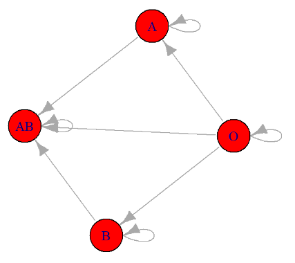

# Probability distributions {#sec-distributions}

```{r setup_distributions, include=FALSE}

library(tidyverse)

knitr::opts_chunk$set(fig.pos = 'H')
```


In this chapter, we explore random variables, which assign numerical values to outcomes of random events, with a particular emphasis on the different types of probability distributions. These distributions are broadly classified into two main categories: discrete distributions, such as the binomial and Poisson distributions, in which random variables take on a countable set of values; and continuous distributions, such as the normal and chi-square distributions, in which random variables can assume any value within a continuous range of real numbers.

 

## Random variables and probability distributions

A random variable\index{random variable} assigns a numerical quantity to every possible outcome of a random phenomenon and may be:

-   **Discrete** if it takes either a finite number or an infinite sequence of possible values.
-   **Continuous** if it takes any value in some interval $(\alpha , \beta)$, $-\infty \leq \alpha < \beta \leq \infty$.

For instance, a random variable representing the ABO blood system (A, B, AB, or O blood type) would be discrete, while a random variable representing the height of a person in centimeters would be continuous.


***Example***

Let the random variable X represent blood type in population, with the following probabilities: P(A) = 0.41, P(B) = 0.10, P(AB) = 0.04, and P(O) = 0.45.

We assign numerical values to each of the four possible outcomes for the discrete variable X: X = 1 if the person has blood type A, X = 2 for blood type B, X = 3 for blood type AB, and X = 4 for blood type O.

\vspace{15pt}

$$X={\begin{cases}1, &for\ blood\ type\ A\\2, &for\ blood\ type\ B\\3, &for\ blood\ type\ AB\\4, &for\ blood\ type\ O\end{cases}}$$

Thus, the **probability distribution** that describes the probability of different possible outcomes of random variable X is:

$$P(X=x)={\begin{cases}0.41,&for\ x=1\\0.10,&for\ x=2\\0.04,&for\ x=3\\0.45,&for\ x=4\end{cases}}$$

Here, x denotes a specific value (i.e., 1, 2, 3, or 4) of the random variable X. Then, instead of saying P(A) = 0.41, i.e., the blood type is A with probability 0.41, we can say that P(X = 1) = 0.41, i.e., X is equal to 1 with probability of 0.41. Probability distributions are often presented using probability tables, such as @tbl-abo.

:::::: columns
::: {.column width="20%"}
:::

::: {.column width="60%"}

|                |      |      |      |      |
|:----------------|:----:|:----:|:----:|:----:|
| **Blood type** |  A   |  B   |  AB  |  O   |
| **X**          |  1   |  2   |  3   |  4   |
| **P(X)**       | 0.41 | 0.10 | 0.04 | 0.45 |

: Probability table of ABO system. {#tbl-abo .latex-table} 

:::

::: {.column width="20%"}
:::
::::::


Note that the probability axioms and properties that we discussed earlier are also applied to random variables. For example, the total probability for all possible outcomes of a random variable X is equal to one: P(X=1) + P(X=2) + P(X=3) + P(X=4) = 0.41 + 0.10 + 0.04 + 0.45 = 1.


The probability distribution allows us to answer questions like: What is the probability that a randomly selected person from the population can donate blood to someone with type B blood?

{#fig-bloodtypes width="50%"}


It is known that individuals with blood type B or O are eligible to donate to recipients with blood type B (@fig-bloodtypes). Therefore, we need to find the probability P(blood type B OR blood type O). Since having blood type B and blood type O are mutually exclusive events, we can apply the addition rule for mutually exclusive events as follows:

$$ \textrm{P(blood type B OR blood type O)= P(X = 2) + P(X = 4) = 0.10 + 0.45 = 0.55}$$

Hence, there is a 55% probability that a randomly selected individual from our population can donate blood to someone with blood type B.


We will explore different types of probability distributions, broadly categorized into two main groups: **discrete** and **continuous** probability distributions. In R, each distribution has four associated built-in functions. The function prefix indicates its type (d for "density", p for "probability", q for "quantile", and r for "random"), while the suffix specifies the distribution. For example, in the case of **binomial** distribution, these functions are: **`dbinom()`**, **`pbinom()`**, **`qbinom()`**,  and **`rbinom()`**. Similarly, for the normal distribution, they are: **`dnorm()`**, **`pnorm()`**, **`qnorm()`**,  and **`rnorm()`**.


## Discrete probability distributions

The probability distribution of a discrete random variable X is defined by the **probability mass function** (pmf) as:

$$
 P(X = x) = P(x)
$$ {#eq-pdfdiscrete}


where:

$P(X = x)$ is the probability that the random variable X takes the value x and

$P(x)$ is the probability of the specific outcome x occurring.


The pmf has two properties:

-   $P(x) \geq 0$
-   $\sum_{x} P(x) = 1$, where x runs through all possible values of the random variable X.


Additionally, the **cumulative distribution function** (cdf) gives the probability that the random variable X is less than or equal to x and is usually denoted as F(x):

$$
F(x) = P(X \le x)= \sum_{x_i\le x} P(x_i)
$$ {#eq-cdfdiscrete}


where the sum takes place for all the values $x_1, x_2, \ldots, x_i$, which are $x_i\le x$.


When dealing with a random variable, it is common to estimate three key summary measures: the **expected value**, **variance** and **standard deviation**.


::: content-box-purple
**Expected Value**

The expected value, or mean, denoted as **E(X)**, is defined as the weighted average of the values that X can take. Each possible value $x_i$ is weighted by its corresponding probability $P(x_i)$.

$$
\mu = E(X)= \sum\limits_x x_i \cdot P(x_i)
$$ {#eq-expdiscrete}

:::

 

::: content-box-purple
**Variance**

We can also define the variance, denoted as $\sigma^2$, which is a measure of the variability of the X.

$$
 \sigma^2=\text{Var}(X)= E[X - E(X)]^2 = E[(X - \mu)^2] = \sum\limits_x\ (x_i-\mu)^2 P(x_i)
$$ {#eq-vardiscrete}


There is an easier form of this formula.

$$
\sigma^2=\text{Var}(X)= E(X^2) - E(X)^2=\sum\limits_x x_i^2 P(x_i)-\mu^2
$$ {#eq-vardiscrete2}

:::

 

::: content-box-purple
**Standard Deviation**

The standard deviation is the square root of the variance.

$$
\sigma=\sqrt{\text{Var(X)}}=\sqrt{\sigma^2}
$$ {#eq-sddiscrete}
:::

 

### Discrete uniform distribution

Let X be a discrete random variable that takes integer values within the interval (a, b), where $a \leq b$, and each integer in this interval is equally likely to occur. The distribution of the variable X follows a discrete uniform distribution, denoted as: $X \sim \text{Uniform}(a, b)$.


-   The probability mass function (pmf) of X is given by:

$$ 
P(X = x) = \frac{1}{b-a+1} \quad \text{where} \quad x \in \left\lbrace a, a+1, \ldots, b-1, b \right\rbrace
$$ {#eq-pmfuni12}

<br>

-   The cumulative distribution function (cdf) of X is given by:

$$
F(x) = P(X \le x)= \left\{
\begin{array}{rl}
0 \; , & \text{for} \; x < a \\
\frac{x - a + 1}{b - a + 1} \; , & \text{for} \; a \leq x \leq b \\
1 \; , & \text{for} \; x > b \; 
\end{array}
\right.
$$ {#eq-cdfuni12}


<br>

The **expected value** of random variable, X, with $\text{Uniform}(a, b)$ distribution is:

$$
\mu= E(X) =\dfrac{a+b}{2}
$$ {#eq-meanuni12}


The **variance** is:

$$
\sigma^2=Var(X) = \frac{(b-a+1)^2 -1}{12}
$$ {#eq-varuni12}


and the standard deviation is:

$$
\sigma= \sqrt{Var(X)} = \sqrt{\frac{(b-a+1)^2 -1}{12}}
$$ {#eq-sigma12}

<br>

***Example***

A postgraduate program in medicine intends to randomly select one student from a group of five excellent students to receive a scholarship. Given that each student has an equal probability of being chosen, the selection process follows a discrete uniform distribution.


-   The pmf for this distribution is (a=1, b=5):

$$P(X = x) = \frac{1}{5-1+1} = \frac{1}{5} = 0.2 \quad \text{where} \quad x \in \left\lbrace 1, 2, 3, 4, 5 \right\rbrace$$


The probability table (@tbl-tbuniform) and the distribution visualization (@fig-unipmf1234) are shown below:


:::::: columns
::: {.column width="20%"}
:::

::: {.column width="60%"}

|          |     |     |     |     |     |
|:----------|:---:|:---:|:---:|:---:|:---:|
| **X**    |  1  |  2  |  3  |   4 |   5 |
| **P(X)** | 0.2 | 0.2 | 0.2 |  0.2| 0.2 |

: Probability table of X. {#tbl-tbuniform .latex-table} 

:::

::: {.column width="20%"}
:::
::::::

<br>

```{r}
#| echo: false
#| warning: false
#| label: fig-unipmf1234
#| out-width: "60%"
#| fig-align: "center"
#| fig-cap: Plot of the pmf for the Uniform(1, 5) distribution.


# Create a data frame
x <- as.factor(c(1, 2, 3, 4, 5))
y <- c(0.2, 0.2, 0.2, 0.2, 0.2)
dat01 <- data.frame(x, y)
 
# Plot
ggplot(dat01, aes(x = x, y = y)) +
  geom_segment(aes(x = x, xend=x, y=0, yend = y), linewidth = 0.3, color = "black") +
  geom_point(color="deeppink", size = 4.5) +
  scale_y_continuous(expand = c(0, 0), limits = c(0, 0.21)) +
  theme_classic(base_size = 14) +
  labs(title = "pmf Uniform(1, 5)",
       x = "X", y = "Probability") +
  theme(plot.title = element_text(size = 16),
        axis.text = element_text(size = 16))
```

<br>

-   The cdf for this distribution is:

$$F(x) = P(X \le x)={\begin{cases}0,&for\ x <1\\\frac{x}{5},&for\ 1\leq x \leq 5\\1,&for\ x > 5 \end{cases}}$$


The corresponding plot is shown in @fig-unicdf1234.

```{r}
#| echo: false
#| warning: false
#| label: fig-unicdf1234
#| out-width: "60%"
#| fig-align: "center"
#| fig-cap: Plot of the cdf for the Uniform(1, 5) distribution.

# Create a data frame
dat02 <- data.frame(x = 0:6, 
                    y =  c(0, extraDistr::pdunif(x, 1, 5), 1))
# Step line plot
ggplot(dat02, aes(x=x, y=y)) +
  geom_step(linewidth = 0.3) +
  geom_point(x = 1, y = 0.2, color="deeppink", size = 4.5) +
  geom_point(x = 2, y = 0.4, color="deeppink", size = 4.5) +
  geom_point(x = 3, y = 0.6, color="deeppink", size = 4.5) +
  geom_point(x = 4, y = 0.8, color="deeppink", size = 4.5) +
  geom_point(x = 5, y = 1, color="deeppink", size = 4.5) +
  scale_x_continuous(limits = c(0, 6), breaks = seq(0, 6, 1)) +
  scale_y_continuous(limits = c(0, 1), breaks = seq(0, 1, 0.2)) +
theme_classic(base_size = 10) +
  labs(title = "cdf Uniform(1, 5)", 
       x = "X", y = "F(x)") +
  theme(plot.title = element_text(size = 16),
        axis.text = element_text(size = 16))

```

<br>

The mean is $\mu= \dfrac{a+b}{2} = \dfrac{5+1}{2}=3$ and the variance is $\sigma^2 = \dfrac{(b-a+1)^2 -1}{12} = \dfrac{25-1}{12} = 2$.


