# Data visualization with ggplot2 {#sec-ggplot2}


```{r setup_ggplot2, include=FALSE}

options(width=85)
knitr::opts_chunk$set(fig.pos = 'H')
```

In this chapter, we will explore the power of data visualization in R, focusing on the **ggplot2** package and its extensions. The **ggplot2** package provides a graphical environment for creating a wide range of plots, from basic scatterplots to complex data visualizations. Through examples and practical tips, we will learn the fundamental principles for producing custom data visualizations in R.


```{r, message=FALSE, warning=FALSE}
# Required packages for this chapter
library(here)                
library(readxl)              
library(tidyverse)           
library(ggrepel)
library(ggsci)
library(ggthemes)
library(ggnewscale)
library(ggstar)
library(colorblindcheck)
```

 

## Basic concepts and data preparation

### Essential components of *ggplot2* data visualizations

The ***ggplot2*** package is an open-source data visualization system for R that is based on the Grammar of Graphics framework. The core idea of ***ggplot2*** is that any plot can be constructed by combining essential components, including:

-   **Data** and **coordinate system**.
-   **Geometric objects**, such as points, bars, and lines, and **statistical transformations**, such as grouping data into bins in a histogram.
-   **Aesthetic mappings** that define how variables are mapped to visual properties or aesthetics (e.g., color, size, shape) of the graph.
-   **Theme** that style all the visual elements not directly related to the data, such as the background color and the width of the grid lines.
-   **Facet** that determines how to split and display the data in a matrix of panels, allowing for the visualization of different data segments in separate, comparable panels, also known as small multiples.

Understanding ***ggplot2*** requires thinking of a figure as being built from **multiple layers** ([@fig-layers]).


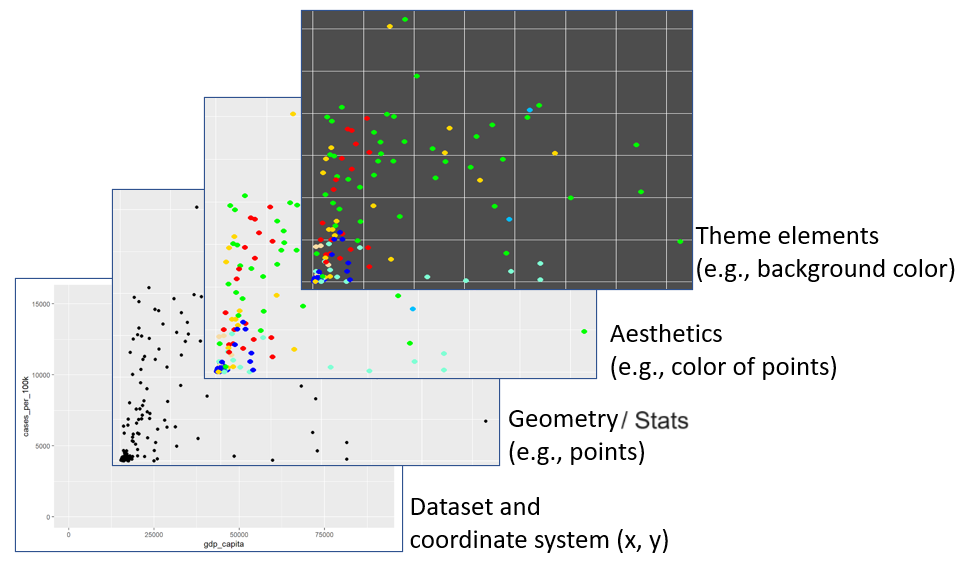{#fig-layers width="75%"}

### Covid-19 data

In this Chapter, we will visually explore the association between a country's wealth and its COVID-19 cases. However, other factors, such as testing rate, may also be related to both wealth and COVID-19 cases. For example, wealthier countries often have national programs for distributing tests and providing self-testing guidance, along with more advanced infrastructure for regularly reporting results to centralized organizations. Conversely, developing countries may face limitations in testing resources, which can lead to underreporting of cases.

```{r, message=FALSE, warning=FALSE}

covid_data <- read_excel(here("data", "covid19_dat.xlsx"))
```

Let's have a look at the types of variables:

```{r}
glimpse(covid_data)
```

\vspace{15pt}

The data frame contains `r nrow(covid_data)` rows, **each representing a country**, and `r ncol(covid_data)` columns, which are described as follows:

-   **country:** Country name.

-   **confirmed:** Confirmed Covid-19 cases recorded from January 1, 2020, to September 9, 2021.

-   **total_tests:** Test counts recorded from January 1, 2020, to September 9, 2021.

-   **region:** Country region (East Asia & Pacific, Europe & Central Asia, Latin America & Caribbean, Middle East & North Africa, North America, South Asia, Sub-Saharan Africa).

-   **income:** Country income group ("Low income", "Lower middle income", "Upper middle income", "High income").

-   **population:** Country population.

-   **gdp_capita:** Country gross domestic product (GDP) per capita, measured in 2010 US-dollars.


### Data preparation for the plots

We will compute confirmed cases per 100,000 inhabitants and tests per capita. Additionally, to ensure accurate analysis, it's essential to use the appropriate data types for the variables. Therefore, we will convert the `region` and `income` variables from character to factor.

```{r}
dat <- covid_data |> 
  mutate(region = factor(region),
         income = factor(income, levels = c("Low income", "Lower middle income",
                                            "Upper middle income", "High income")),
         cases_per_100k = round((confirmed / population) * 100000, digits = 1),
         tests_per_capita = round(total_tests / population, digits = 2)) |>
  select(country, gdp_capita, cases_per_100k, tests_per_capita, region, income)
```

After data preparation, we have a subset containing the following six variables:

```{r}
glimpse(dat)
```

It's apparent that there are **missing values** in the dataset, denoted as `NA`. These missing values can affect the appearance of plots created with ***ggplot2***. We can determine the number of missing values for each variable in the data frame as follows:

```{r}
colSums(is.na(dat))
```


## Basic steps for creating a plot with *ggplot*

The ***ggplot2*** package is part of the ***tidyverse*** ecosystem and is automatically installed when we install the ***tidyverse*** package. Additionally, ***ggplot2*** is one of the core packages included in the ***tidyverse***, so it is loaded into an R session when we run the command `library(tidyverse)`.

### Initializing a ggplot

The **`ggplot()`** function has **two basic named arguments**. The first argument, `data`, specifies the dataset that will be used for the plot. The second argument, `mapping`, defines how variables are mapped to the plot's aesthetics.

First, we pass our dataset "dat" to the data argument of the **`ggplot()`** function. Then, within the **`aes()`** function, we map the variable `gdp_capita` to the x-axis position and the variable `cases_per_100K` to the y-axis position (@fig-p1):


```{r}
#| out-width: "85%"
#| label: fig-p1
#| fig-align: center
#| fig-cap: Variables are mapped to x and y axes on a canvas with grid lines.

ggplot(data = dat, mapping = aes(x = gdp_capita, y = cases_per_100k))
```


After running the code, axis elements, such as titles, are automatically added based on the selected variables. However, we haven't specified any geometric objects yet to visually represent the data.


Note that it's common practice not to explicitly specify the names of the arguments `data` and `mapping`. Therefore, the following command is equivalent:

```{r}
#| eval: false

ggplot(dat, aes(x = gdp_capita, y = cases_per_100k))
```

### Adding geometry

Geometric objects, or *geoms*, are fundamental components of ***ggplot2*** visualizations. Each geom has a corresponding function named with the prefix **geom\_**, followed by the specific shape it represents. For example, **`geom_point`** is used for scatterplots, **`geom_bar()`** for bar charts, and **`geom_line()`** for line plots (@tbl-geometry). It is important to note that every **geom\_** function has a corresponding default **stat** argument. For example, `stat="identity"`, means no transformation of the raw data, while `stat="count"` calculates the frequency of each category on the x-axis in a bar plot.


:::::: columns
::: {.column width="10%"}
:::

::: {.column width="80%"}


| Geometry         |   Stat   |                   Example                   |
|:-----------------|:--------:|:-------------------------------------------:|
| geom_point()     | identity |   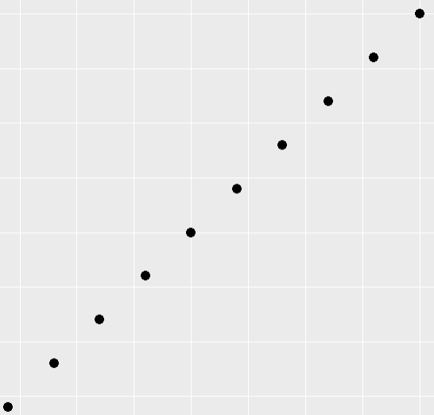{width="30%"}   |
| geom_line()      | identity |   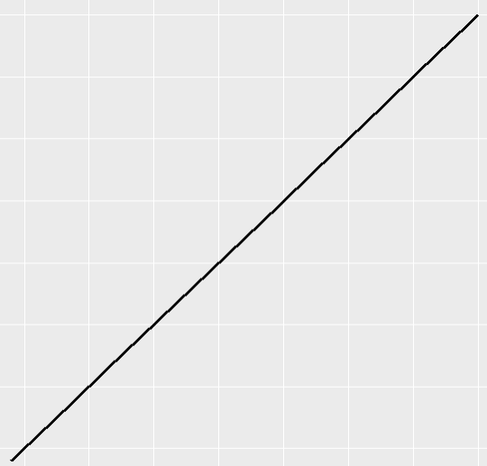{width="30%"}    |
| geom_text()      | identity |   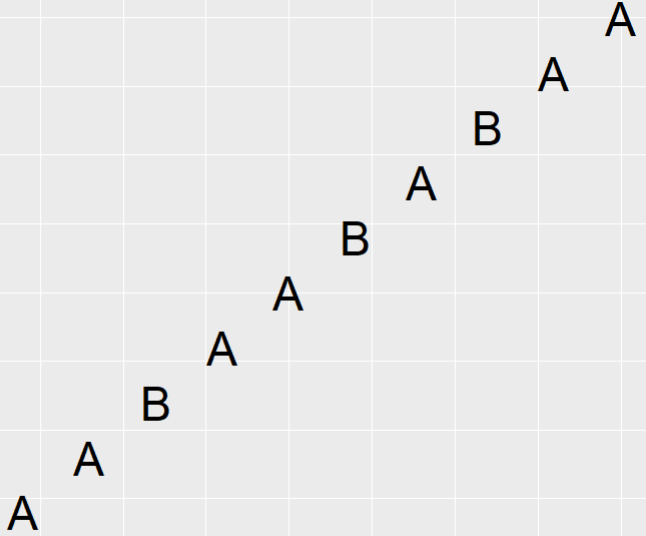{width="30%"}    |
| geom_histogram() |   bin    | 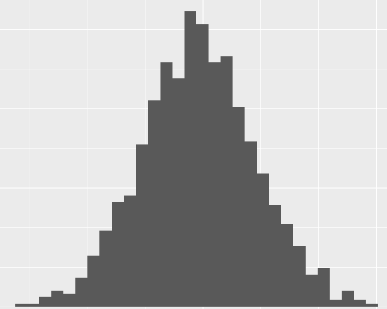{width="30%"} |
| geom_density()   | density  |  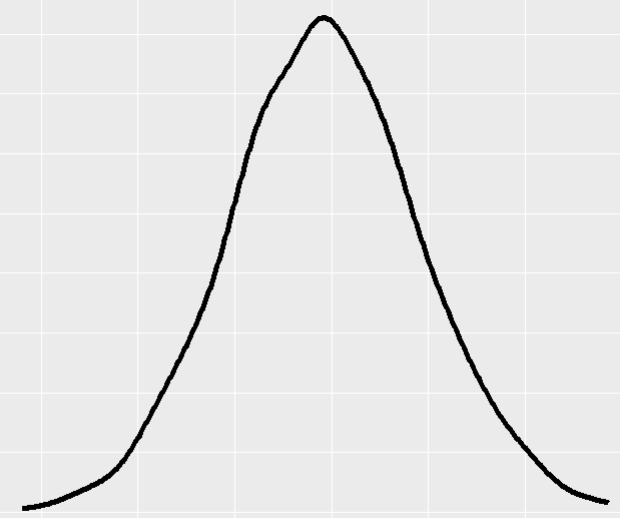{width="30%"}  |
| geom_bar()       |  count   |    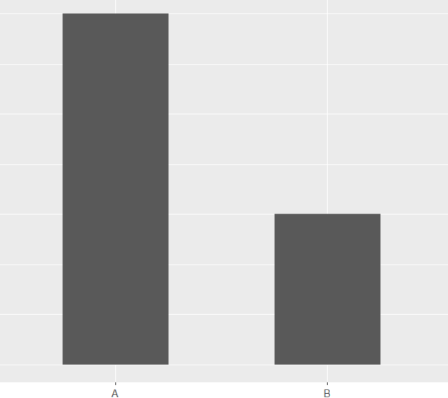{width="30%"}    |
| geom_boxplot()   | boxplot  |  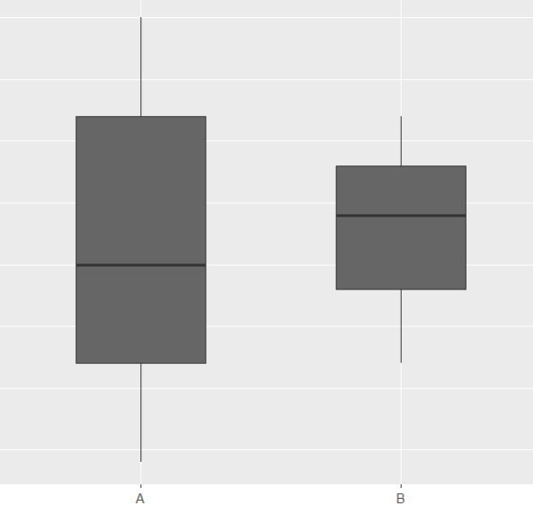{width="30%"}  |

: Common geometries used in ggplot data visualizations. {#tbl-geometry .latex-table}
:::

::: {.column width="10%"}
:::
::::::

<br>

Suppose we want to explore the association between `gdp_capita` and `cases_per_100k`; in that case, a scatterplot would be the most suitable visualization, with each point representing a country (@fig-p2). We’ll create this scatter plot by adding points with the **`geom_point()`** layer, as shown in the code. The plus sign (`+`) at the end of the first line indicates that the **`geom_point()`** layer is being added to the base plot^[A new package, tidyplots, inspired by the philosophy of ggplot2, has been developed to use the \|\> operator instead of + for layering components [@engler2025].]. Notably, the **`geom_point()`** layer inherits the `x` and `y` aesthetics specified in the **`ggplot()`** function.


```{r}
#| out-width: "85%"
#| label: fig-p2
#| fig-align: center
#| fig-cap: Adding a point geometry to the ggplot object, with each point representing a distinct country.

ggplot(dat, aes(x = gdp_capita, y = cases_per_100k)) +
  geom_point()
```

The *warning* message indicates that three rows have been removed because they contain missing values in these two variables. Note that in most of the subsequent plots, *warning* messages for missing data will not be displayed in the output.


### Adding aesthetics to geometry

Each geom has a set of aesthetics that control its visual properties. For example, `geom_point()`, used for scatter plots, provides several aesthetics to customize the appearance of its points: ***x*** (required), ***y*** (required), *alpha*, *color*, *fill*, *group*, *shape*, *size*, *stroke*. Notably, to incorporate additional data variables into the plot, we can map these variables to aesthetics such as *color*, *shape*, and *size*.

#### *`color` aesthetics*

Color is an important characteristic of plots, but choosing the right colors and using them effectively are essential for clear communication. Color palettes (or colormaps) are classified into three main categories in ***ggplot2***:

-   **Sequential** (continuous or discrete) palette that is used for **quantitative** data. This palette typically uses a single base color (monochromatic) and creates a gradient by varying its lightness, indicating the increasing or decreasing values within our data.


```{r}
#| echo: false
#| out-width: "55%"
#| fig-align: center

knitr::include_graphics(here("images", "sequential2.png"))
```


-   **Diverging** palette consists of two color gradients that converge at a center point. This type of palette is particularly useful when visualizing data with both positive and negative values or ranges that have two opposing extremes centered around a baseline value.

```{r}
#| echo: false
#| out-width: "55%"
#| fig-align: center

knitr::include_graphics(here("images", "gradient.png"))
```


-   **Qualitative** palette that is used mainly for **categorical** data. This palette is consisted from a discrete set of distinct colors with no implied order.


```{r}
#| echo: false
#| out-width: "55%"
#| fig-align: center

knitr::include_graphics(here("images", "qualitative.png"))
```


For example, we can add a **`color`** argument within the **`aes()`** function to group the points by the categorical variable `region`, as shown below:

```{r}
#| message: false
#| warning: false
#| out-width: "85%"
#| label: fig-p3
#| fig-align: center
#| fig-cap: Mapping a categorical third variable to the color aesthetic.

ggplot(dat, aes(x = gdp_capita, y = cases_per_100k)) +
  geom_point(aes(color = region))        
```

The color argument inside the **`aes()`** function mapped the data of the categorical variable `region` to the color aesthetic of **`geom_point()`**. This caused ***ggplot2*** to automatically apply a qualitative color palette. Additionally, ***ggplot2*** generated a legend to display the correspondence between the regions and their respective colors.


It is important to understand the difference between including an aesthetic argument **inside** or **outside** of the **`aes()`** function. For example, let's run the following code:

```{r}
#| message: false
#| warning: false
#| out-width: "85%"
#| label: fig-p4
#| fig-align: center
#| fig-cap: Setting the color to deeppink for all points.

ggplot(dat, aes(x = gdp_capita, y = cases_per_100k)) +
  geom_point(color = "deeppink")       
```


In this case, we set the color argument to a **fixed value** ("deeppink") in the **`geom_point()`** function instead of using **`aes()`**, so ***ggplot2*** changed the color of the points "globally".

In R, colors can be specified in quotes either by name (e.g., "deeppink") or as a hexadecimal color (hex code) that starts with a `#` (e.g., `#FF1493`). The main advantage of the hexadecimal color system is its compactness and flexibility, allowing us to select any desired color precisely. In the @tbl-colors, we present examples of colors and their corresponding hex codes:


:::::: columns
::: {.column width="10%"}
:::

::: {.column width="80%"}

| Name                                                         | Hex code  |
|:-------------------------------------------------------------|:----------|
| `r kableExtra::text_spec("chartreuse2", color = "#76EE00 ")` | `#76EE00` |
| `r kableExtra::text_spec("blue", color = "#0000FF")`         | `#0000FF` |
| `r kableExtra::text_spec("deeppink", color = "#FF1493")`     | `#FF1493` |
| `r kableExtra::text_spec("black", color = "#000000")`        | `#000000` |

: Examples of names and hex color codes of different colors. {#tbl-colors .latex-table}

:::

::: {.column width="10%"}
:::
::::::

<br>

::: content-box-purple
**Note**

ggplot2 understands both **color** and **colour** as well as the short version **col**.   
:::

 

#### *`shape` aesthetics*

The different points shapes symbols commonly used in R are shown in the @fig-p6 :

```{r}
#| echo: false
#| message: false
#| warning: false
#| out-width: "85%"
#| label: fig-p6
#| fig-align: center
#| fig-cap: Points shapes symbols and their numeric codes commonly used in R.


pchShow <- function(cex = 2.5, col = "black", bg = "gold", 
                    coltext = "black", cextext = 0.9,
                    main = paste("plot symbols :  points (...  pch = *, cex =", cex,")"))
{

  np  <- 26
  ipch <- 0:(np - 1)
  k <- floor(sqrt(np))
  dd <- c(-1,1)/2
  rx <- dd + range(ix <- ipch %/% k)
  ry <- dd + range(iy <- 3 + (k - 1) - ipch %% k)
  pch <- as.list(ipch) # list with integers & strings
  plot(rx, ry, type ="n", axes = FALSE, xlab = "", ylab = "", 
       main = main)
  abline(v = ix, h = iy, col = "lightgray", lty = "dotted")
  for (i in 1:np) {
    pc <- pch[[i]]
    ## 'col' symbols with a 'bg'-colored interior (where available) :
    points(ix[i], iy[i], pch = pc, col = col, bg = bg, cex = cex, lwd = 2)
    if (cextext > 0)
      text(ix[i], iy[i] -0.4, pc, col = coltext, cex = cextext)
  }
}
par(mar = c(0,0,0,0))
pchShow(main = NULL)
```

<br>

By default, in @fig-p4, **`geom_point()`** uses shape 19, which represents a solid circle. If we choose a shape between 21 and 25, we can specify both the color and fill aesthetics for the points. The
@fig-p7 - @fig-p9 demonstrate how to configure the color and fill arguments for shape *24*, which represents a **triangle**.


```{r}
#| message: false
#| warning: false
#| out-width: "85%"
#| label: fig-p7
#| fig-align: center
#| fig-cap: Setting the shape to a triangle using shape symbol 24.

ggplot(dat, aes(x = gdp_capita, y = cases_per_100k)) +
  geom_point(shape = 24)     
```


```{r}
#| message: false
#| warning: false
#| out-width: "85%"
#| label: fig-p8
#| fig-align: center
#| fig-cap: Setting the outline color of the triangles to red.

ggplot(dat, aes(x = gdp_capita, y = cases_per_100k)) +
  geom_point(shape = 24, color = "red")    
```


```{r}
#| message: false
#| warning: false
#| out-width: "85%"
#| label: fig-p9
#| fig-align: center
#| fig-cap: Setting the outline and fill colors of the triangles to red and yellow, respectively.

ggplot(dat, aes(x = gdp_capita, y = cases_per_100k)) +
  geom_point(shape = 24, color = "red", fill = "yellow")
```

<br>

::: content-box-purple
**NOTE**

-\   The point shapes 0 to 14 have an outline (we use "color" to set the outline color).

-\   The point shapes 15 to 20 are solid shapes (we use "color" to set their color).

-\   Point shapes 21 to 25 allow us to control both the outline and fill colors separately (we use "color" to set the color of the outline and "fill" to set the fill color).
:::

 

Now, let's group the points by the `region` variable and use different point shapes rather than colors, as shown below:


```{r}
#| eval: false
#| message: false
#| warning: false
#| out-width: "85%"
#| fig-align: center

ggplot(dat, aes(x = gdp_capita, y = cases_per_100k)) +
  geom_point(aes(shape = region))
```


```{r, out.width='85%', fig.align = 'left', echo=FALSE}

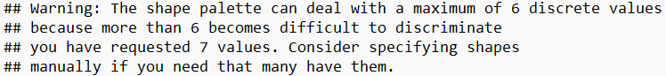
```


```{r}
#| echo: false
#| message: false
#| warning: false
#| out-width: "85%"
#| label: fig-p5
#| fig-align: center
#| fig-cap: Mapping a categorical third variable to the shape aesthetic.

ggplot(dat, aes(x = gdp_capita, y = cases_per_100k)) +
  geom_point(aes(shape = region))
```


A *warning* message in the console indicates that **`ggplot2`** by default allows only six distinct point shapes to be displayed in the plot. In our case, the `region` variable has seven levels, exceeding the number of available shapes. However, we will see how to change this using appropriate `scales`.


#### *`size` aesthetics*

By mapping a third numeric variable, such as `tests_per_capita`, to the size aesthetic, we create a "bubble" plot. This type of graph allows for the visualization of multiple data points based on three dimensions. This means that in addition to the variables represented on the x-axis and y-axis, the size of each point is proportional to the value of the third variable.

```{r}
#| message: false
#| warning: false
#| out-width: "85%"
#| label: fig-p10
#| fig-align: center
#| fig-cap: Mapping a numeric third variable to the size aesthetic.

ggplot(dat, aes(x = gdp_capita, y = cases_per_100k)) +
  geom_point(aes(size = tests_per_capita))
```


## Adding a new geom layer (text information for each point)

Each point in our scatterplot corresponds to a unique country. Now, let’s enhance it by labeling each data point with the corresponding country name. The **`geom_text_repel()`** function from the add-on package ***ggrepel*** allows us to add text labels for each data point that repel away from each other to avoid overlapping of the text. To achieve this, we define `label = country` argument inside the **`aes()`** of the **`geom_text_repel()`** function.

```{r}
#| out-width: "85%"
#| label: fig-p11
#| fig-align: center
#| fig-cap: Adding a text geometry to the ggplot object.


ggplot(dat, aes(x = gdp_capita, y = cases_per_100k)) +
  geom_point(aes(size = tests_per_capita)) +
  geom_text_repel(aes(label = country), seed = 123)
```


The *warning* messages indicate that the plot is impacted by **missing data** in the variables used. Notably, a total of 79 data points, representing countries, are absent from the plot due to missing values (primarily because of `NA`s in the `tests_per_capita` variable). Furthermore, a second warning notes that the **`geom_text_repel()`** function encounters difficulties in labeling all data points due to text overlap.


## Modifying the default settings of the plot with *scales*

While ***ggplot2*** provides default aesthetics for various geoms, modifications are often crucial for creating plots that are both informative and visually compelling. Scale functions offer a wide range of customization options. We can control the scaling of axes, choosing between linear, logarithmic, or other options to ensure our data is presented accurately. Furthermore, we can manipulate the visual appearance of the geoms themselves. For example, by adjusting the color and shape of the points or lines, we can highlight specific patterns and encode additional information into our visualizations.

### Modifying the scale of the axis

We will apply a logarithmic transformation (base 10) to the scale of the y-axis. This scaling compresses larger values on the y-axis and expands smaller ones, facilitating the visualization of data points across the entire range.

```{r}
#| message: false
#| warning: false
#| out-width: "85%"
#| label: fig-p12
#| fig-align: center
#| fig-cap: Transforming the y-axis to a logarithmic scale for better visualization.


ggplot(dat, aes(x = gdp_capita, y = cases_per_100k)) +
  geom_point(aes(size = tests_per_capita)) +
  geom_text_repel(aes(label = country), seed = 123) +
  scale_y_log10()
```

We can use `scale_y_continuous(trans='log10')` as an alternative to `scale_y_log10()`. Both functions achieve the same result of applying a logarithmic scale to the y-axis.


### Modifying the default point shapes

Let's add a new dimension to the @fig-p12 by shaping points according to the `region` variable. We previously discussed the warning message that arises when there are more levels in the region variable than available shapes in ggplot. However, we can manually specify shapes for each level using scales. For example, we can select the following shapes from @fig-p6:

```{r, out.width='40%', fig.align = 'center', echo=FALSE}

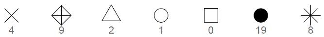
```


In @fig-p13 two scatterplots are shown: (a) "Default," which uses a standard set of point shapes to represent the different regions, and (b) "Modified," which customizes the point shapes by manually assigning distinct symbols to each region using `scale_shape_manual()`.

```{r}
#| message: false
#| warning: false
#| label: fig-p13
#| fig-cap: "Modifying the default point shapes."
#| fig-subcap: 
#|   - "Default"
#|   - "Modified"
#| layout-ncol: 2


# default
ggplot(dat, aes(x = gdp_capita, y = cases_per_100k)) +
  geom_point(aes(size = tests_per_capita, shape= region)) +
  geom_text_repel(aes(label = country), seed = 123) +
  scale_y_log10()

# modified
ggplot(dat, aes(x = gdp_capita, y = cases_per_100k)) +
  geom_point(aes(size = tests_per_capita, shape= region)) +
  geom_text_repel(aes(label = country), seed = 123) +
  scale_y_log10() +
  scale_shape_manual(values = c(4, 9, 2, 1, 0, 19, 8))
```


::: content-box-purple
**TIP**

When mapping a variable to size, it is recommended to avoid mapping another variable to shape. This is because comparing the sizes of different shapes (e.g., a size 4 square versus a size 4 triangle) can be visually challenging for viewers.
:::

 

### Modifying the default colors

A better approach would be to use distinct colors for the various levels of the `region` variable. The ***ggsci*** package offers high-quality color palettes, and we will select the "JCO" palette, which is inspired by the plots in *Journal of Clinical Oncology*.

We have two options: `scale_color_jco()` and `scale_fill_jco()`. We will select the first option because the default *shape 19* has not fill aesthetic.

```{r}
#| message: false
#| warning: false
#| label: fig-p14
#| fig-cap: "Modifying the default colors."
#| fig-subcap: 
#|   - "Default"
#|   - "Modified"
#| layout-ncol: 2


# default
ggplot(dat, aes(x = gdp_capita, y = cases_per_100k)) +
  geom_point(aes(size = tests_per_capita, color = region)) +
  geom_text_repel(aes(label = country), seed = 123) +
  scale_y_log10()

# modified
ggplot(dat, aes(x = gdp_capita, y = cases_per_100k)) +
  geom_point(aes(size = tests_per_capita, color = region)) +
  geom_text_repel(aes(label = country), seed = 123) +
  scale_y_log10() +
  scale_color_jco()
```

It is important to note that a color palette can be checked with [***colorblindcheck***](https://jakubnowosad.com/colorblindcheck/) package to improve graph readability for readers with common color vision deficiency (deuteranopia, protanopia, and tritanopia). The [***viridis***](https://sjmgarnier.github.io/viridis/) color palette is a great choice, as it is designed to be colorblind-friendly and ensures that visualizations remain accessible to all viewers. More color palettes can be found in the [***coolors***](https://coolors.co/palettes/popular).


## Modifying/setting ggplot labels with *labs()*

The **`labs()`** function allows us to modify or set various labels within our ggplot (FIGURE \@ref(fig:p15)). It allows us to customize axis and legend titles, set the main title, subtitle, caption, and tag of the ggplot.

```{r}
#| message: false
#| warning: false
#| out-width: "90%"
#| label: fig-p15
#| fig-align: center
#| fig-cap: Adding labels (e.g., title, subtitle, caption) to the plot.

ggplot(dat, aes(x = gdp_capita, y = cases_per_100k)) +
  geom_point(aes(size = tests_per_capita, color = region)) +
  geom_text_repel(aes(label = country), seed = 123) +
  scale_y_log10() +
  scale_color_jco() +
  labs(x = "GDP per capita ($)", y = "Cases per 100,000 inhabitants",
       color = "Region", size = "Proportion tested",
       title = str_wrap("Confirmed cases per 100,000 inhabitants,
                    GDP per capita, and COVID-19 testing rate by country", 
                    width = 75), 
       subtitle = "May 20, 2021", 
       caption = "Source Data: Covid-19 related data.", tag = 'A')
```


Note that we have also used the **`str_wrap()`** function from the ***stringr*** package to handle our lengthy plot title.


## Modifying theme elements with *theme()* function

Theme elements are the **non-data** elements of a ggplot, including line, text, main title, grid (major, minor), background, and tick marks.

The default appearance of theme elements can be customized using the **`theme()`** function. The syntax requires two components: an **element name** and an **element function**, structured as: `theme(element name = element_function(arguments))`.


***Element name***

We are able to modify the appearance of theme elements in **plot**, **panel**, **axis**, and **legend** compartments of a simple ggplot (@fig-compartments}).

```{r}
#| echo: false
#| message: false
#| warning: false
#| out-width: "85%"
#| label: fig-compartments
#| fig-align: center
#| fig-cap: The main compartments including plot, panel, axis, legend of a ggplot.


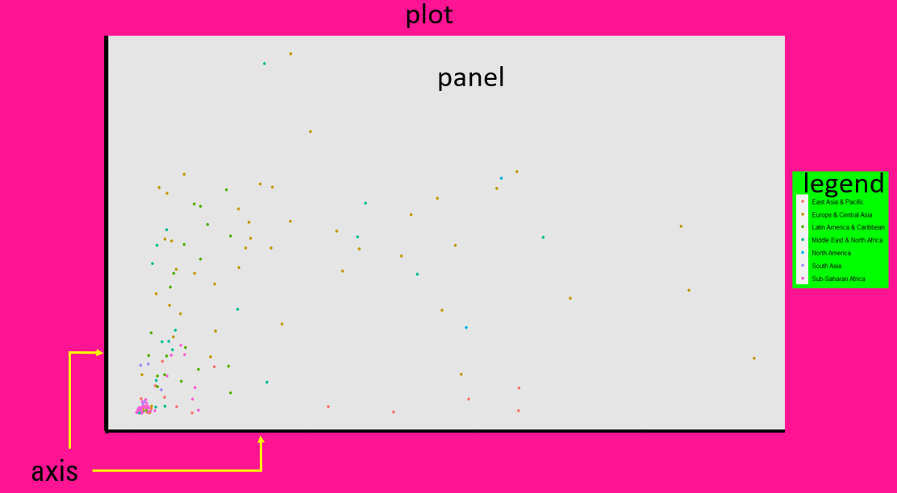
```

The theme system enables us to specify the appearance of elements for particular compartments of the ggplot by creating **element names** in the form of `compartment.element`. For example, we can specify the title element in plot, axis, and legend with the element names `plot.title`, `axis.title`, and `legend.title`, respectively.


***Element function***

Depending on the type of element that we want to modify, there are three pertinent functions that start with `element_`:

-   `element_line()`: specifies the display of lines
-   `element_text()`: specifies the display of text elements
-   `element_rect()`: specifies the display of borders and backgrounds


::: content-box-purple
**NOTE**

- There is also the **element\_blank()** that suppresses the appearance of elements we're not interested in. 

- Other features of the ggplot, such as the position of legend, are not specified within an *element\_function*.      
:::

 

For example, if we want to change the color of the axis lines (from black to red) and modify their width, the syntax would be as follows:

```{r, out.width='80%', fig.align = 'center', echo=FALSE}

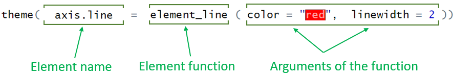
```

Next, we present examples for each element function to help understand these concepts.


### element_line()

With **`element_line()`**, we can customize all the lines of the ggplot that are not part of data. @fig-element_line shows the basic line elements (axis lines, tick marks, and grid lines) that we can modify in a simple ggplot.


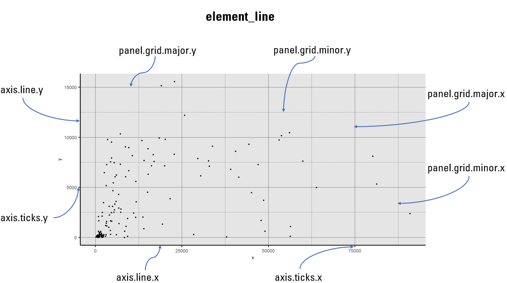{#fig-element_line width="100%"}


#### *Modifying the `X` and `Y` axis lines*

The available options include:

-   To modify both X and Y axes: `axis.line = element_line()`
-   To modify only X axis: `axis.line.x = element_line()`
-   To modify only Y axis: `axis.line.y = element_line()`


***Example***

While ggplot2 doesn't display axis lines by default, we can easily add and customize them using the **`theme()`** function.

```{r}
#| message: false
#| warning: false
#| out-width: "75%"
#| label: fig-p16
#| fig-align: center
#| fig-cap: Adding and customizing axis lines to ggplot.


ggplot(dat, aes(x = gdp_capita, y = cases_per_100k)) +
  geom_point() +
  theme(axis.line.x = element_line(color = "red", linewidth = 1),
        axis.line.y = element_line(color = "green", linewidth = 0.6, linetype = 5))
```

In @fig-p16, we set the x-axis line to red with a width of approximately 0.75 mm (solid line; the unit of linewidth is roughly 0.75 mm), and the y-axis line to green with a width of approximately $0.75 \times 0.6 = 0.45 \ mm$ and a long dashed linetype. The available line types are presented in @fig-p17.

```{r}
#| echo: false
#| message: false
#| warning: false
#| out-width: "60%"
#| label: fig-p17
#| fig-align: center
#| fig-cap: Line types (0 = blank, 1 = solid, 2 = dashed, 3 = dotted, 4 = dotdash, 5 = longdash, 6 = twodash).


tibble(y = 1:6, x = 0, xend = 1) |> 
  ggplot() +
  aes(x, y, xend = xend, yend = y, linetype = as.integer(y)) +
  geom_segment(size = 1) +
  theme_minimal(16) +
  scale_y_continuous(breaks = 1:6, trans = "reverse") +
  theme(
    plot.title = element_text("mono"),
    panel.grid = element_blank(), 
    axis.text.x = element_blank()
  ) +
  scale_linetype_identity() +
  labs(subtitle = "linetype =", y = NULL, x = NULL)
```


#### *Modifying the tick marks on `X` and `Y` axes*

The available options include:

-   To modify both X and Y tick marks: `axis.ticks = element_line()`
-   To modify only X tick marks: `axis.ticks.x = element_line()`
-   To modify only Y tick marks: `axis.ticks.y = element_line()`


***Example***

Similar adjustments can be applied to the x-axis and y-axis tick marks, as shown in @fig-p18).

```{r}
#| message: false
#| warning: false
#| out-width: "80%"
#| label: fig-p18
#| fig-align: center
#| fig-cap: Applying adjustments to the x-axis and y-axis tick marks.


ggplot(dat, aes(x = gdp_capita, y = cases_per_100k)) +
  geom_point() +
  theme(axis.ticks.x = element_line(color = "red", linewidth = 3),
        axis.ticks.y = element_line(color = "green", linewidth = 3))
```


#### *Modifying the major and minor grid lines in the panel*

Grid lines come in two types: major grid lines, which align with the tick marks, and minor grid lines, which are positioned between the major ones. In @fig-p19 - @fig-p20, we present examples of modifying both major and minor grid lines.


**Major grid**

The available options include:

-   To modify major grid lines: `panel.grid.major = element_line()`
-   To modify major vertical grid lines: `panel.grid.major.x = element_line()`
-   To modify major horizontal grid lines: `panel.grid.major.y = element_line()`


***Example***

```{r}
#| message: false
#| warning: false
#| out-width: "75%"
#| label: fig-p19
#| fig-align: center
#| fig-cap: Modifying the major grid in the panel of ggplot.


ggplot(dat, aes(x = gdp_capita, y = cases_per_100k)) +
  geom_point() +
  theme(panel.grid.major.x = element_line(color = "red", linewidth = 0.45),
        panel.grid.major.y = element_line(color = "green", linewidth = 0.45))
```

<br>

**Minor grid**

The available options include:

-   To modify minor grid lines: `panel.grid.minor = element_line()`
-   To modify minor vertical grid lines: `panel.grid.minor.x = element_line()`
-   To modify minor horizontal grid lines: `panel.grid.minor.y = element_line()`

```{r}
#| message: false
#| warning: false
#| out-width: "75%"
#| label: fig-p20
#| fig-align: center
#| fig-cap: Modifying the minor grid in the panel of ggplot.


ggplot(dat, aes(x = gdp_capita, y = cases_per_100k)) + 
  geom_point() +
  theme(panel.grid.minor.x = element_line(color = "red", linewidth = 0.45, 
                                          linetype = 2),
  panel.grid.minor.y = element_line(color = "green", linewidth = 0.45,
                                    linetype = 2))
```

We can customize all of these grid lines by overriding their default settings (@fig-p21).

```{r}
#| message: false
#| warning: false
#| out-width: "75%"
#| label: fig-p21
#| fig-align: center
#| fig-cap: Modifying both the major and minor grids within a ggplot panel.

ggplot(dat, aes(x = gdp_capita, y = cases_per_100k)) + 
  geom_point() +
  theme(panel.grid.major = element_line(color = "blue", linewidth = 0.55),
  panel.grid.minor = element_line(color = "deeppink", linewidth = 0.35,
                                  linetype = 2))
```


### element_text()

The **`element_text()`** function controls non-data related text elements in the ggplot, allowing for customization of axis labels and titles, legend text elements, and main plot features such as title, subtitle, and caption (@fig-element_text).


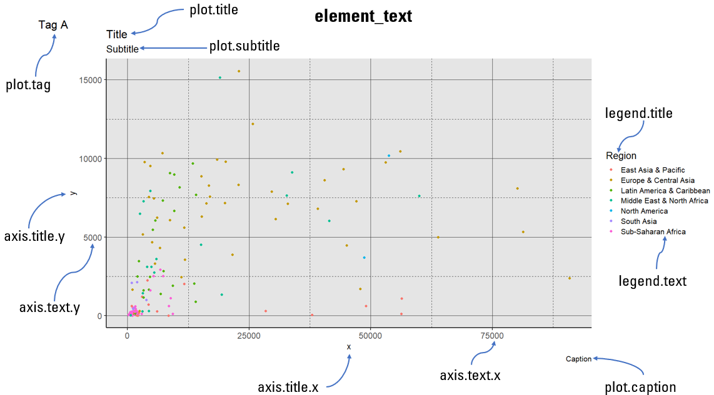{#fig-element_text width="100%"}

By making adjustments to font size, color, and style, we can enhance the quality of our ggplot2 graphics beyond basic data representation.


#### *Modifying the title text of `X` and `Y` axes*

The available options include:

-   To modify both X and Y axis titles: `axis.title = element_text()`
-   To modify X axis title: `axis.title.x = elemeitlent_text()`
-   To modify Y axis title: `axis.title.y = element_text()`

***Example***

Using the **`theme()`** function, we can improve the default appearance of axis title text by setting colors, adjusting size, or altering the angle (@fig-axtitle).

```{r}
#| message: false
#| warning: false
#| out-width: "90%"
#| label: fig-axtitle
#| fig-align: center
#| fig-cap: Modifying the title text of axes.


ggplot(dat, aes(x = gdp_capita, y = cases_per_100k)) +
  geom_point(aes(color = region)) +
   labs(x = "GDP per capita ($)", y = "Cases per 100,000 inhabitants",
       color = "Region", size = "Proportion tested",
       title = str_wrap("Confirmed cases per 100,000 inhabitants, 
                    GDP per capita, and COVID-19 testing rate by country",
                    width = 75),
       subtitle = "May 20, 2021", caption = "Source Data: Covid-19 related data.",
       tag = 'A') +
  theme(axis.title.x = element_text(color = "red", size = 12, angle = 10),
        axis.title.y = element_text(color = "green", size = 10))
```


#### *Modifying the label text of `X` and `Y` axes*

The available options include:

-   To modify both X and Y axis text: `axis.text = element_text()`
-   To modify X axis text: `axis.text.x = element_text()`
-   To modify Y axis text: `axis.text.y = element_text()`

Similar customization can be made to the axis label text, as shown in @fig-axtext.

```{r}
#| message: false
#| warning: false
#| out-width: "90%"
#| label: fig-axtext
#| fig-align: center
#| fig-cap: Modifying the label text of axes.


ggplot(dat, aes(x = gdp_capita, y = cases_per_100k)) +
  geom_point(aes(color = region)) +
   labs(x = "GDP per capita ($)", y = "Cases per 100,000 inhabitants",
       color = "Region", size = "Proportion tested",
       title = str_wrap("Confirmed cases per 100,000 inhabitants, 
                    GDP per capita, and COVID-19 testing rate by country",
                    width = 75),
       subtitle = "May 20, 2021", caption = "Source Data: Covid-19 related data",
       tag = 'A') +
  theme(axis.text.x = element_text(color = "red", size = 12,
                                   face="bold", angle = 90),
        axis.text.y = element_text(color = "green", size = 10))
```


#### *Modifying the plot's title, subtitle, caption, and tag*

Titles, subtitles, captions, and tags are essential components for providing context and information about plots. When creating plots, it's important to carefully consider the content, placement, font size, and colors of these textual elements to effectively communicate the intended message.

```{r}
#| message: false
#| warning: false
#| out-width: "90%"
#| label: fig-plottitle
#| fig-align: center
#| fig-cap: Modifying the plot's title, subtitle, caption, and tag.


ggplot(dat, aes(x = gdp_capita, y = cases_per_100k)) +
  geom_point(aes(color = region)) +
  labs(x = "GDP per capita ($)", y = "Cases per 100,000 inhabitants",
       color = "Region", size = "Proportion tested",
       title = str_wrap("Confirmed cases per 100,000 inhabitants, 
                    GDP per capita, and COVID-19 testing rate by country",
                    width = 75), 
       subtitle = "May 20, 2021", caption = "Source Data: Covid-19 related data",
       tag = 'A') +
  theme(plot.title = element_text(color = "deeppink"),
        plot.subtitle = element_text(color = "blue"),
        plot.caption = element_text(color = "orange", size = 12),
        plot.tag = element_text(color = "green", size = 14))
```

The **`element_text()`** functions inside the **`theme()`** set the color of the plot title to "deeppink", the subtitle to "blue", the caption to "orange" with a font size of 12, and the tag letter to "green" with a font size of 14 (@fig-plottitle).


#### *Modifying the title and text of legend*

Using the **`theme()`** function we can also modify the appearance of legend title and text properties such as font size and color (@fig-plotlegend).

```{r}
#| message: false
#| warning: false
#| out-width: "90%"
#| label: fig-plotlegend
#| fig-align: center
#| fig-cap: Modifying the title and text of legend.


ggplot(dat, aes(x = gdp_capita, y = cases_per_100k)) +
  geom_point(aes(color = region)) +
  labs(x = "GDP per capita ($)", y = "Cases per 100,000 inhabitants",
       color = "Region", size = "Proportion tested",
       title = str_wrap("Confirmed cases per 100,000 inhabitants, 
                    GDP per capita, and COVID-19 testing rate by country",
                    width = 75),
       subtitle = "May 20, 2021", caption = "Source Data: Covid-19 related data",
       tag = 'A') +
  theme(legend.title = element_text(color = "red", size = 14),
        legend.text = element_text(color = "green", size = 10))
```


### element_rect()

The **`element_rect()`** function allows us to manage the appearance of borders and backgrounds for all rectangular components within the graph.

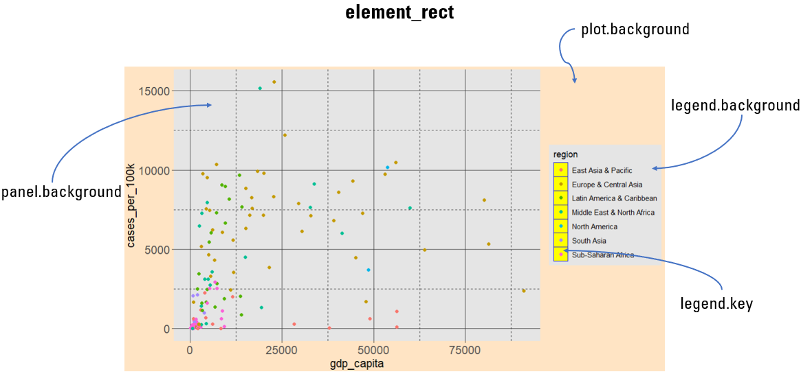{#fig-element_rect width="100%"}


#### *Modifying the background color*

In Figures \@ref(fig:plotbackground)-\@ref(fig:keybackground), we present examples of modifying the color of border and background of the various compartments within ggplot.

\vspace{15pt}

-   **Modifying the border and background color of the plot area**

```{r}
#| message: false
#| warning: false
#| out-width: "80%"
#| label: fig-plotbackground
#| fig-align: center
#| fig-cap: Modifying the border and background color of the plot area.


ggplot(dat, aes(x = gdp_capita, y = cases_per_100k)) +
  geom_point(aes(color = region)) +
   labs(x = "GDP per capita ($)", y = "Cases per 100,000 inhabitants",
       color = "Region", size = "Proportion tested") +
  theme(plot.background = element_rect(color = "green", linewidth = 3,
                                       fill = "deeppink"))
```


-   **Modifying the border and background color of the panel area**

```{r}
#| message: false
#| warning: false
#| out-width: "80%"
#| label: fig-panelbackground
#| fig-align: center
#| fig-cap: Modifying the border and background color of the panel area.

ggplot(dat, aes(x = gdp_capita, y = cases_per_100k)) +
  geom_point(aes(color = region)) +
   labs(x = "GDP per capita ($)", y = "Cases per 100,000 inhabitants",
       color = "Region", size = "Proportion tested") +
  theme(panel.background = element_rect(color = "green", linewidth = 1.2,
                                        fill = "deeppink"))
```


-   **Modifying the border and background color of legend area**

```{r}
#| message: false
#| warning: false
#| out-width: "80%"
#| label: fig-legendbackground
#| fig-align: center
#| fig-cap: Modifying the border and background color of legend area.


ggplot(dat, aes(x = gdp_capita, y = cases_per_100k)) +
  geom_point(aes(color = region)) +
   labs(x = "GDP per capita ($)", y = "Cases per 100,000 inhabitants",
       color = "Region", size = "Proportion tested") +
  theme(legend.background = element_rect(color = "green", linewidth = 1.2,
                                         fill = "deeppink"))
```


-   **Modifying the border and background color of legend key area**

```{r}
#| message: false
#| warning: false
#| out-width: "90%"
#| label: fig-keybackground
#| fig-align: center
#| fig-cap: Modifying the border and background color of legend key area.


ggplot(dat, aes(x = gdp_capita, y = cases_per_100k)) +
  geom_point(aes(color = region)) +
   labs(x = "GDP per capita ($)", y = "Cases per 100,000 inhabitants",
       color = "Region", size = "Proportion tested") +
  theme(legend.key = element_rect(color = "green", linewidth = 1,
                                  fill = "deeppink"))
```


### Predefined themes and further customization

The default theme of ggplot is the `theme_gray`. We can customize the default settings by applying predefined themes, rather than manually adjusting every single theme element. There are ready to use themes from the ***ggplot2*** and ***ggthemes*** packages.

\vspace{5pt}

**Examples of in-build theme from *ggplot2*:**

-   **`theme_bw()`** -- dark on light ggplot2 theme.

-   **`theme_dark()`** -- lines on a dark background instead of light.

-   **`theme_minimal()`** -- no background annotations, minimal feel.

-   **`theme_classic()`** -- theme with no grid lines.

-   **`theme_void()`** -- a completely empty theme.


::: content-box-purple
**CAUTION**

We must ensure that any theme adjustments are made after applying an in-build theme to guarantee that our modifications override the theme's default settings.
:::


## Faceting: splitting a plot into multiple panels

In R, the ***ggplot2*** package provides two primary functions to split a plot into multiple panels (small multiples), each displaying a different subset of the data: **`facet_wrap()`** and **`facet_grid()`**.

-   **`facet_wrap()`**: This function arranges panels sequentially based on the levels of a single factor variable and "wrapping" them according to the specified number of columns or rows (@fig-facet a). We can use it with the formula `facet_wrap(~variable)`.

-   **`facet_grid()`**: This function creates a grid layout, where panels are arranged based on two categorical variables (@fig-facet b). It's particularly useful for exploring combinations of two factor variables, and we can use it with the formula `facet_grid(variable1~variable2)`.


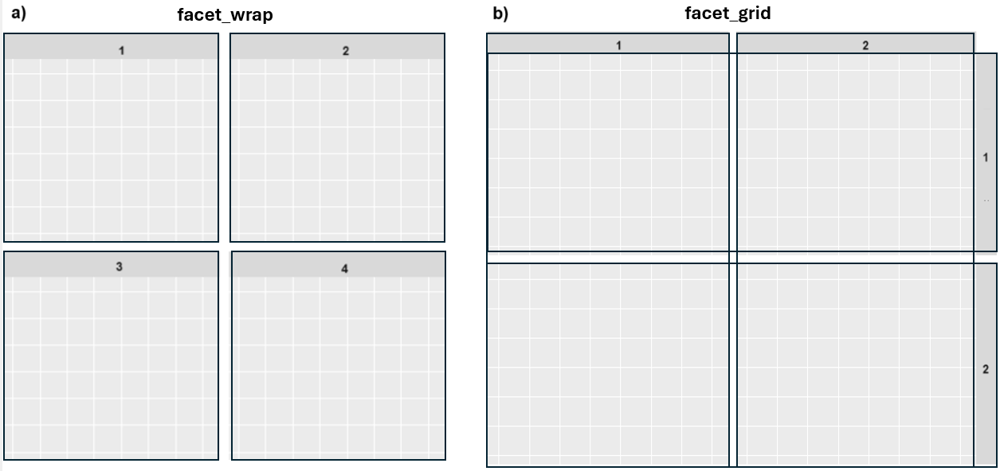{#fig-facet width="85%"}


### `facet_wrap()`

Panels are placed next to each other, wrapping based on a specified number of columns or rows. By default, each panel's facet label is displayed in a strip at the top of the plot.


***Example***

```{r}
#| message: false
#| warning: false
#| fig-height: 12
#| fig-width: 8
#| label: fig-wrap
#| fig-align: center
#| fig-cap: Side-by-side alignment of panels.


ggplot(dat, aes(x = gdp_capita, y = cases_per_100k)) +
  geom_point(size = 1.5, color = "deeppink", alpha = 0.7) +
  geom_text_repel(aes(label = country), seed = 42, box.padding = 0.1, 
                  color = "black", size = 2.5) +
  scale_y_continuous(trans = "log10") +
  theme_bw() +
  facet_wrap(~region, ncol=2)
```

By using `facet_wrap(~region, ncol=2)`, the plot in @fig-wrap is split into panels based on the `region` variable. The panels are arranged into two columns for better visualization. This allows for easy comparison of the association between `gdp_capita` and `cases_per_100k` across different regions.


### `facet_grid()`

The `facet_grid()` function arranges panels in a grid layout, with rows and columns determined by the levels of two categorical variables. For example, in FIGURE @fig-grid, the plot is split into a grid of panels based on the combination of `region` and `income` categories. This enables a more detailed exploration of the association between `tests_per_capita` and `cases_per_100k` across different regions and income levels simultaneously.

```{r}
#| message: false
#| warning: false
#| fig-height: 10
#| fig-width: 8
#| label: fig-grid
#| fig-align: center
#| fig-cap: Grid arrangement of panels based on the levels of two factor variables.

ggplot(dat, aes(x = tests_per_capita, y = cases_per_100k)) +
  geom_point(size = 1.5, color = "deeppink", alpha = 0.7) +
  geom_text_repel(aes(label = country), seed = 42, box.padding = 0.1, 
                  color = "gray30", segment.size = 0.2, size = 2.5) +
  scale_y_continuous(trans = "log10") + 
  facet_grid(region~income) +
  theme(strip.background = element_blank(), strip.text.y = element_text(angle = 0))
```


