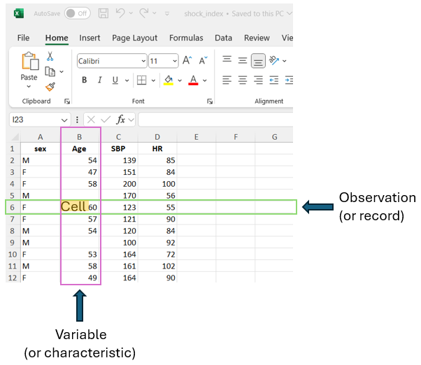
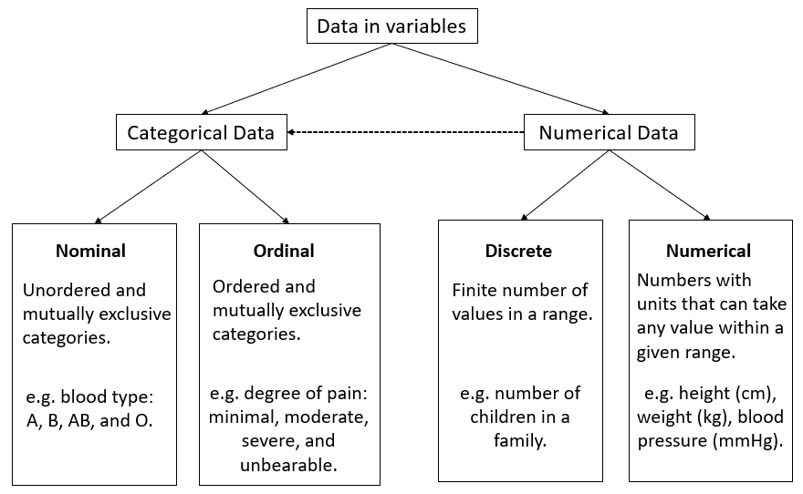

# Introduction to Statistics {#sec-intro}

```{r setup_intro, include=FALSE}

knitr::opts_chunk$set(fig.pos = 'H')
```

In this chapter, we introduce essential statistical concepts, highlighting key distinctions between descriptive and inferential statistics, structured and unstructured data, qualitative and quantitative data, and independent and dependent variables. A solid understanding of these concepts will enhance our ability to apply statistical methods effectively.

 

## The discipline of Statistics

Statistics is an applied mathematical science that, according to Croxton and Cowden, can be defined as “the science of collection, presentation, analysis, and interpretation of numerical data” [@croxton1939].

The field of statistics includes different theoretical frameworks such as **traditional** (frequentist) statistics and **Bayesian** statistics. In this textbook, we will cover classical parametric and nonparametric statistical tests of traditional statistics.

Relying heavily on probability theory and empirical methods, statistics aims to describe and summarize data, as well as to draw inferences about the populations from which the data are derived. Accordingly, the discipline of traditional (frequentist) statistics is typically divided into two main branches (@fig-statisticsdiscipline):


-   **Descriptive statistics**, which include measures of frequency (e.g., percentages), measures of central tendency or location (e.g., the sample mean), and measures of dispersion (e.g., the sample standard deviation). They also describe the shape of data distributions, through metrics such as skewness and kurtosis.


-   **Inferential statistics**, aim to draw conclusions about a population based on data collected from a sample. This branch includes methodologies such as estimation and hypothesis testing.


In a research study, both descriptive and inferential statistics are commonly used. First, researchers present descriptive statistics (e.g., demographic data, baseline characteristics) to provide a clear snapshot of the sample. Then, inferential statistics are applied to test hypotheses and draw conclusions about the broader population from which the sample was drawn.


```{mermaid}
%%| label: fig-statisticsdiscipline
%%| fig-width: 9
%%| fig-cap: The discipline of traditional statistics is divided into two main branches$:$ descriptive statistics and inferential statistics.

flowchart LR
  
    A[Traditional <br/> Statistics]--- B[Descriptive statistics]
    A --- C[Inferential statistics]
    B --- D[Measures of frequency: <br/> e.g., frequency, percentage.]
    B --- E[Measures of location <br/> and dispersion: <br/> e.g., mean, standard deviation.]
    C --- H[Estimation]
    C --- I[Hypothesis Testing]
    style A color:#980000, stroke:#333,stroke-width:4px
    
```


## Data and variables

### Biomedical data

**Biomedical data** have unique features compared with data in other domains. The data may include administrative health data, biomarker data, biometric data (e.g., data from wearable technologies) and imaging, and may originate from many different sources, including Electronic Health Records (EHRs), surveillance systems, clinical registries, biobanks, the internet (e.g. data from social media) and patient self-reports (e.g., questionnaires). Biomedical data can be transformed into **information**, which becomes **knowledge** when the researchers and clinicians understand it.

There are three main levels of structure in data: structured, semi-structured, and unstructured.

-   **Structured data:** This type of data is highly organized, and stored in formats that allow for easy searching, processing, and analysis. Examples include data in relational databases (RDB), spreadsheets, and CSV files.

-   **Semi-Structured data:** Although it does not follow a strict tabular format, semi-structured data contains some organizational properties. For example, emails are semi-structured as they include metadata such as sender, recipient, subject, date, and time, and are typically organized into folders like Inbox, Sent, and Trash.

-   **Unstructured data:** This type of data lacks any predefined structure and includes formats like text (e.g., social media posts, text from books), images, and videos. In recent years, artificial intelligence (AI) techniques, such as natural language processing (NLP), computer vision, machine learning (ML), and deep learning architectures, have been increasingly used to extract valuable insights from unstructured data.


In this textbook, we use structured data in Excel sheets ([@fig-excelsheet]; see also @sec-rtransformations). This type of data is organized in a tabular format, consisting of rows and columns. Each row represents an observation or record, indicating the statistical unit of the dataset. The columns correspond to the variables or characteristics of interest in the research study. The cells, at the intersection of rows and columns, contain individual data values corresponding to the specific observation and variable.


{#fig-excelsheet width="70%"}


### Variables

A **variable** is a characteristic or quantity that can be observed or measured and is **free to vary**, meaning it can take on different values^[In social sciences, these are commonly called observed or measurement variables, as they can be observed or measured directly. In contrast, latent variables are abstract constructs that cannot be measured directly but are inferred from patterns among observed variables.]. Researchers design studies to test whether changes to one or more variables are associated with changes in another variable of interest.

For example, if researchers hypothesize that a new treatment is more effective than the usual care for migraine pain, they could design a study to test this hypothesis. Participants would be randomly assigned to one of two groups: the experimental group, which receives the new treatment aimed at reducing migraine pain, and the control group, which receives the usual care.

In this example, the type of treatment each participant received (i.e., the new treatment vs. usual care) is the **independent** variable, as it is the variable that the researchers manipulate. The **dependent** variable, or the outcome variable, is the pain relief, as it reflects the effect or outcome that the researchers measure to determine whether the intervention has an impact on reducing migraine pain.


::: content-box-purple
**IMPORTANT**

-\   An **independent** variable is the variable that is changed or controlled in a research study to examine its effect on another variable, which represents the outcome being measured.


-\   A **dependent** variable is the variable that is measured and assessed in a research study, influenced by the independent variable(s) being studied. It represents the outcome of the study.
:::

 

## Types of data

Data in variables can be either **categorical** or **numerical** (otherwise known as qualitative and quantitative) in nature ([@fig-typesofdata]):


{#fig-typesofdata width="85%"}


::: content-box-purple
**NOTE**

The **type of data** in variables is an important factor in determining the most appropriate **statistical analysis** of the data.
:::

 

### Categorical data

**A. Nominal data**

Nominal data consist of distinct, unordered categories that are labeled but not measured—only **counted**. This means we can record the frequency with which items fall into each category. These categories can be binary, such as alive or dead, cured or not cured, or they can have **multiple categories**, such as blood group (A, B, AB, O), type of diabetes (type I, type II, or gestational diabetes), and eye color (e.g., brown, blue, green, gray).

These categories are often encoded numerically, for example, health status as 0 for alive and 1 for dead, and blood type as 1, 2, 3, and 4 for A, B, AB, and O, respectively. Unlike true numerical data, these codes are simply labels without inherent mathematical meaning. However, they can represent the outcomes of a discrete random variable, allowing us to assign probabilities—a topic we’ll revisit in @sec-distributions.

**B. Ordinal data**

When categories follow a meaningful order, the data are considered ordinal. For example, patients may rate their pain as minimal, moderate, severe, or unbearable. These categories follow a natural progression—moderate pain is more intense than minimal, but less than severe. Another common example of ordinal data is the **Likert scale**, where respondents rate their level of agreement with a statement on an ranked scale. A typical version ranges from 1 (strongly disagree) to 5 (strongly agree), with intermediate options such as 2 (disagree), 3 (neutral), and 4 (agree). Although the responses follow a clear order, the intervals between them are not assumed to be equal.


::: content-box-purple
**IMPORTANT**

-\ Ordinal data with multiple categories are often converted into binary data to simplify analysis, presentation, and interpretation; however, this process may lead to a **loss of information**.

-\ Although the **Likert scale** consists of ordered categories, its levels are often treated as integers—particularly in psychological measurement instruments—enabling researchers to sum responses and calculate total scores for participants.
:::

 

### Numerical data

**A. Discrete data**

Discrete data can take only a **finite number of values** (usually integers) within a range, such as the number of children in a family or the count of white blood cells in a blood sample. Other common examples include **counts per unit of time**, such as the number of deaths in a hospital per year, the number of visits to a general practitioner annually, or the number of epileptic seizures a patient experiences each month. In dentistry, a frequently used measure is the number of decayed, filled, or missing teeth.

In practice, discrete data are often treated as ordinal data, especially when the number of possible values is small. While this approach can simplify analysis, it may not fully optimize the information contained in the data.


**B. Continuous data**

Continuous data\index{continuous data} are numbers (usually with units) that can theoretically take any value within a given range. Height, weight, blood pressure, body temperature, and cholesterol level are just few examples of variables that can take continuous values. However, in practice, these variables are measured in a discrete manner, constrained by the precision of measuring instruments and the specific objectives of the study. For example, while height can be measured to several decimal places, it is typically recorded as a discrete value in medicine. A person may measure 172.345 cm tall, but this would usually be recorded as 172 cm.


::: content-box-purple
**IMPORTANT**

Continuous data are often categorized to create categorical variables. For example, body mass index (BMI)—a continuous variable that measures weight relative to height—is typically converted into an ordinal variable with four categories: underweight, normal weight, overweight, and obese.
It is important to note that this transformation is irreversible; without access to the original data, a categorical variable cannot be accurately converted back into a continuous one. Consequently, dividing continuous variables into categories results in a considerable loss of information.
:::

