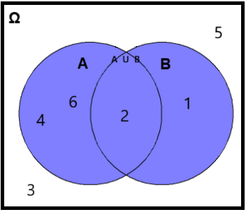
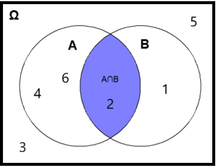
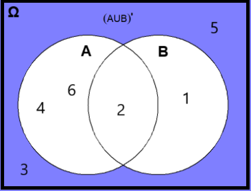
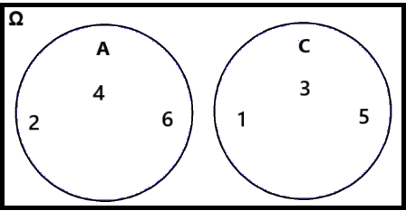
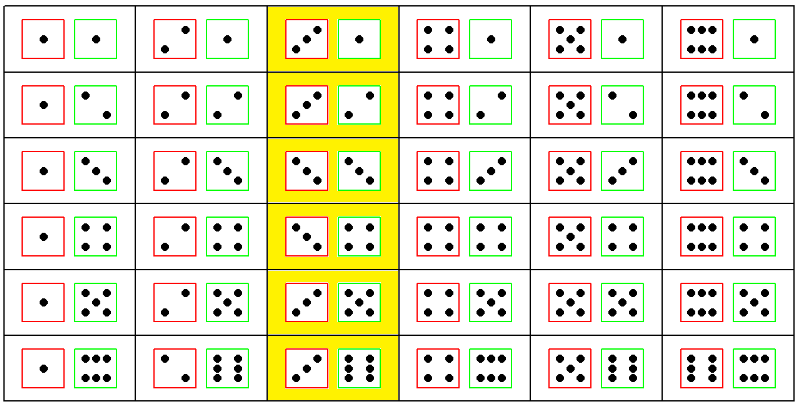
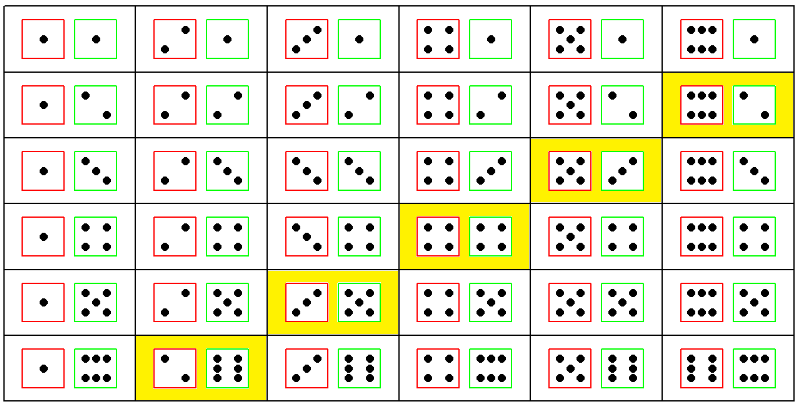
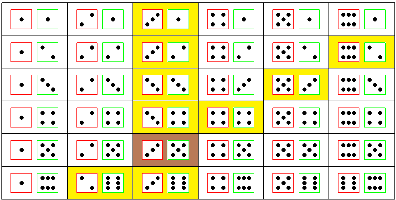
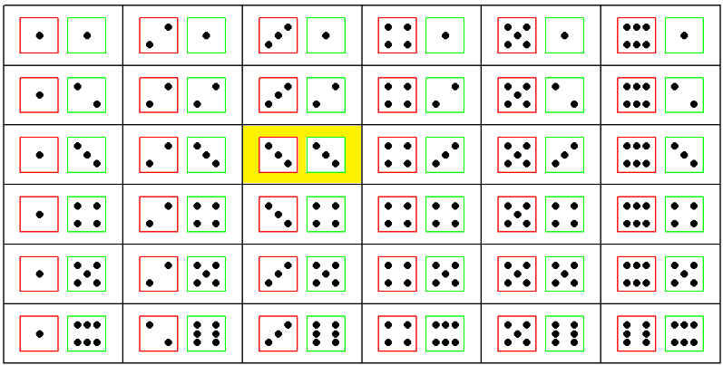

# Basic Concepts of Probability {#sec-probability}

```{r setup_probability, include=FALSE}

knitr::opts_chunk$set(fig.pos = 'H')
```

The foundation of statistical inference is primarily grounded in probability theory. In this chapter, we begin by defining sample space and random events, then explore operations on events using set theory and Venn diagrams. We also cover the definitions of probability, conditional probability, and Bayes' theorem.

```{r}
#| message: false
#| warning: false

# Required packages for this chapter
library(tidydice)     
library(ggplot2)     
```

 

## Sample Space and Random Events

Both deterministic and stochastic phenomena drive the everyday life.

-   A **deterministic** phenomenon (process or experiment) always produce the same outcome each time it is repeated under the same conditions.

-   A **random** phenomenon (process or experiment) is characterized by conditions under which the result cannot be determined with certainty before it occurs, that is, one of several possible outcomes is observed each time the process or experiment is repeated. For example, when a coin is tossed, the outcome is either heads H or tails T, but unknown before the coin is tossed.

The **sample space Ω** is defined as the set of **all** possible outcomes of a random experiment. For example, if we roll a six-sided die, the sample space is the set of the six possible outcomes, Ω ={1, 2, 3, 4, 5, 6}.

```{r, out.width='25%', fig.align = 'center', echo=FALSE}


```

Different random experiments have different sample spaces that can be denoted in an equivalent way (flipping a coin: Ω ={H, T}, flipping two coins: Ω ={HH, HT, TH, TT}, testing for possible genotypes of a bi-allelic gene A: Ω ={AA, Aa, aa}).

A **random event** (henceforth called event) is denoted by a capital letter such as A, B, or C and is a sub-set of sample space Ω, including a number of possible outcomes of the experiment. For example, in the case of rolling a die, the event "even number" may be represented by A = {2, 4, 6}, which is a subset of Ω (A$⊂$Ω), and the event "odd number" by B = {1, 3, 5}, which is also a subset of Ω (B$⊂$Ω). In the case of flipping two coins, an event could be that "exactly one of the coins lands heads", A = {HT, TH} or the event could be that "at least one of the coins lands heads", B = {HH, HT, TH}.

If an event consists of a single outcome from the sample space, it is termed a **simple event**. For example, the event of getting the number 1 on rolling a die, denoted as A = {1}. If an event consists of more than a single outcome from the sample space, it is called a **compound event** such as rolling a die and getting an even number, A = {2, 4, 6}.

::: content-box-gray
**IMPORTANT**

For each experiment, two events always exist:

1.  the **sample space**, Ω, which comprises all possible outcomes.
2.  the **empty set =** $\varnothing$, that contains no outcomes and it is called the impossible event.\
:::

 

## Operations of Events Using Set Theory and Venn Diagrams

### Union of Events: A$∪$B

The union of the events A and B, denoted by A$∪$B, is the collection of all outcomes that are in A or in B or in both of them and it is also an event. It will occur if either A or B occurs (the symbol $∪$ is equivalent to **OR** operator).

#### Example

In the experiment of rolling a die, let's consider the events **A** = "the number rolled is even" and **B** = "the number rolled is less than three". Which outcomes correspond to the event that at least one of A or B is true? @fig-unionAB displays the union of these events.

```{r}
A <- c(2, 4, 6)      # A = {2, 4, 6}
B <- c(1, 2)         # B = {1, 2}
union(A, B)          # AUB = {2, 4, 6, 1} 
```

{#fig-unionAB width="35%"}

### Intersection of Events: A$∩$B

The intersection of A and B, denoted by A$∩$B, consists of all outcomes that are in both A and B (the symbol $∩$ is equivalent to **AND** operator). That is, the events A and B must occur simultaneously (@fig-intersectionAB).

#### Example

```{r}
# A = {2, 4, 6}
# B = {1, 2}
intersect(A, B)
```

{#fig-intersectionAB width="35%"}

### Complement Events

As an example, consider the complement of the union of events A and B, denoted by $(A∪B)'$ or $(A∪B)^c$. This complement is also an event and consists of all outcomes of the sample space Ω that do not belong to A$∪$B (@fig-complement).

#### Example

```{r}
# A = {2, 4, 6}
# B = {1, 2}
AUB <- union(A, B)                     # AUB = {2, 4, 6, 1} 
sample_space <- c(1, 2, 3, 4, 5, 6)    # sample_space = {1, 2, 3, 4, 5, 6}
setdiff(sample_space, AUB)
```

{#fig-complement width="35%"}

### Mutually Exclusive Events (Disjoint Events)

Let's consider the events A = "the number rolled is even" and C = "the number rolled is odd". The events A and C are mutually exclusive\index{mutually exclusive events} (also known as incompatible\index{incompatible events} or disjoint\index{disjoint events}) if they **cannot** occur simultaneously. This means that they do not share any outcomes and $A∩C =∅$ (@fig-empty).

#### Example

```{r}
A <- c(2, 4, 6)      
C <- c(1, 3, 5)         
intersect(A, C)         
```

{#fig-empty width="45%"}

 

## Probability Definitions and Properties

The concept of probability is used in everyday life which stands for the likelihood of occurring or non-occurring of random events. The first step towards determining the probability of an event is to establish a number of **basic rules** that capture the meaning of probability. The probability of an event should fulfill three **axioms** defined by **Kolmogorov**:

::: content-box-gray
**The Kolmogorov Axioms**

1.  The probability of an event A is a non-negative number, $P(A) ≥ 0$.
2.  The probability of all possible outcomes, or sample space Ω, equals one, $P(Ω) = 1$.
3.  If A and B are mutually exclusive (disjoint) events, meaning $A ∩ B = ∅$, then $P(A ∩ B) = 0$. As a result, the probability of their union is $P(A ∪ B) = P(A) + P(B)$.
:::

 

### Definitions of Probability

There is no other concept in mathematics that is defined in so many distinct and divergent ways as probability [@finetti2008].


#### *Theoretical Probability (Theoretical Approach)*

Theoretical probability describes the behavior we expect to happen if we give a precise description of the experiment (but without conducting any experiments). Theoretically, we can list out all the **equally probable** outcomes of an experiment, and determine how many of them are favorable for the event A to occur. Then, the probability of an event A to occur is defined as:

$$
P(A) = \frac{\textrm{Number of outcomes favourable to the event A}}{\textrm{Total number of possible outcomes}}
$$ {#eq-theoreticalprobability}

Note that the @eq-theoreticalprobability only works for experiments that are considered **"fair"**; this means that there must be no bias involved so that all outcomes are **equally likely** to occur.

##### Example 1

What is the theoretical probability of rolling {width="13" height="13"} when we roll a six-sided fair die once?

The theoretical probability is:

$$P(\textrm{rolling 5}) = \frac{\textrm{1 outcome favourable to the event}}{\textrm{6 possible outcomes}} = \frac{1}{6} \approx 0.167$$

This is because only one outcome (die showing {width="13" height="13"} ) is favorable out of the six equally likely outcomes.

 

##### Example 2

What is the probability of rolling either {width="13" height="13"} or {width="12" height="12"} when we roll a six-sided fair die once?

The theoretical probability is:

$$P(\textrm{rolling 5 OR 6}) = \frac{\textrm{2 outcomes favourable to the event}}{\textrm{6 possible outcomes}} = \frac{2}{6} = \frac{1}{3}\approx 0.33$$

This is because two outcomes (die showing {width="12" height="12"} or {width="13" height="13"} ) are favorable out of the six equally likely outcomes.

We can also use the probability's axioms. The probability of rolling a 6 is 1/6 and the probability of rolling a 5 is also 1/6. We cannot take a 5 and 6 at the same time (these events are mutually exclusive) so:

$$\textrm{P(rolling a 5 OR 6) = P(rolling a 5) + P(rolling a 6) = 1/6 + 1/6 = 2/6 = 1/3}$$  

#### *Experimental Probability (Frequentist Approach)*

The experimental probability\index{experimental probability} is based on data collected from repeated trials of the same random experiment, such as tossing a coin or rolling a die. According to this approach, the probability of an event A, denoted by P(A), is the **relative frequency** of occurrence of the event over a total number of experiments:

$$
P(A) \approx  \frac{\textrm{number of times A occured}}{\textrm{total number of experiments}}
$$ {#eq-probability}


##### Example

We rolled a six-sided die 100 times and we recorded how often each outcome occurred (@fig-die100). What is the experimental probability of getting {width="12" height="12"} ?

```{r}
#| message: false
#| warning: false
#| out-width: "65%"
#| label: fig-die100
#| fig-align: center
#| fig-cap: Bar plot showing the counts for each outcome from 100 rolls of a six-sided die.

set.seed(348)
roll_dice(times = 100) |>  
  ggplot(aes(x = result)) +
  geom_bar(fill = "gray60", width = 0.65) +
  geom_text(aes(label=after_stat(count)), stat = "count", 
            size = 3.5, vjust = 1.5, color = "white") +
  scale_x_continuous(breaks = c(1:6), labels = factor(1:6)) +
  labs(x = "Outcome") +
  theme_minimal(base_size = 14)
```

The experimental probability is:

$$ P(\textrm{rolling a 5}) =\frac{\textrm{20 times the number “5” occured}}{\textrm{100 experiments}}=  \frac{20}{100} = 0.20\ or\ 20\%$$

In 20% of the cases, we got a {width="13" height="13"} that is greater than the expected value of $100/6 \approx 16.67\%$.

However, if the die is rolled numerous times, for example 10000 times, the experimental probability should approximate the theoretical probability of that outcome (**Law of Large Numbers**), as shown in @fig-die1000:

```{r}
#| message: false
#| warning: false
#| out-width: "65%"
#| label: fig-die1000
#| fig-align: center
#| fig-cap: Bar plot showing the counts for each outcome from 10000 rolls of a six-sided die.


set.seed(128)
roll_dice(times = 10000) |>  
  ggplot(aes(x = result)) +
  geom_bar(fill = "gray60", width = 0.65) +
  geom_text(aes(label=after_stat(count)), stat = "count", 
            size = 3.5, vjust = 1.5, color = "white") +
  scale_x_continuous(breaks = c(1:6), labels = factor(1:6)) +
  labs(x = "Outcome") +
  theme_minimal(base_size = 14)
```

Now, the experimental probability is:

$$P(\textrm{rolling a 5}) =\frac{\textrm{1684 times the number “5” occured}}{\textrm{ 10000 experiments}}=  \frac{1684}{10000} = 0.1684\ or\ 16.84\%$$

that is very close to the theoretical probability 16.67%.

::: content-box-gray
**Law of Large Numbers**

The **more times** the experiment is performed, the **closer** the experimental probability approaches the theoretical probability.
:::

 

#### *Subjective Probability (Bayesian Approach)*

The probability assigned to an event represents the **degree of belief** that the event will occur in a given try of the experiment, and it implies an element of subjectivity.

##### Example

In the die roll experiment, if one’s subjective belief is that the die is unbiased, one assigns equal credence to each of the six possible outcomes {width="13" height="13"} , {width="13" height="13"} , {width="13" height="13"}, ,{width="13" height="13"}, {width="13" height="13"}, {width="13" height="13"}. The quantitative expression of the degree of belief— a coherent probability assignment consistent with the Kolmogorov axioms— is P(1) = P(2) = P(3) = P(4) = P(5) = P(6) = 1/6. However, if one has information or a reason to believe that the die is biased—for example, favoring the number six— then one’s credences should change accordingly. A coherent probability assignment would then give a higher probability to rolling a six (i.e., P(6) > 1/6), while still satisfying the axioms of probability.


 

The following **properties** are useful to assign and manipulate event probabilities.

::: content-box-gray
**Fundamental Properties of Probability**

1.  The probability of the null event is zero, $P(∅) = 0$.
2.  The probability of the complement event A satisfies the property:
$$
P(A') = 1 − P(A)
$$ {#eq-complement}
3.  (Addition Rule of Probability) The probability of the union of two events satisfies the general property that:
$$
P(A ∪ B) = P(A) + P(B) − P(A ∩ B)
$$ {#eq-addrule}
:::

 

### The Conditional Probability

Conditional probability, denoted as **P(A\|B)** (i.e., the probability of A **given** B), represents the probability of event A occurring given that event B has already occurred. The following formula defines the conditional probability:

$$
 P(A|B)=  \frac{P(A∩B)}{P(B)}, \quad P(B) > 0
$$ {#eq-conditional2}

It is important to note that by conditioning on event B, we modify the sample space to include only the outcomes where event B occurs.

Using this definition, we can express the probability that both A and B occurring in terms of conditional probability as follows:

$$
P(A ∩ B) = P(A|B)·P(B)
$$ {#eq-conditional}

This is known as the **multiplication rule of probability**.

##### Example

Suppose we roll two fair six-sided dice. What is the probability that the first die is a 3, given that the sum of two dice is 8?

The sample space of the experiment consists of all ordered pairs of numbers from 1 to 6. That is, Ω = {(1, 1), (1, 2), ... , (1, 6), (2, 1), ... , (6, 6)}. It is useful to define the following two events:

-   **A** = {The first die shows {width="13" height="13"}, and the second any number}.

-   **B** = {The sum of two dice is 8}.

We are interested in finding the conditional probability: $$P(A|B) = \frac{P(A∩B)}{P(B)}$$

-   **Event A** (the first die shows 3, and the second any number) is given by outcomes A = {(3,1), (3,2), (3,3), (3,4), (3,5), (3, 6)}.

```{r, out.width='55%', fig.align = 'center', echo=FALSE}


```

Therefore, the probability of event A is:

$$P(A) = \frac{6}{36} =\frac{1}{6}$$

-   **Event B** (the sum of two dice is 8) is given by outcomes B = {(2,6), (3,5), (4,4), (5,3), (6,2)}.

```{r, out.width='55%', fig.align = 'center', echo=FALSE}


```

Therefore, the probability of event B to occur is:

$$P(B) = \frac{5}{36}$$

-   Also, the event A$∩$B occurs if the first die shows 3 and the sum of dice is 8, which can clearly occur only if a sequence of **(3,5)** takes place:

```{r, out.width='55%', fig.align = 'center', echo=FALSE}


```

Thus, the joint probability (i.e., the probability of two events occurring together) is:

$$P(A∩B) = \frac{1}{36}$$

-   Finally, according to the definition of conditional probability @eq-conditional2, the probability of interest is calculated as follows:

$$P(A|B) = \frac{P(A ∩ B)}{P(B)} = \frac{\frac{1}{36}}{\frac{5}{36}} = \frac{1}{5}$$

Therefore, the "knowledge" that the sum of two dice is 8 has **updated** the probability of A from P(A) = 1/6 = 0.167 to P(A\|B) = 1/5 = 0.2.

 

### Bayes' Theorem

Bayes' theorem\index{Bayes' theorem} provides a way to express $P(A|B)$ in terms of $P(B|A)$, while incorporating prior knowledge.

The multiplication rule (@eq-conditional) states that $P(A∩B) = P(A|B)·P(B)$. Since $P(A∩B)$ represents the probability of both events A and B occurring, we can also express it as $P(A∩B) = P(Β∩Α) = P(B|A) · P(A)$.

Now, substituting $P(A∩B)$ with $P(B|A) · P(A)$ in @eq-conditional2, we derive the **Bayes' theorem**:

$$
P(A|B) = \frac{P(B|A)·P(A)}{P(B)}
$$ {#eq-bayes}

where $P(B)\neq 0$.

##### Example

We are interested in calculating the probability of developing lung cancer if a person smokes tobacco for a long time, P(Cancer\|Smoker).

Suppose that 8% of the population has lung cancer, P(Cancer) = 0.08, and 30% of the population are chronic smokers, P(Smoker) = 0.30. Also, suppose that we know that 60% of all people who have lung cancer are smokers, P(Smoker\|Cancer) = 0.6.

Using the Bayes' theorem we have:

$$ \textrm{P(Cancer|Smoker) = }\frac{\textrm{P(Smoker|Cancer)· P(Cancer)}}{\textrm{P(Smoker)}} = \frac{0.6 \times 0.08}{0.3}= \frac{0.048}{0.3}= 0.16$$

 

### Independence of Events

If the occurrence of an event **does not influence** the occurrence of another, the two events are said to be independent. For example, when rolling two dice, the outcome of the first die is independent of the outcome of the second die.

When events A and B are independent, the conditional probability of A given B equals the probability of A: P(A\|B) = P(A). This means that the occurrence of event B does not affect the probability of event A. Similarly, P(B\|A) = P(B), indicating that the occurrence of event A has no effect on the probability of event B.

Two events, A and B, are **statistically independent** if and only if their joint probability equals the product of their individual probabilities:

$$
P(A ∩ B) = P(A)·P(B)
$$ {#eq-independent}

This is a special case of the multiplication rule of probability, derived from @eq-conditional when the events are independent.

##### Example

Determine the probability of obtaining two 3s when rolling two six-sided fair dice.

-   Let A represent the event of getting a 3 on the first die: **A** = {die 1 shows {width="13" height="13"} }. The probability of event A is:

$$P(A) = \frac{1}{6}$$

-   Let B represent the event of getting a 3 on the second die: **B** = {die 2 shows {width="13" height="13"} }. The probability of event B is:

$$P(B) = \frac{1}{6}$$

Since the outcome of one die does not affect the other (i.e., the rolls of the dice are independent events), we can calculate the probability of both events occurring, $P(A∩B)$, using the multiplication rule for independent events (@eq-independent):

$$P(A \cap B) = P(A)·P(B) = \frac{1}{6}·\frac{1}{6} = \frac{1}{36}$$

This result can be verified by directly counting all possible outcomes when rolling two dice. As shown below, out of the 36 possible outcomes, only one combination results in both dice showing 3s.

```{r, out.width='55%', fig.align = 'center', echo=FALSE}


```
