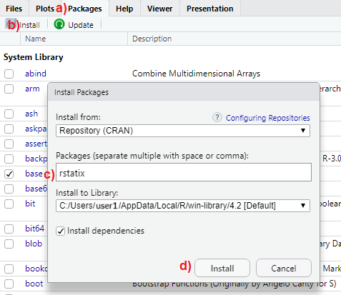

# R packages {#sec-rpackages}

```{r setup_rpackages, include=FALSE}

options(width=85)
knitr::opts_chunk$set(fig.pos = 'H')
```

In this chapter, we explore one of R’s most powerful features: packages.
We examine how they expand R’s functionality and provide practical guidance on their installation and use. Special emphasis is placed on the ***tidyverse*** package, renowned for its efficient approach to data manipulation, transformation, and visualization

 

## What are R packages?

### Standard (base) R packages

During the installation process, R automatically installs a set of **standard (base) packages**. These packages are stored in the *library* folder of the R program and contain essential functions required for R to operate, as well as various statistical and graphical functions for basic data analysis.

### Add-on packages

Additional packages can be installed to the User's R library and loaded into the R session whenever needed for specific purposes. These **add-on R packages** are created by a worldwide active community of developers and R users, covering a broad range of applications. Most of these packages are available for free and can be downloaded from various online repositories.

A **repository** is a centralized storage location where software packages, code, and other digital resources are stored, made available for users to access and download, and often allow for contributions. Some of the most popular repositories for R packages, are:

-   **CRAN:** Comprehensive R Archive Network(CRAN) is the official R repository.

-   **Github:** Github is the most popular repository for open source projects.

-   **Bioconductor:** Bioconductor is a topic-specific repository, intended for open source software for bioinformatics.


::: content-box-white
**INFO**

**Add-on R packages** extend the functionality of R by providing additional collections of R functions, sample data, and documentation for the included functions in a well-defined format.    
:::

 

To **use** an add-on package we need to:

1.  **Install the package from a repository**. Once we've installed a package, we don't need to install it again unless we want to update it.

2.  **Load the package in R session**. Add-on packages are not loaded by default when we start an R session in RStudio. Each add-on package needs to be loaded explicitly **every time** we open RStudio.

For example, among the many add-on packages, this textbook will use the **_dplyr_** package for data manipulation and transformation, the **_ggplot2_** package for data visualization and the **_rstatix_** package for statistical tests. Below, we demonstrate how to perform these steps using the **_rstatix_** package as an example.


## Package installation

### Installing packages from CRAN using RStudio IDE

The **_rstatix_** package is available in the CRAN repository. To install it, follow the steps illustrated in [@fig-installation]:

a\)  In the multifunctional pane of RStudio, activate the "Packages" tab.

b\)  Click on "Install".

c\)  Type **_rstatix_** in the box under "Packages" (*NOTE: separate multiple package names with space or comma*).

d\)  Click "Install" to begin the installation process.

 

{#fig-installation width="60%"}


### Installing packages from CRAN using commands

Type the following command into the RStudio Console to install the **_rstatix_** package from **CRAN**, then press `Enter`:

```{r, eval=FALSE}

install.packages("rstatix")
```

Note that we must include the **quotation marks** around the name of the package. To install **multiple** packages at once, we simply use the **`install.packages()`** function as follows:

```{r, eval=FALSE}

install.packages(c("rstatix", "dplyr", "ggplot2"))
```

We only need to install a package **once**. However, to update an installed package to a newer version, we must reinstall it using the same command.


### Installing packages from other repositories

Suppose we want to download the **development** version of the [**_rstatix_**](https://github.com/kassambara/rstatix) package from **GitHub**. The first step is to install and load the **_devtools_** package, available on CRAN (see the next section for an explanation of what "load" means). On Windows, if we encounter any errors, we may need to install the [**Rtools**](https://cran.r-project.org/bin/windows/Rtools/) program. It's important to note that Rtools is not an R package, but rather a separate software tool for building R packages from source.

Then we can use the **`install_github()`** function to install the R package from GitHub.

```{r, eval=FALSE}
if(!require(devtools)) install.packages("devtools")
library(devtools)   # load the devtools package
install_github("kassambara/rstatix")  # install devtools package from GitHub
```


If we need to install an **earlier** version of a package, the simplest approach is to use the **`install_version()`** function from the **_devtools_** package to install the desired version.


## Package loading

After installing a package, we need to **load it** into the current R session using the **`library()`** command (note that the quotation marks are not necessary when loading a package). For example, 
to access all the functions and datasets within the **_rstatix_** package, we run the following code in the Console pane:

```{r, eval=FALSE}

library(rstatix)
```


::: content-box-white
**INFO**

There is often confusion between the terms "packages" and "libraries". In R, "packages" are bundled collections of functions, datasets, and documentation designed for specific tasks. In contrast, "libraries" refer to locations on the filesystem where installed packages are stored. When we use the **library()** function, R searches these directories (library paths) and loads the specified package or packages into the current session.
:::

 

A blinking cursor next to the `>` prompt in the Console indicates that the package, such as **_rstatix_**, has been successfully installed and is ready for use. If the installation fails, an error message will be displayed, as shown below:

`r kableExtra::text_spec("Error in library(rstatix) : there is no package called ‘rstatix’", color = "#8676F8")`

In this case, it's important to carefully review the installation process, ensuring the package name is correct and there are no connectivity issues preventing the download from the repository.

 

It is important to note that attempting to use a function from **_rstatix_** package, such as **`t_test()`**, without first loading the package in the R session will result in the following error:

`r kableExtra::text_spec("Error in ... : could not find function t_test", color = "#8676F8")`

To resolve this error, we simply need to load the **_rstatix_** package into the R session using **`library()`** before calling its functions. This ensures that all functions and resources from the package are available in the R environment.

 

However, in R, it's possible to access functions from specific packages without loading the entire package into the current R session by using the notation **`package::function()`**. For example:

```{r, eval=FALSE}

rstatix::t_test()
```


This approach allows us to access the **`t_test()`** function from **_rstatix_** without loading the entire package. It is especially useful for avoiding namespace conflicts that can occur when multiple packages contain functions with the same names.


## The _tidyverse_ package

Throughout this textbook, we will use the **_tidyverse_** package, a comprehensive suite of R packages designed for data manipulation, transformation, and visualization tasks, all of which work together in harmony.

The command `install.packages("tidyverse")` will **install** the entire **_tidyverse_** collection. This meta-package provides a one‑step shortcut for downloading the following packages:

```{r, echo=FALSE}

tidyverse::tidyverse_packages()
```


However, when we load the **_tidyverse_** package (version 2.0.0 or later) using the command `library(tidyverse)`, R will load only the **nine core packages**: **_dplyr_**, **_forcats_**, **_ggplot2_**, **_lubridate_**, **_purrr_**, **_readr_**, **_stringr_**, **_tibble_**, and **_tidyr_**, making them available in the current R session.

Packages outside the core **_tidyverse_** collection serve more specialized purposes and are not loaded automatically with the `library(tidyverse)` command. Therefore, we need to load each of these packages explicitly using the **`library()`** function if we wish to use them.


## The _here_ package

When working with Projects in RStudio (@sec-rproject), the **_here_** package can be extremely helpful. Its main function, **`here()`**, constructs file paths relative to the top level of the RStudio project each time it is called. This enables easy navigation through subfolders and files within the project using **relative** paths.

We can think of paths as directions to files. There are two types of paths: **absolute paths** and **relative paths**. For example, suppose Emily and Paul are collaborating on a project and need to read an Excel file named `shock_index.xlsx`, stored within a "data" folder on their individual computers. They could access the file in RStudio using either an absolute or a relative path, as shown below:

 

**A. Reading data using an absolute path**

Emily's file is located at "`C:/emily/project/data/shock_index.xlsx`". In R, she would use the following command:

```{r, eval=FALSE}

library(readxl)
dat <- read_excel("C:/emily/project/data/shock_index.xlsx")  
```


 

Paul's file, however, is located at "`C:/paul/project/data/shock_index.xlsx`", and his R command would be:

```{r, eval=FALSE}

library(readxl) 
dat <- read_excel("C:/paul/project/data/shock_index.xlsx")
```

Even though Emily and Paul stored their files in a data folder on their "C" drive, the absolute paths differ because of their different usernames.


 

**B. Reading data using a relative path**

Using a relative path, both Emily and Paul can run the exact same command:

```{r, eval=FALSE}

library(readxl)
library(here)
dat <- read_excel(here("data", "shock_index.xlsx"))
```

Alternatively, the file path can be passed as a single string:

```{r, eval=FALSE}
library(readxl)
library(here)
dat <- read_excel(here("data/shock_index.xlsx"))
```


The **`here()`** function constructs file paths relative to the root of the R project directory. This approach ensures that paths remain consistent across different computer systems, enhancing reproducibility and facilitating code sharing. In this example, the relative path `data/shock_index.xlsx` remains the same for both users.


 

The same result can also be achieved without the **_here_** package when working within an RStudio project:

```{r, eval=FALSE}
library(readxl)
dat <- read_excel("data/shock_index.xlsx")
```

However, using **`here()`** is more robust: it ensures that file paths remain consistent relative to the R project root, improving reproducibility and making the code portable across different environments.


