# RStudio Projects {#sec-rproject}

```{r setup_rproject, include=FALSE}

options(width=85)
knitr::opts_chunk$set(fig.pos = 'H')
```

RStudio Projects offer a powerful way to organize data analysis work. Think of a single folder that contains everything we need, from imported data to final visualizations. This self-contained structure promotes clear project organization and facilitates seamless collaboration with others. In this chapter, we explore how to create, manage, and make the most of RStudio Projects, while also learning how to write and save R code in scripts.

 

## Working with RStudio Projects

One of the advantages of RStudio IDE is that allows us to work with [RStudio Projects](https://support.posit.co/hc/en-us/articles/200526207-Using-RStudio-Projects). The RStudio Projects are recommended for the following main reasons:

-   When working in R, the program needs to know where to find input files (e.g., datasets) and where to save output files (e.g., R scripts, figures). It first looks into the *working directory*. When an R session is initiated through a project file (.Rproj), the *working directory* is automatically set to the project's root folder.

-   RStudio Project is a powerful feature that enables users to organize all their files and switch between different projects and tasks without mixing up datasets, code scripts, or output files.

### Creating an RStudio Project

Let's create our first RStudio Project to use for the rest of this textbook. From the RStudio menu bar ([@fig-project0]) we select:

`File` $\longrightarrow$ `New Project...`

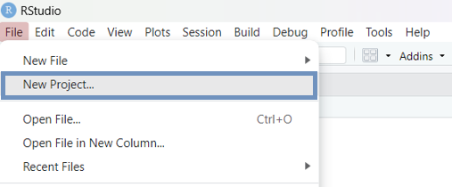{#fig-project0 width="55%"}

 

Alternatively, we can click the plus project icon {width="20" height="18"} in the main RStudio menu, or select `New Project...` from the top-right Project menu ([@fig-project1]):

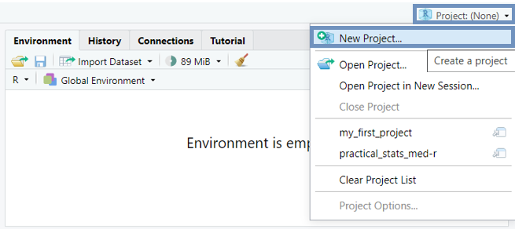{#fig-project1 width="55%"}

Then, we follow the steps in [@fig-step1] - [@fig-step3].

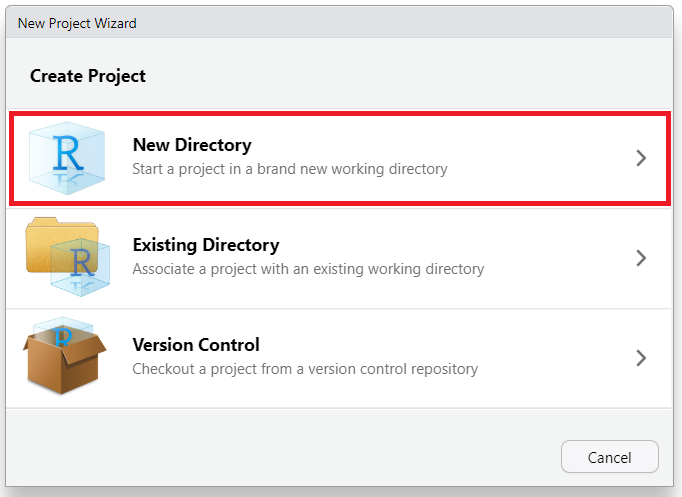{#fig-step1 width="55%"}

 

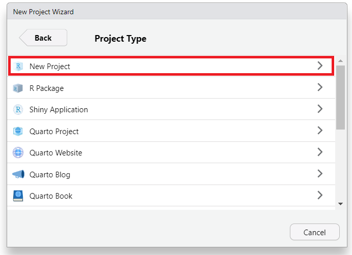{#fig-step2 width="55%"}

 

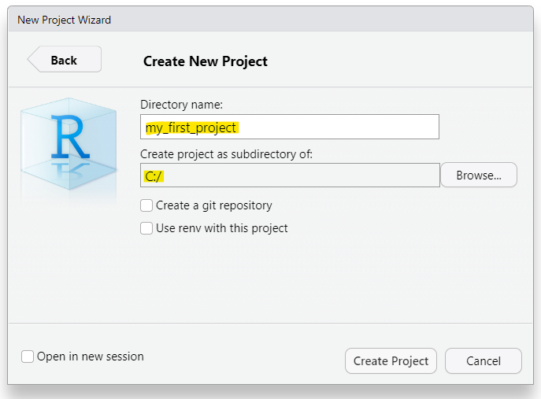{#fig-step3 width="55%"}

 

In Step 3 ([@fig-step3]) the directory name that we type will be the project's name. We call it whatever we want, for example "*my_first_project*".

Once we have completed this process, R session switches to the new RStudio Project with the name "*my_first_project*" ([@fig-top_right_project_name]).

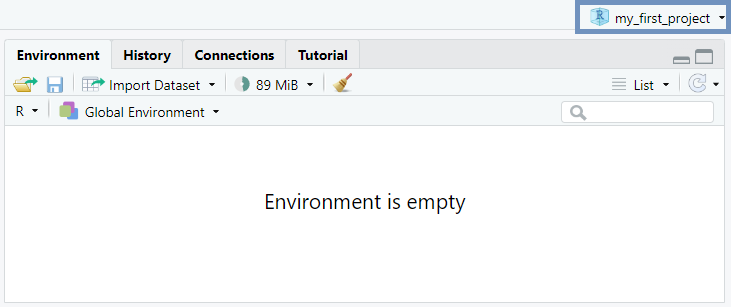{#fig-top_right_project_name width="55%"}

 

### Organizing an RStudio Project folder

An RStudio Project folder can be organized and managed just like the folders and subfolders on a computer. For our purposes, it is sufficient to consider a simple RStudio Project folder structure that contains two subfolders: **data** (for saving data files of any kind, such as `.csv`, `.xlsx`, and `.txt`) and **figures** (for saving plots, diagrams, and other charts), as shown schematically below:

```         
my_first_project/
├── data
└── figures
```

Using the {width="70" height="20"} button in RStudio’s Files pane, we can easily create new subfolders within the main RStudio Project directory. [@fig-folder_data] demonstrates how to create the "data" subfolder.

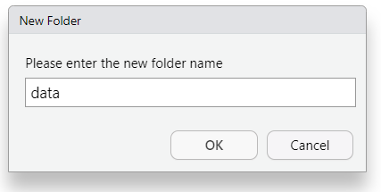{#fig-folder_data width="65%"}

To add the “figures” subfolder, we simply repeat the same steps ([@fig-folder_figures]):

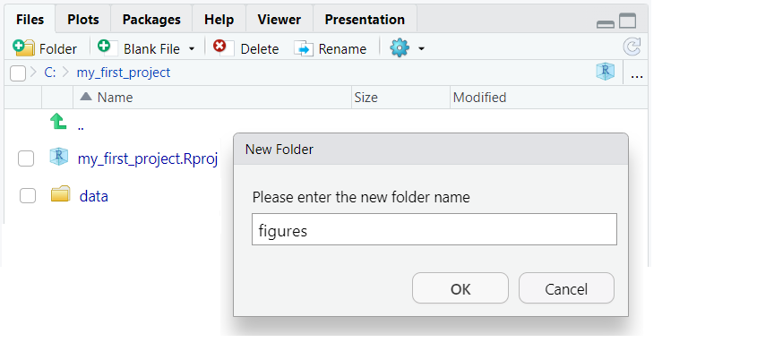{#fig-folder_figures width="65%"}

Therefore, we end up to the following RStudio Project folder structure ([@fig-my_project_str]):

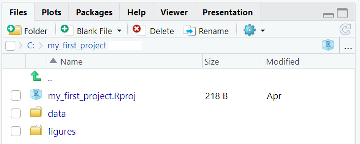{#fig-my_project_str width="65%"}

 

::: content-box-white
**INFO**

The file named $my\_first\_project.Rproj$, which has been created by RStudio automatically in our project folder, contains information of the project and can also be used as a shortcut for opening the project directly from the file system in our computer.
:::

 

## Opening a New R Script

Typically, R code is written in script files denoted by the `.R` extension. An R script is a plain text file containing R code that can be executed in the R console. The use of R script files offers various benefits, including the ability to execute code in chunks rather than individual lines, which enhances code reuse and organization. Furthermore, R script files enable easy documentation through one-line comments prefixed with the hash symbol (`#`), and support efficient code sharing with others.

To open an R script in RStudio ([@fig-open_rscript]), we navigate to the menu bar at the top of the RStudio window and follow these steps:

`File` $\longrightarrow$ `New File` $\longrightarrow$ `R Script`

 

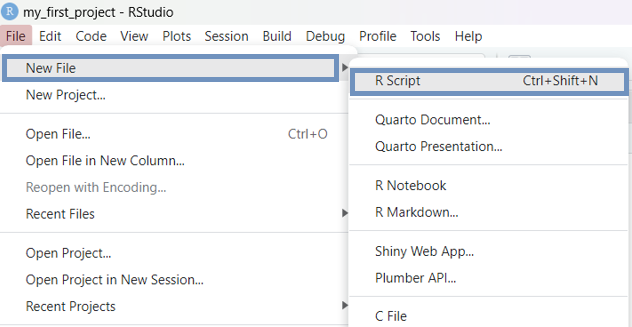{#fig-open_rscript width="65%"}

Alternatively, we can use the plus icon {width="22" height="18"} from RStudio toolbar or the keyboard shortcut `Ctrl+Shift+N` for Windows/Linux or `Cmd+Shift+N` for Mac.

Another pane, the *"Source Editor"*, is opened on the left above the Console pane ([@fig-RStudio_4panes]). In the Source Editor, we can write a lengthy script with numerous code chunks and save the file for future use. By default, the first unsaved R script in an R session is named *"Untitled 1"*. We can change the **size** of the panes by either clicking the minimize or maximize buttons on the top right of each pane, or by clicking and dragging the middle of the borders of the panes.

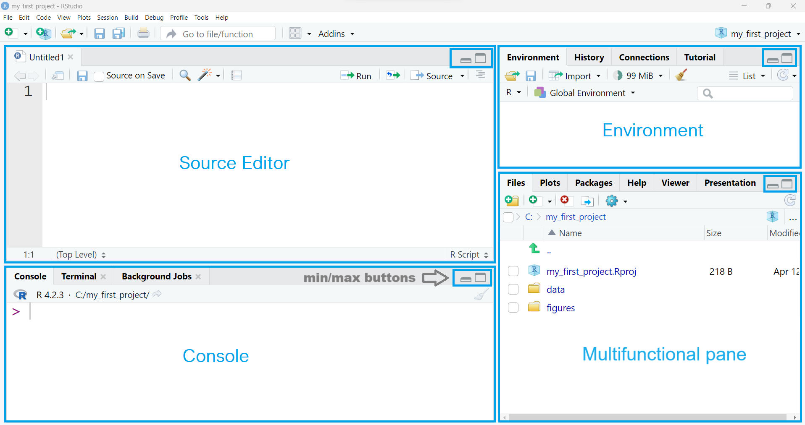{#fig-RStudio_4panes width="100%"}

Additionally, the four panes can be arranged in a different order from that shown in [@fig-RStudio_4panes]. If desired, we can change where each pane appears within RStudio by adjusting the preferences ([@fig-pane_layout]). We select from RStudio menu:

`Tools` $\longrightarrow$ `Global Options` $\longrightarrow$ `Pane layout`

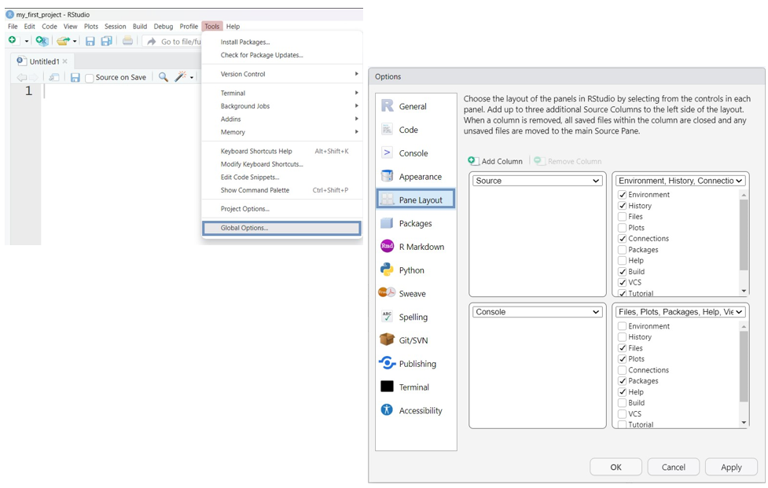{#fig-pane_layout width="100%"}

 

Now, let's type `14 + 16` at a new R script in the Source Editor pane and press the 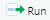{width="40" height="18"} button located at the top of the Source Editor. The result is printed in the Console ([@fig-rscript1]):

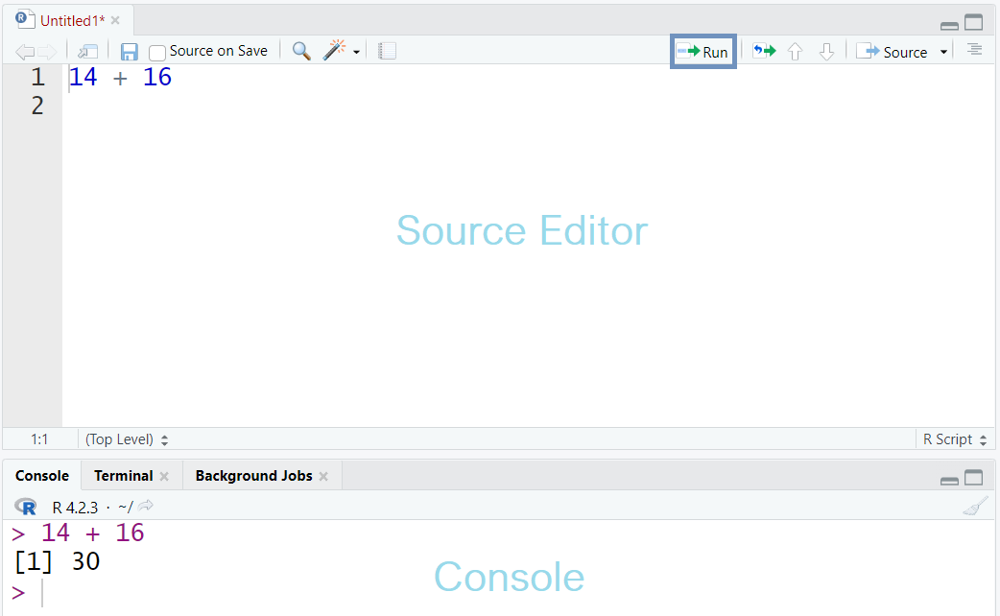{#fig-rscript1 width="70%"}

 

::: content-box-white
**INFO**

In an R script, we can execute code line by line by placing the cursor on a line and pressing the Run button in the Source Editor. Alternatively, we can run a selected chunk of code by highlighting it and then clicking Run. The selected code can also be run using the keywboard shortcut Ctrl+Enter on Windows/Linux or Cmd+Enter on Mac.
:::

## Adding Comments and Saving a Script

Including **comments** in code is considered good practice when writing R scripts. Comments clarify the code's purpose and enhance its readability. In R, comments begin with the **hash symbol** (`#`); when the code runs, anything following `#` on the same line is ignored ([@fig-rscript2]). This feature can also be used to temporarily disable one or more lines of code, which is useful when testing alternative code versions.

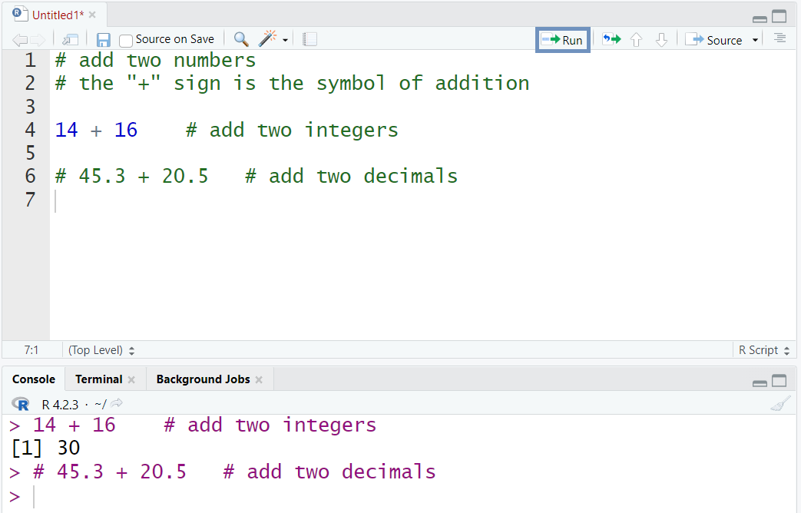{#fig-rscript2 width="70%"}

::: content-box-white
**INFO**

The keyboard shortcut for commenting or uncommenting **multiple selected lines** of code at once in RStudio is: Ctrl+Shift+C for Windows/Linux or Cmd+Shift+C for Mac .
:::

 

Finally, we can save our R script in the RStudio Project folder. The simplest way is to click on the save icon {width="20" height="22"}, give a file name to the script such as *"my_script"* and then press the "save" button to store it in *"my_first_project"* folder ([@fig-save_script]).

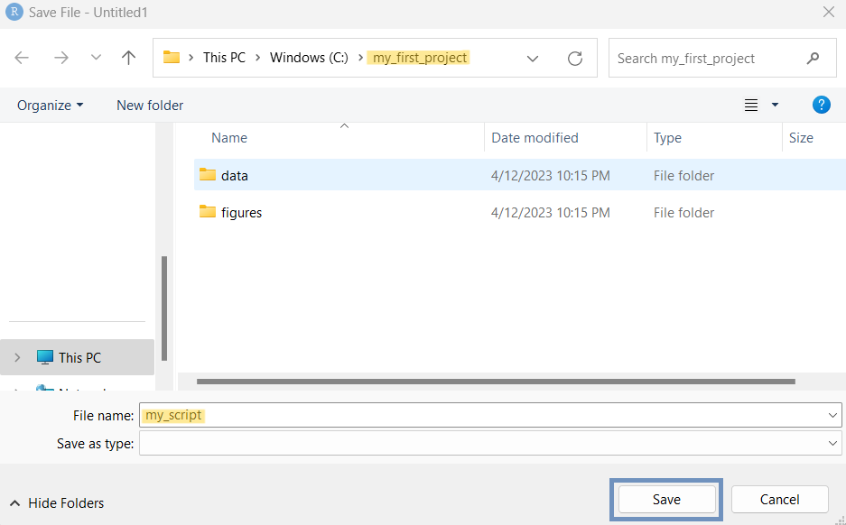{#fig-save_script width="75%"}

 

Now, the folder structure of our RStudio Project should include the following items ([@fig-final_folder_structure]):

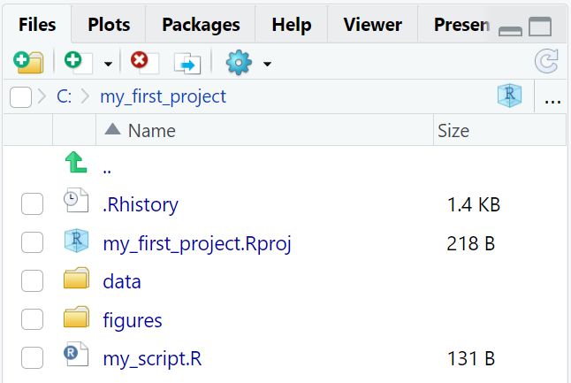{#fig-final_folder_structure width="50%"}

 

::: content-box-white
**INFO**

The *.Rhistory* file, created automatically by RStudio, contains a history of the code that has been executed.
:::

If we close the pane containing the R script, we can reopen it by clicking on the *"my_script.R"* file in the "Files" tab.
