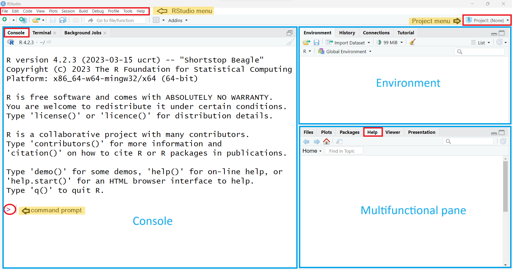
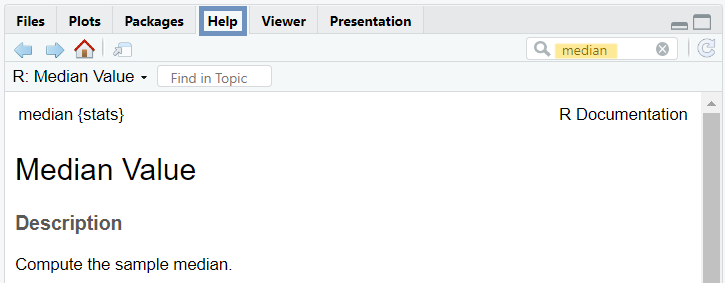
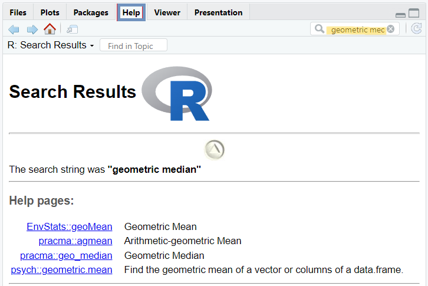

# R via RStudio {#sec-rstudio}

```{r setup_rstudio, include=FALSE}

options(width=85)
knitr::opts_chunk$set(fig.pos = 'H')
```

In this chapter, we explore the basic features of RStudio, the integrated development environment (IDE) selected for running R throughout this textbook. We start by exploring RStudio's layout and learning how to navigate and use each RStudio pane effectively. Next, we distinguish between errors, warnings, and messages in R. Finally, we discuss strategies and sources for finding help when needed.

 

## Installing R and RStudio

R is a free, open-source statistical programming language (an implementation of the S programming language) and a powerful graphics engine. It was created by Ross Ihahka and Robert Gentleman at the University of Auckland in 1993.

RStudio is an integrated development environment (IDE) founded by J.J. Allaire in 2009, with the first public release in 2011. Today, it is developed and maintained by Posit PBC (formerly RStudio Inc.) and is available in both open-source and commercial editions. RStudio provides a user-friendly interface with numerous features such as code auto-completion, syntax highlighting, and a suite of integrated tools that support data analysis and programming.

More recently, Posit has released a new multi-language IDE called [Positron](https://positron.posit.co/). Designed to support both R and Python, Positron is still under active development and may not yet provide the full range of features and functionalities available in RStudio.

Therefore, throughout this textbook, we will use **R** via **RStudio IDE**, both of which can be downloaded from {width="12" height="10"} [Posit](https://posit.co/download/rstudio-desktop/).

## Starting R & RStudio

Once R and RStudio are installed, clicking the RStudio icon {#fig-r_studio_icon width="3%"} will automatically launch R within RStudio environment. Each time we start an R session, three panes appear in the RStudio interface, as shown in [@fig-RStudio_panes].

{#fig-RStudio_panes width="100%"}


The three main RStudio panes that divide the screen are as follows:

1.  The large **Console pane** on the left (also known as the command-line pane) runs R code immediately. When we start a new R session, the Console displays startup information including the R version, licensing details, and guidance on accessing help. The last line displays the **standard command prompt**, denoted by the "\>" symbol, indicating that R is ready to execute commands.

2.  The **Environment pane**, which includes among others the Global Environment (Workspace) and History tabs, in the upper right.

    -   The **Environment tab** keeps track of the objects we create as we work with R.

    -   The **History tab** maintains a record of commands we have run during our current and past R sessions.

3.  The **Multifunctional pane** in the lower right which includes:

    -   The **Files tab** allows us to create new folders on our computer, as well as copy, move, delete, or rename files.

    -   The **Plots tab** displays all static visualizations produced by our R code. Backward (←) and forward (→) arrows at the top allow us to navigate through the sequence of generated plots. The Zoom button opens the selected plot in a larger, separate window, while the Export option enables us to save plots in formats such as PNG, JPEG, or PDF. Clicking the broom icon {width="24" height="22"} clears all temporary plots from the tab.

    -   The **Packages tab** lists all R packages installed on our computer and indicates whether they are currently loaded. We can use it to install new packages and update existing ones. We will discuss packages in more detail in Chapter \@ref(rpackages).

    -   The **Help tab** displays search results for R documentation.

    -   The **Viewer tab** in RStudio allows us to view local web content, including HTML tables and interactive HTML widgets like `plotly` charts.

    -   The **Presentation tab** displays HTML slides generated using Quarto's revealjs format.

Throughout this textbook, we will learn the purpose of each of these panes.

 

Let's type `14 + 16` in front of the R command prompt in the Console and press `Enter`:

```{r}
14 + 16
```

In the console, the output appears as `[1] 30`. While 30 is the result of the calculation, you might wonder what the `[1]` means. For now, we can ignore it, but technically, it refers to the **index of the first item** on the output line. When R returns a large sequence of elements, the number inside the square brackets helps identify the position of each item in the sequence, particularly when multiple lines are displayed.

## Errors, warnings, and messages in R

Let's type the the word *hello* in the Console and press `Enter`:

```{r, eval=FALSE}

hello
```

We get the following error:\
`r kableExtra::text_spec("Error: object ‘hello’ not found", color = "#8676F8")`

R will show in the Console pane that something unusual is happening in three different situations:

-   **Errors:** When there is an error, code execution halts immediately and relevant information about the failure is usually reported.

-   **Warnings:** When there is a warning, the code continues to run, but there may be potential issues to be aware of.

-   **Messages:** Messages are often displayed after code execution to provide useful information for the user.

Now, let's type a syntactically incomplete mathematical expression into the Console and press `Enter`:

```{r, echo=TRUE, eval=FALSE}

14 + 16 - 
```

The output is:

`14 + 16 -`

`+`

This means that when an R command is not syntactically complete, the Console displays a plus sign (`+`), known as the continuation prompt, on the second and subsequent lines. This prompt signals that R is waiting for additional input. In this example, we can enter a number to complete the mathematical expression, or press the `Esc` key to cancel the command.

 

::: content-box-gray
**TIP**

In the **Console**, use the up ($\uparrow$) arrow key to scroll through previous commands and the down ($\downarrow$) arrow key to move forward to more recent ones. To edit or correct a command, use the left ($\leftarrow$) and right ($\rightarrow$) arrow keys to navigate within the command.
:::

 

## R Help sources

Before asking others for help, we should try to solve R programming problems on our own. Therefore, it's recommended to learn how to use R's built-in help system.

-   First, we can use the **`help()`** command or the **`?`** help operator, both of which provide access to documentation pages included in the **standard R distribution**. For example, to get information about the *median*, we can use the following command:

```{r, eval=FALSE}

help(median)
?median
```

Alternatively, RStudio has a search box in the upper-right corner of the "Help" tab, where we can type *median* and then press `Enter` to find relevant documentation ([@fig-median_help]).

{#fig-median_help width="65%"}

 

-   The **`help.search()`** command or its shortcut, the double question mark operator (**`??`**), can be used to search the R help system for documentation matching a phrase or term across all installed packages in the R library. For example, to search documentation for the *geometric median*, type:

```{r, eval=FALSE}

help.search("geometric median")
??"geometric median"
```

Note that multi-word phrases must be enclosed in quotation marks (either single or double).

Alternatively, we can type *geometric median* (without quotes) in the search bar within the "Help" tab and then press `Enter` ([@fig-help_search]).

{#fig-help_search width="65%"}

 

-   To search for all names in the **current R session** that contain a specific pattern, such as "med", we can use **`apropos()`**, which performs partial matching. For example:

```{r aproposShow}
apropos("med")
```

 

-   We can also use **`example()`** to run the examples provided in R's documentation, such as for *median*. This can help us understand how it works and what kind of results to expect.

```{r}
example(median)
```

   

Additionally, numerous **online sources**, including [RSeek.Org](https://rseek.org/), [R-bloggers](https://www.r-bloggers.com/), [Stack Overflow](https://stackoverflow.com/), and AI Chatbots are available to assist with R programming. However, it is worth mentioning that blindly copying and pasting code can introduce unforeseen bugs into our projects and does little to enhance our R programming skills.
