# Data import, pre-processing, and transformation {#sec-rtransformations}

```{r setup_rtransformations, include=FALSE}

options(width=85)
knitr::opts_chunk$set(fig.pos = 'H')
```


This chapter focuses on importing data from spreadsheets into R and covers essential techniques for manipulating, transforming, and summarizing data effectively. We also introduce the powerful native forward pipe operator `|>`, which streamlines the process by allowing operations to be chained together in a clear and concise manner. Additionally, we present and explain the process of reshaping data between wide and long formats in R.


```{r, message=FALSE, warning=FALSE}

# Required packages for this chapter
library(readxl)              
library(janitor)             
library(here) 
library(tidyverse)
```

 


## Importing data

Spreadsheets are commonly used to organize structured, rectangular data and are available in formats such as Excel, CSV, or Google Sheets. Each format offers unique features, from Excel's comprehensive capabilities to CSV's simplicity and Google Sheets' collaborative editing. In this textbook, most [datasets](https://osf.io/3amrb/files/osfstorage) are provided in Excel files (`.xlsx`) and typically have the following basic characteristics:

-   The first line in the file is a *header* row, specifying the names of the columns (variables).
-   Each value has its own cell.
-   Missing values are represented as empty cells.


For example, [@fig-excel] shows a screenshot of data from a single sheet of an Excel file. The dataset, named `shock_index`, contains information about the characteristics of 30 adult patients suspected of having a pulmonary embolism. The following variables were recorded:

-   **sex:** F for females and M for males
-   **Age:** age of the patients in years
-   **SBP:** systolic blood pressure in mmHg
-   **HR:** resting heart rate in beats/min


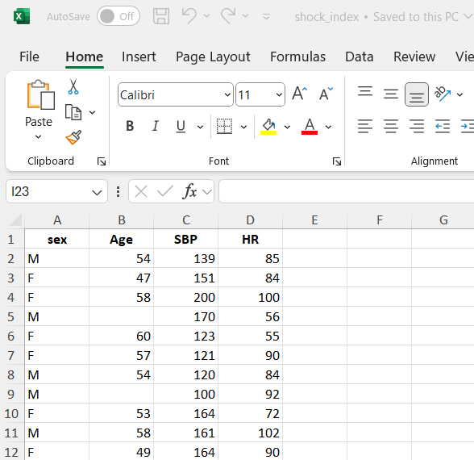{#fig-excel width="65%"}


### Importing data from Excel using the RStudio Interface

To import data using the RStudio interface, we navigate to the Environment pane, where we'll find the "Import Dataset" button. Clicking this button will prompt a dropdown menu with options to import data from various file formats such as CSV, Excel, or other common formats. We select "From Excel..." ([@fig-import]).


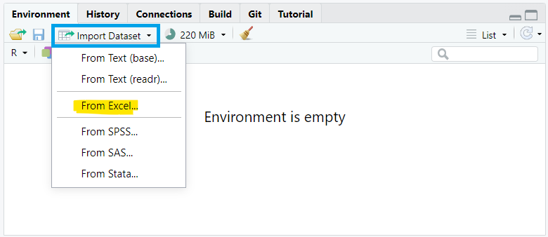{#fig-import width="70%"}


A dialog box then appears, enabling us to navigate our file system and specify the desired dataset ([@fig-wizard]). Once selected, we confirm the import by clicking "Open". Finally, we proceed by clicking the "Import" button, which imports the selected dataset into our RStudio session."


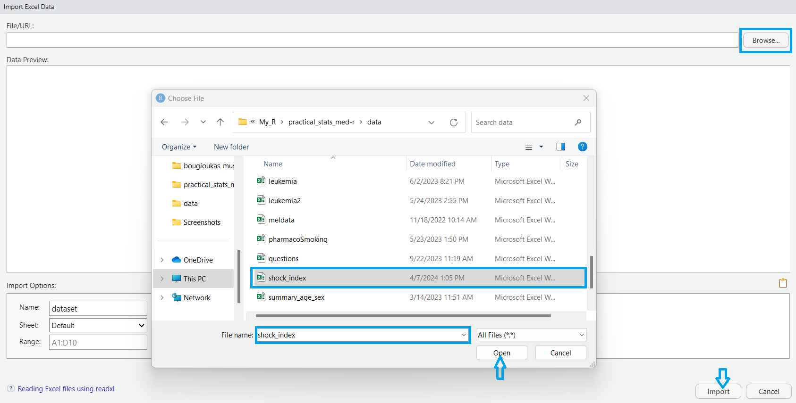{#fig-wizard width="95%"}


After a successful import, the dataset will be displayed in the Environment pane, allowing for further manipulation.


### Importing data from Excel into R with commands

Alternatively, if the dataset is saved in the subfolder named "data" of our RStudio project (see also @sec-rproject), we can read it with the **`read_excel()`** function from ***readxl*** package as follows:

```{r, message=FALSE, warning=FALSE}

dat <- read_excel(here("data", "shock_index.xlsx"))
```

The path of a file (directory) is its location in the file system (address). As we have previously discussed, there are two kinds of paths.

-   absolute paths such as "`C:/My_name/../my_project/data/shock_index.xlsx`" and
-   relative paths such as "`data/shock_index.xlsx`".

The function `here()` allows us to navigate throughout each of the subfolders and files within a given RStudio Project using *relative paths* (see also @sec-rpackages).

\vspace{20pt}

Using **`head()`** is a convenient way to get a quick overview of our dataset and check for any obvious issues before proceeding with further analysis or data manipulation.

```{r}
head(dat)
```

By default, the **first six** rows of the data frame are displayed. To view a different number of rows (e.g., the first ten), we can specify the desired number as an argument, like this: `head(dat, 10)`.

Additionally, when working with large datasets in R, it's often useful to inspect the last few rows of a data frame. The **`tail(`)** function is used for this purpose:

```{r}
tail(dat)
```

Now, the **last six** rows of the data frame are displayed in the R console.


<br>


## Pre-processing data

### Adding an unique identifier for each observation

A unique identifier for each observation is often useful for various data manipulation and analysis tasks. In R, we can add row numbers starting from 1 to the number of rows in our data frame using the **`rowid_to_column()`** function from the ***tibble*** package:

```{r}

dat <- rowid_to_column(dat)
head(dat)
```

### Renaming variables and cleaning names

Choosing informative column names can significantly enhance the clarity and interpretability of our dataset. For instance, renaming `rowid` to `patient_ID` clarifies that this column serves as a unique identifier for each patient. Likewise, renaming `HR` to `Heart.Rate` offers a more intuitive and informative label for the heart rate variable.

```{r, message=FALSE}
dat <- rename(dat, 
               patient_ID = rowid,
               Heart.Rate = HR)
head(dat)
```


However, it's crucial to ensure that the column names are consistent with the naming conventions in R. This can be achieved by using the **`clean_names()`** function from the ***janitor*** package, which standardizes column names by converting them to lowercase, removing special characters, and replacing spaces with underscores.

```{r, message=FALSE, warning=FALSE}

dat <- clean_names(dat)
head(dat)
```


### Converting to the appropriate data type

We might have noticed that the categorical variable `sex` is coded as F (for females) and M (for males), so it is recognized of `character` type. We can use the `factor()` function to encode a variable as a factor:

```{r}

dat$sex <- factor(dat$sex, levels = c("F", "M"), labels = c("female", "male"))
head(dat)
```


### Handling missing values

Upon reviewing the dataset, it's apparent that there are missing values in the `age` variable, denoted as `NA`. Various techniques exist to handle missing values in data such as excluding observations with any missing values, substituting with a constant value (mean, median, mode), or employing multiple imputation methods. The choice of method depends on factors such as the proportion of missing data, its distribution, and understanding the underlying mechanism behind the missingness (whether it's random or non-random) [@altman2007; @heymans2022].

While this introductory textbook primarily uses datasets without missing values, it's important to note that missing data present a frequent challenge in real-world data analysis. Fortunately, several R packages are tailored to address this issue, including: [**`mice`**](https://amices.org/mice/), [**`VIM`**](https://statistikat.github.io/VIM/index.html), [**`naniar`**](https://naniar.njtierney.com/index.html), and [**`Hmisc`**](https://hbiostat.org/r/hmisc/).

 

## Transforming data

### Subsetting observations (rows)

Subsetting observations (rows) is a common data manipulation task in data analysis, allowing us to focus on specific subsets of data that meet particular criteria. This process involves selecting rows from a dataset based on conditions we specify.

#### *Select observations by indexing position within* `[ ]`

Just as we use square brackets `[row, column]` to select elements from matrices, we apply the same approach to select elements from a data frame. For example, by specifying the row indices `[5:10, ]` within the brackets, we can select the data for rows 5 through 10:

```{r}
dat1 <- dat[5:10, ]
dat1
```


#### *Select observations by using logical conditions inside* `[ ]`

By applying logical conditions, such as greater than (`>`), less than (`<`), equal to (`==`), or combinations of these, we can filter observations that meet specific criteria.

-   For example, we can filter the data to find patients whose age is greater than 55, as follows:

```{r}
dat2 <- dat[dat$age > 55, ]
dat2
```


**Step-by-step explanation:** First, the code evaluates the expression `dat$age > 55` for each row in the data frame, generating a logical vector where `TRUE` indicates patients older than 55 and `FALSE` indicates others. This logical vector is then used inside the square brackets `[ ]` to subset the data frame, selecting only the rows where the condition is `TRUE`. The resulting subset is assigned to the new object `dat2`. Note that when there are missing values in the `age` column, the corresponding rows in `dat2` contain `NA` values.


Similarly, we can use the **`which()`** function that returns the **indices** where the condition `age > 55` is `TRUE`. However, in this case, the missing values are treated as `FALSE`, resulting in the exclusion of rows where `age` in the original data is `NA`.

```{r}
dat3 <- dat[which(dat$age > 55), ]
dat3
```


-   If our objective is to analyze data for female patients aged over 55, we can create a subset by incorporating the logical **`&` operator** to combine the conditions for age and sex.

```{r}
dat4 <- dat[which(dat$age > 55 & dat$sex == "female"), ]
dat4
```


The resulting data frame contains only the rows that meet both of these conditions, namely females over 55 years old.


#### *Select observations using the `filter()` function from `dplyr`*

The ***dplyr*** package also provides the **`filter()`** function for selecting observations.

-   Selecting rows where age is greater than 55:

```{r}
dat5 <- filter(dat, age > 55)
dat5
```


-   Selecting rows where age is greater than 55 and patient is female:

```{r}
dat6 <- filter(dat, age > 55 & sex == "female")
dat6
```


The above code is equivalent to the following command:

```{r, eval=FALSE}
filter(dat, age > 55, sex == "female")
```


::: content-box-purple
**IMPORTANT**

When multiple logical expressions are separated by a comma within the **filter()** function, they are effectively combined using the \& operator. 
:::

 

### Reordering observations (rows)

Another useful data manipulation involves sorting observations in ascending or descending order of one or more variables (columns). When multiple column names are provided, each additional column helps resolve ties in preceding columns' values.

-   For example, to arrange the rows of our data based on the values of `sbp` in ascending order (the default), we can run the following code:

```{r}
dat7 <- arrange(dat, sbp)
head(dat7)
```


-   To rearrange the data in descending order based on `sbp`, we can use the **`desc()`** function within the ***arrange()*** function:

```{r}
dat8 <- arrange(dat, desc(sbp))
head(dat8)
```


The above code is equivalent to the following command:

```{r, eval=FALSE}
arrange(dat, -sbp)  # The minus sign indicates descending order
```


-   We can also sort the data in ascending (or descending) order based first on the values in the column `sbp` and then on the values in the column `heart_rate`.

```{r}
dat9 <- arrange(dat, sbp, heart_rate)
head(dat9)
```

Notably, two patients (IDs 16 and 28) share the lowest systolic blood pressure of 92 mmHg. When sorting in ascending order, if multiple patients have the same systolic blood pressure, these observations are further sorted by heart rate, with lower heart rate taking precedence. In this case, patient 28, with a heart rate of 119 beats/min, is listed before patient 16, whose heart rate is 122 beats/min.


### Subsetting variables (columns)

When working with data frames, selecting specific variables (columns) for analysis is a common task. For instance, suppose we want to select only the `sex`, `age`, and `heart_rate` variables from the data frame.

#### *Select variables by indexing their name within* `[ ]`

Subsetting variables can be achieved by indexing the variables' names within `[ ]`, as follows:

```{r}
dat10 <- dat[, c("sex", "age" , "heart_rate")]
head(dat10)
```


#### *Select variables by indexing position within* `[ ]`

By specifying the column indices, such as `c(2, 3, 5)`, within brackets, we can select the data in columns 2, 3, and 5 as follows:

```{r}
dat11 <- dat[, c(2, 3, 5)]
head(dat11)
```


Or we can exclude the variables in the first and forth position.

```{r}
dat12 <- dat[-c(1, 4)]
head(dat12)
```


#### *Select variables using the `select()` function from `dplyr`*

In **`select()`** function we pass the data frame first and then the variables separated by commas. Quotes are optional for column names that don't contain special characters or spaces.

```{r}
dat13 <- select(dat, sex, age, heart_rate)
head(dat13)
```


Or we can exclude the variables `patient_id` and `sbp`.

```{r}
select(dat, -c(patient_id, sbp))

```


### Creating new variables

Data analysis often involves creating new variables within data frames based on existing variables. This data transformation process involves adding new columns to a data frame derived from the values of one or more existing columns.

Suppose we want to compute a new variable representing the ratio of heart rate to systolic blood pressure (HR/sbp), which we will call `shock_index`. We can achieve this by using the `mutate()` function from ***dplyr*** package, as follows:

```{r}
dat14 <- mutate(dat, shock_index = heart_rate / sbp)

head(dat14)
```


::: content-box-purple
**IMPORTANT**

By default, the **mutate()** function adds the new variable as the last column in the tibble. 
:::

 

Our next step involves categorizing the newly created `shock_index` variable based on the defined normal range (0.5 to 0.7 beats/mmHg $\cdot$ min). This can be done using the **`case_when()`** function from the ***dplyr*** package.

```{r}
dat15 <- mutate(dat14,
                shock_index1 = case_when(shock_index < 0.5 ~ "low",
                                         shock_index <= 0.7 ~ "normal",
                                         TRUE ~ "high"))
head(dat15)
```

However, it's important to keep in mind that transforming continuous variables into categories may simplify interpretation, but it often results in information loss.

### Using the native pipe operator in a sequence of commands

Given that each verb in ***dplyr*** specializes in a particular task, addressing complex queries often typically involves integrating several verbs, a process simplified by using the native forward pipe operator, `|>`.

For example, we want to filter the original dataset to include only rows where the shock index category is "low" or "high", using a sequence of ***dplyr*** verbs.

```{r}
sub_dat <- dat |>
  mutate(shock_index = heart_rate / sbp,
         shock_index1 = case_when(shock_index < 0.5 ~ "low",
                                  shock_index <= 0.7 ~ "normal",
                                  TRUE ~ "high")) |> 
  filter(shock_index1 == "low" | shock_index1 == "high")
```

We would read this sequence of commands as:

$\rightarrow$   Begin with the dataset `dat`, **then**

$\rightarrow$  Use it as input to the **`mutate()`** function to calculate the `shock_index` variable and create the `shock_index1` categorical variable, **then**

$\rightarrow$  Use this output as input to the **`filter()`** function to select patients with "low" or "high" values of `shock index`. 

The first six rows are shown below:

```{r}
head(sub_dat)
```


Using the `%in%` operator inside the **`filter()`** function simplifies the code by enabling multiple logical `OR` conditions to be checked simultaneously.


```{r, eval=FALSE}
dat |>
  mutate(shock_index = heart_rate / sbp,
         shock_index1 = case_when(shock_index < 0.5 ~ "low",
                                  shock_index <= 0.7 ~ "normal",
                                  TRUE ~ "high")) |>
  filter(shock_index1 %in% c("low", "high"))
```


::: content-box-white
**INFO**

The native forward pipe operator $|>$ was introduced in base R version 4.1.0. It provides a built-in way to chain function calls in R, similar to the functionality offered by the $>$ operator from the magrittr package.
:::

 


## Summarizing data

### Summary measures

Let’s calculate two common summary measures of the `age` variable in our data frame: the sample mean and standard deviation. To compute these summary statistics, we use the **`mean()`** and **`sd()`** mathematical functions in R (@sec-rcalculator).

```{r}
mean(dat$age, na.rm = TRUE)
```

```{r}
sd(dat$age, na.rm = TRUE)
```


Now, we’ll use the **`mean()`** and **`sd()`** within the **`summarize()`** generic function from the **`dplyr`** package. We’ll store the results in a new data frame called `stats`, which will contain two columns: the `mean_age` and the `sd_age`.

```{r}
stats <- dat |> 
  summarize(mean_age = mean(age, na.rm = TRUE),
            sd_age = sd(age, na.rm = TRUE))
stats
```


::: content-box-white
**INFO**

The **dplyr** package also provides the alternative spelling **summarise()** for users who prefer the UK convention. Both functions work identically.
:::

 

To calculate statistical summaries for multiple columns simultaneously, we can use the **`across()`** function within the **`summarize()`** function. For example:

```{r}
dat |> 
  summarize(across(
    .cols = c(age, sbp),
    .fns = list(
      mean = \(x) mean(x, na.rm = TRUE),
      sd = \(x) sd(x, na.rm = TRUE)),
    .names = "{col}_{fn}")
)
```

In the above syntax, the `.cols` argument specifies the columns to be summarized, while the `.fns` argument defines the functions to be applied, such as **`mean()`** and **`sd()`**, which are wrapped in a list. Finally, the `.names` argument specifies the naming convention for the output columns. Note that the expressions `\(x) mean(x, na.rm = TRUE)` and `\(x) sd(x, na.rm = TRUE)` are examples of "anonymous" functions in R and can also be written using the *purrr-style lambda* as `~ mean(.x, na.rm = TRUE)` and `~ sd(.x, na.rm = TRUE)`, respectively.

```{r, eval=FALSE}
dat |> 
  summarize(across(
    .cols = c(age, sbp),
    .fns = list(
      mean = ~ mean(.x, na.rm = TRUE),
      sd = ~ sd(.x, na.rm = TRUE)),
    .names = "{col}_{fn}")
)
```


::: content-box-white
**INFO**

Anonymous functions, also called lambda functions, are created  "on-the-fly" in R without being assigned a name. They are commonly used within other functions or operations, providing a concise and efficient way to perform specific calculations.
:::

 

Next, suppose we want to compute the mean and standard deviation of age for female and male patients **separately**, instead of calculating a single mean and standard deviation for all patients. We can achieve this using the following code:

```{r}
# Calculate the mean and sd of age for females and males separately
stats_by_sex <- dat |>
  group_by(sex) |> 
  summarize(mean_age = mean(age, na.rm = TRUE),
            sd_age = sd(age, na.rm = TRUE)) |> 
  ungroup()   # ungrouping variable is a good habit to prevent errors
stats_by_sex
```

In this example, the **`group_by()`** function groups the rows of data based on the categories of the `sex` variable, allowing independent mathematical operations within each group. It is important to note that the **`group_by()`** function itself does not modify the data frame; changes occur only after the **`summarize()`** function is applied.


Note that we can simplify the code by using the `.by` argument of the **`summarize()`** function:

```{r}
dat |>
  summarize(mean_age = mean(age, na.rm = TRUE),
            sd_age = sd(age, na.rm = TRUE), .by = sex)
```


### Frequency Statistics

Let's calculate the frequency distribution of the `sex` variable in our data.

```{r}
counts <- dat |>
  group_by(sex) |> 
  summarize(n = n()) |> 
  ungroup()
counts
```

Here, the **`n()`** function is used within the **`summarize()`** function to count the number of rows (observations) within each group defined by the `sex` variable.


Alternatively, we can use the **`count()`** function from the ***dplyr*** package.

```{r}
counts2 <- dat |>
  count(sex)
counts2
```

The main difference is that the **`count()`** function automatically handles grouping internally, so there's no need to explicitly ungroup the data afterward. This simplifies the code and makes it more concise.


## Reshaping data

Reshaping data between "wide" and "long" formats in R is a common task in data transformation. For example, data were collected from four individuals, with total cholesterol (TCH) levels measured at baseline (week 0), as well as at 6 and 12 weeks following a 12-week dietary intervention. The data are stored in an Excel spreadsheet with the following structure:


```{r}
dat_TCH <- read_excel(here("data", "cholesterol.xlsx"))
dat_TCH
```


We observe that the dataset is organized in what is commonly referred to as a **"wide"** format. This structure is particularly well-suited for a repeated measures design, also known as a longitudinal or within-subject design. In such designs, the same individuals are measured multiple times over a period, with each measurement representing a different time point.

When reshaping data between "wide" and "long" formats, it's essential to uniquely identify each observation. If no variable in the original data serves this purpose, adding a **row identifier** ensures that each observation retains its identity during the reshaping process, preventing data loss or misalignment. Therefore, before proceeding with data transformation in R, we add a column to the dataset that assigns a unique identifier to each row using the **`rowid_to_column()`** function:

```{r}
dat_TCH <- dat_TCH |> 
  rowid_to_column()
dat_TCH
```


### From wide to long format

The "wide" format may not always be the most suitable data shape for certain types of statistical analyses or visualizations in R, whereas the **"long"** format is often more appropriate. This reshaping process can be achieved using the **`pivot_longer()`** function from the **_dplyr_** package, as shown below:


```{r}

dat_TCH_long <- dat_TCH |> 
  pivot_longer(cols = starts_with("week"),
               names_to = "week",
               values_to = "total_cholesterol")
dat_TCH_long
```

We observe that the "long" format consists of one column for the row ID, one for the week of measurement, and another for the total cholesterol values. 

To better understand the dataset transformation from a "wide" to a "long" format, it's helpful to break down the code and use data from the first two individuals ([@fig-reshape00]).


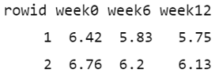{#fig-reshape00 width="30%"}


Initially, the `cols = starts_with("week")` argument specifies which columns from the original data should be pivoted. In this case, it selects the columns that start with the prefix "week", such as "week0", "week6", and "week12". Additionally, the values in the identifier column (rowid) in the "wide" format are repeated in the "long" format as many times as the number of columns being pivoted, which in this case is three ([@fig-reshape01]).


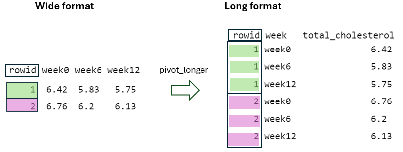{#fig-reshape01 width="75%"}

<br>

Next, by using the `names_to = "week"` argument, the column names being pivoted (i.e., week0, week6, and week12) become values within a newly defined variable, `week`, in the "long" format. These values are repeated as many times as the number of rows in the "wide" format, in this case two, while considering the `rowid` ([@fig-reshape02]).


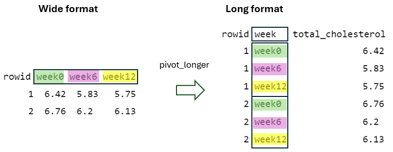{#fig-reshape02 width="75%"}


<br>

Finally, by using the `values_to = "total_cholesterol"` argument, the cell values from the pivoted variables are placed into a newly defined variable in the "long" format with the name `total_cholesterol`, with the `rowid` and `week` taken into account ([@fig-reshape03]).


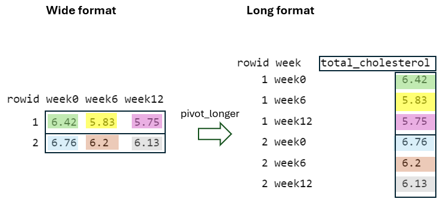{#fig-reshape03 width="75%"}

 


### From long to wide format

The **`pivot_wider()`** function is essentially the reverse of **`pivot_longer()`** function, reshaping data from "long" to "wide" format.

```{r}
dat_TCH_wide <- dat_TCH_long |>
  pivot_wider(id_cols = rowid,
              names_from = week,
              values_from = total_cholesterol)
dat_TCH_wide
```


To better understand the reshaping process of the **`pivot_wider()`** function, let's consider the data of the first two individuals in the "long" format ([@fig-reshape000]):

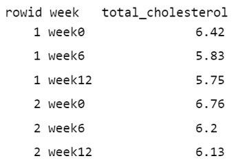{#fig-reshape000 width="30%"}


First, in the "wide" format, the `rowid` column must contain unique values to ensure each row is uniquely identified within the dataset ([@fig-reshape04]). This is achieved by using the argument `id_cols = rowid`, which specifies that the unique values from the `rowid` column in the "long" format should be used as the identifier column in the "wide" format.

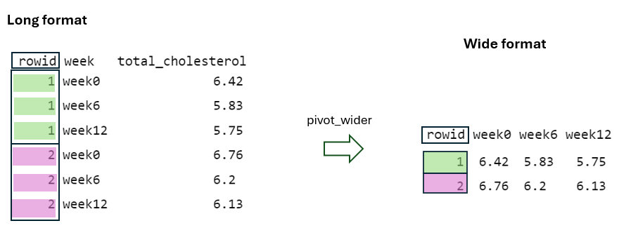{#fig-reshape04 width="75%"}


<br>

Second, the `names_from = week` argument specifies that the distinct week values in the "long" format serve as the basis for generating new column names (“week0”, “week6”, and “week12”) in the "wide" format ([@fig-reshape05]).


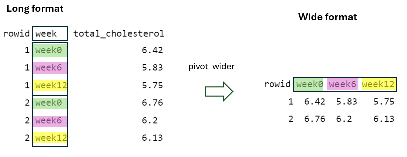{#fig-reshape05 width="75%"}

<br>


Finally, the `values_from = total_cholesterol` argument specifies that the `total_cholesterol` values of the "long" format must be placed into the cells of the new columns in the "wide" format, considering the rowid and week values ([@fig-reshape06]).


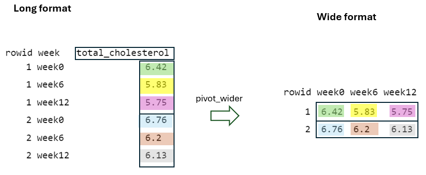{#fig-reshape06 width="75%"}


