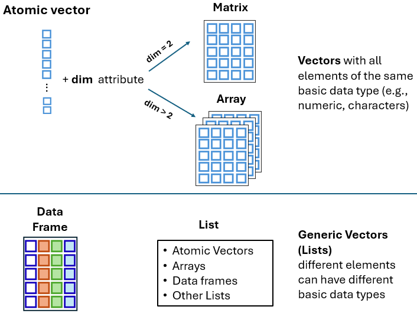

# Atomic vectors {#sec-rvectors}

```{r setup_rvectors, include=FALSE}

options(width=85)
knitr::opts_chunk$set(fig.pos = 'H')
```

In R, vectors are fundamental data structures that play a central role in organizing and storing information effectively. They are primarily categorized into two types: atomic vectors and generic vectors (lists). In this chapter, we focus on atomic vectors, which consist of a single sequence of elements of the same data type—logical, integer, double, or character—and explore their properties and operations.

 

## Introduction to Vectors in R

One of the most central concepts in R are the **vectors**. Vectors are broadly categorized into two types: **atomic vectors** and **generic vectors (lists)** ([@fig-str]).

<br>

{#fig-str width="80%"}

Atomic vectors must consist of elements of the same basic data type (e.g., numeric, characters). In contrast, lists can contain elements of varying data types (e.g., some elements may be numeric, while others may be characters).

The R language supports various data structures for organizing and storing information. In the following chapters, we will explore more complex structures, such as **matrices, arrays, and data frames**. Each of these structures serves a specific purpose and can differ in the type of data it holds and its level of complexity. These data structures are schematically illustrated in [@fig-str].

## Atomic Vectors in R

The most fundamental **data structure** in R is the atomic vector atomic vector, which consists of a single sequence of elements of the same data type. Each element within the vector is uniquely identified by its position within this sequence.

::: content-box-gray
**Types of atomic vectors**

There are four primary types of atomic vectors (also known as "atomic" classes):

-   logical

-   integer

-   double

-   character (which may contain strings)

Integer and double vectors are collectively known as **numeric** vectors. There are also two rare types, complex and raw, which we will not cover in this textbook.
:::

Let's begin by understanding one-element vectors, the simplest form of atomic vectors in R. After that, we will explore longer atomic vectors to gain insight into their properties and practical applications.

### One-Element Atomic vectors

Individual logical values, numbers (also known as scalars), or characters are atomic vectors of length one. Therefore, **a one-element vector (oev)** represents a single value that can be used as the building block to construct more complex objects (longer vectors). The following examples demonstrate one-element vectors for each of the four primary data types, arranged from the most specific to the most general.

#### *Logical One-Element Vector*

Logical values, also known as Boolean values, are represented as `TRUE` or `FALSE`. While they can be abbreviated to `T` or `F`, this practice is generally not recommended. Examples of logical one-element vectors (oev) are as follows:

```{r}

oev_a <- TRUE     # assign the logical TRUE to an object named oev_a
oev_a             # call the object with its name
oev_b <- FALSE    # assign the logical FALSE to an object named oev_b
oev_b             # call the object with its name
```

#### *Integer One-Element Vector*

Although numbers such as 1 or 2 may appear in the console, R may internally store them as 1.00 or 2.00. To explicitly specify integer values in R, we must append an "L" suffix, as demonstrated in the following examples:

```{r}

oev_c <- 3L          
oev_c
oev_d <- 100L        
oev_d
```

#### *Double one-element vector*

Doubles, which represent real numbers, can be expressed either in decimal form (e.g., 0.000017) or in **e**-notation (e.g., 1.7e-05).

```{r}

oev_decimal <- 0.000017   
oev_decimal                       
oev_scientific <- 1.7e-05      
oev_scientific              
```

#### *Character One-Element Vector*

One-element vectors can also be character values—that is, single characters or entire strings of text. In R, characters can be defined using either single `''` or double `""` quotation marks. Internally, however, R stores all strings using double quotes, even if they were originally created with single quotes.

```{r}

oev_e <- 'R'               # a character enclosed in single quotation marks
oev_e
oev_f <- "R is awesome"    # a string enclosed in double quotation marks
oev_f
```

It is important to understand that R treats numeric and character vectors differently. For example, while basic arithmetic operations can be performed on numeric vectors, they are not valid for character vectors. Attempting to apply numeric operations, such as addition, to character vectors will result in an error, as shown below:

```{r, error=TRUE, eval=FALSE}

h <- "1"      # "1" is stored as a character vector
k <- "2"      # "2" is stored as a character vector
h + k
```

`r kableExtra::text_spec("Error in h + k : non-numeric argument to binary operator", color = "#8676F8")`

The error message indicates that we are attempting to apply numeric operations to character objects, "1" and "2", which is not valid. To resolve this, the characters need to be converted to numeric values before any operations can be applied.

Single values (one-element vectors) are rarely the focus of an R session. Next, we are going to discuss about "longer" atomic vectors.

### Longer Atomic Vectors

Atomic vectors typically contain more than one element. **The elements of a vector are ordered and must all be of the same data type**. Common examples of "long" atomic vectors include numeric (whole numbers and fractions), logical (e.g., TRUE or FALSE), and character (e.g., letters or words). Let's explore how to create "long" atomic vectors and highlight key properties through examples.

#### *The Colon Operator `:`*

The colon operator **`:`** generates a sequence of consecutive numbers increasing or decreasing by 1. For example:

```{r}
1:5
```

Here, the colon operator `:` takes two integers, 1 and 5, and returns an atomic vector of integers starting at 1 and ending at 5, incremented by 1.

We can assign the atomic vector to an object named `x_seq` as follows:

```{r}
x_seq <- 1:5
```

To access the vector, simply refer to its name:

```{r}
x_seq
```

We can determine the type of a vector using the **`typeof()`** function:

```{r}
typeof(x_seq)
```

The elements of the `x_seq` vector are integers. To find the number of elements in the vector, we can use the **`length()`** function:

```{r}
length(x_seq)
```

 

***Other examples:***

```{r}
5:1       # sequence decreases by 1
2.5:8.5   # sequence of decimals increases by 1
-3:4      # sequence from negative to positive integer numbers
```

#### *The Function `seq()`*

We have already explored the **`seq()`** function in @sec-rfunctions, where "seq" stands for sequence. By default, it generates vectors of consecutive numeric values. For example:

```{r}
seq(1, 5)   # generates a sequence from 1 to 5 with a default step of 1
```

#### *The `c()` Function*

We can create atomic vectors manually using the **`c()`** function (short for concatenate), which *combines* values into a single vector and is one of the most commonly used functions in R. For example, to create a numeric vector with the values `2`, `4.5`, and `-1`, we type:

```{r}
c(2, 4.5, -1)
```

We can also create atomic vectors containing logical values, as shown below:

```{r}
c(TRUE, FALSE, TRUE, FALSE)  # or equivalently  c(T, F, T, F)
```

Similarly, character vectors can be created as follows:

```{r}
c("male", "female", "female", "male")
```

Note that an atomic vector is an object and can be an element within another vector. For example:

```{r}
y_seq <- 3:7
c(y_seq, 2, 4.5, -1)  # y_seq object is an element of a vector
```

#### *Repeating Vectors*

The **`rep()`** function in R provides a convenient way to repeat either an entire vector or individual elements within it. Below are some examples:

*A. Repeating the entire vector*

```{r, results='hold'}

rep(1:4, times = 5)               # repeat the entire vector 5 times
rep(c(0, 4, 7), times = 3)        # repeat the entire vector 3 times
rep(c("a", "b", "c"), times = 2)  # repeat the entire vector 2 times
```

 

*B. Repeating each element of the vector*

```{r, results='hold'}

rep(1:4, each = 5)               # repeat each element 5 times
rep(c(0, 4, 7), each = 3)        # repeat each element 3 times
rep(c("a", "b", "c"), each = 2)  # repeat each element 2 times

```

#### *Default Vectors*

R includes a set of built-in vectors that provide useful data for various tasks:

```{r}

# upper-case letters
LETTERS

# lower-case letters
letters

# months
month.name

# three-letter months
month.abb

```

We will use some of these built-in vectors in the examples that follow.

## Mixing Things in a Vector - Coercion

### Implicit Coercion

Implicit coercion \index{implicit coercion} in R refers to the automatic conversion of data from one type to another when required for an operation or function. This feature enables R to handle mixed data types flexibly.

For example, R assumes that all elements in an atomic vector are of the same data type -- such as all numbers, all characters, or all logical elements. Let's create a "mixed" vector:

```{r}
my_vector <- c(1, 4, "hello", TRUE)
my_vector 
```

Since the vector contains a mix of numeric, character, and logical values, R coerces all elements to a common data type. In this case, all elements are converted to characters. As a result, `my_vector` contains `1`, `4`, `hello` and `TRUE` as character elements.

 

**The hierarchy for coercion is:**

**`logical < integer < numeric < character`**

***Examples:***

**1. `numeric` Vs `character`**

```{r}
a <- c(10.5 , 3.2, "I am a character string")
a
typeof(a)
```

When a character string is added to a numeric vector, R automatically coerces all the elements in the vector to character values.

**2. `logical` Vs `character`**

```{r}
b <- c(TRUE, FALSE, "Hello")
b
typeof(b)
```

When a character string is added to a logical vector, R automatically coerces all elements in the vector to character values.

**3. `logical` Vs `numeric`**

```{r}
d <- c(4, FALSE, TRUE, 2, -1, TRUE, FALSE, 0)
d
typeof(d)
```

When a numeric value is added to a logical vector, R automatically coerces all the elements in the vector to numeric (double) values. Logical values are converted to numbers as follows: **FALSE becomes 0** and **TRUE becomes 1**.

### Explicit Coercion

Explicit coercion explicit coercion refers to the process of intentionally converting data from one type to another using specific conversion functions provided by R. For instance, we can convert numeric values into characters using the **`as.character()`** function. Let's create a numeric vector `f`, containing the numbers 1 through 5, and then convert it into a character vector `g`:

```{r}
f <- 1:5

g <- as.character(f)
g
```

We can turn the characters back to numbers using the **`as.numeric()`** function, which converts characters or other data types into numeric values:

```{r}
as.numeric(g)
```

This function is particularly useful in practice, as many datasets—especially those from CSV files, web scraping, or spreadsheets—may contain numeric data in character format. This often occurs when numbers are enclosed in quotes or contain commas (e.g., "1,000" instead of 1000). To perform calculations, data analysis, or any operation requiring numeric data types, we need to convert these character representations into actual numeric data.

Now, suppose we have a vector named `q` containing the values "O", "1", "2", "3", "**d**", "5" as characters and we want to convert them to numbers using the `as.numeric()` function:

```{r}
q <- c("O", "1", "2", "3", "d", "5")

as.numeric(q)
```

When we apply `as.numeric()` to the character vector, R successfully converts the characters `"1"`, `"2"`, `"3"`and `"5"` into their corresponding numeric values `1`, `2`, `3` and `5`. However, R encounters an issue with the characters `"O"` and `"d"`. As a result, we receive a warning that `NAs` were introduced by coercion, indicating that the character elements "O" and "d" were converted to missing values (`NA`).

Moreover, when coercion is not possible or meaningful, R typically displays a warning and converts all elements to `NA`s. For example:

```{r}
x_abcde <- c("a", "b", "c", "d", "e")
as.numeric(x_abcde)
```

## Operators Applied between Two Vectors

### Arithmetic Operators

R supports basic arithmetic operations between vectors using standard operators such as `+`, `-`, `*`, `/`, `^`.

#### *Arithmetic Operations between a Scalar and a Long Vector*

When a scalar (a single numeric value) interacts with a vector, the operation is applied between the scalar and each element of the vector, a process known as vectorization[^rvectors-1].

[^rvectors-1]: Vectorization refers to the process of applying operations or functions to entire vectors directly, without the need for explicit loops or iterations. This allows element-wise operations on vectors, which results in code that is more concise, readable, and often faster compared to traditional iterative approaches.

For example, when we add a scalar and a vector, the scalar is added to each element of the vector, as follows:

```{r}
v <- c(1, 2, 3)

3 + v
```

Similarly, when a vector is multiplied by a scalar, each element of the vector is individually multiplied by the scalar, as shown below:

```{r}
3 * v
```

#### *Arithmetic Operations between Two Long Vectors*

Arithmetic operations in R can be performed element-wise between corresponding elements of two vectors. This means that each element in one vector interacts with the corresponding element in the other vector. Consider two vectors, denoted as `v` and `t`, each containing a series of numerical values. Now, let's apply some arithmetic operators to these vectors.

```{r}
v <- c(1, 2, 3)
t <- c(8, 3, 2)
```

```{r}
t + v           # addition

t * v           # multiplication

t^v             # exponent

t + 3 * v / 2   # remember the order of operations in R
```

Certain **mathematical functions** that operate on vectors implement vectorization, such as the **`sqrt()`** function:

```{r}
z_seq <- 3:9      
sqrt(z_seq)    # calculate the square root of each element in z_seq
```

We can also round the results using the **`round()`** function by setting `digits = 2` argument, as shown below:

```{r}
round(sqrt(z_seq), digits = 2)
```

### Dot Product Operator

The dot product[^rvectors-2] is a mathematical operation between two numeric vectors, $\nu$ and $t$, that results in a scalar quantity. This operation is commonly represented with a dot placed between the vectors: $\nu \cdot t$.

[^rvectors-2]: The dot product of two vectors is an important operation in multiplication of matrices (see @sec-rmatrices).

It is computed by multiplying corresponding elements of the vectors and summing the results. Given two vectors, $\nu= (\nu_1, \nu_2, ..., \nu_n)$ and $t = (t_1, t_2, ..., t_n)$, we have: $$\nu \cdot t = \nu_1 \cdot t_1 + \nu_2 \cdot t_2 + ... + \nu_n \cdot t_n = \sum_{i=1}^n \nu_i \cdot t_i$$

where the symbol $\sum_{i=1}^n$ denotes the summation over all elements from $i=1$ to $i=n$.

In our example, $\nu = (1, 2, 3)$ and $t = (8, 3, 2)$, so the dot product is: $$\nu \cdot t = 1 \cdot 8 + 2 \cdot 3 + 3 \cdot 2 = 8 + 6 + 6 = 20$$

In R, the dot product operator is denoted as `%*%`, so we obtain:

```{r}
v %*% t
```

### Comparison (Relational) Operators

Let’s go through some examples of basic comparison operators (\>, \<, ==, \<=, \>=, !=) applied between two vectors.

#### *Comparison between a Long Vector and a Scalar*

When comparison operators are applied between a long vector and a scalar, each element of the vector is compared to the scalar. The result of each comparison is a **Boolean** value (**`TRUE`** or **`FALSE`**).

##### *Examples*

```{r}
m <- c(4, 2, 3, 8)
```

```{r}
m > 3
m >= 3
m == 3
m != 3
```

#### *Comparison between two long vectors*

In the case of two long vectors, each element of the first vector is compared with the corresponding element of the second vector, a process known as element-wise (or element-by-element) comparison. The result of each comparison is a **Boolean** value (**`TRUE`** or **`FALSE`**).

##### *Examples*

```{r}
w <- c(2, 5.5, 6, 9)
z <- c(8, 2.5, 14, 9)
```

```{r}
w > z
w == z

w >= z
w != z
```

### Logical Operators Applied to Vectors

The logical (Boolean) operators are:

-   `&`, `&` (AND)
-   `|`, `||` (OR)
-   `!` (NOT)

Logical operators are applicable to **logical** and/or **numeric** vectors and are applied in an element-wise way. The result of each comparison is a **logical (Boolean) value**.

Suppose we have the following two vectors:

```{r}
s <- c(1, 0, - 1, 0, TRUE, TRUE, FALSE)
s
u <- c(2, 0, - 2, 2, TRUE, FALSE, FALSE)
u
```

How R will compute, for example, `s & u`?

**The rule** in R is that all **non-zero** values are treated as logical `TRUE`, while all **zero** values are considered `FALSE`.

```{r, eval=FALSE}
s:           1     0     -1     0      1     1     0
             |     |      |     |      |     |     |
Logicals:  TRUE  FALSE  TRUE  FALSE  TRUE  TRUE  FALSE
```

```{r, eval=FALSE}
u:           2      0     -2     2     1     0      0
             |      |      |     |     |     |      |
Logicals:   TRUE  FALSE  TRUE  TRUE  TRUE  FALSE  FALSE
```

Now, let's apply the operators to the vectors.

#### *AND Operators* (`&`, `&&`)

The `&` operator performs an element-wise comparison, evaluating each pair of elements from the first and second vectors. It returns `TRUE` if **both** elements are `TRUE`; otherwise, it returns `FALSE`.

```{r}
s & u
```

The `&&` operator compares two one-element vectors and returns `TRUE` only if **both** elements are `TRUE`. For example:

```{r}
s[1] && u[1]
```

Note that in R 4.3.0 version and later, using the `&&` operator on vectors longer than one results in an error. For example:

```{r, eval=FALSE}

s && u
```

`r kableExtra::text_spec("Error in s && u : ‘length = 7’ in coercion to ‘logical(1)’", color = "#8676F8")`

#### *OR Operators* (`|`, `||`)

The `|` operator performs an element-wise comparison, evaluating each pair of elements from the first and second vectors. It returns `TRUE` if **at least one element of the pair** is `TRUE`; otherwise, it returns `FALSE`.

```{r}
s | u
```

The `||` operator compares two one-element vectors and returns `TRUE` if **at least one of the elements** is `TRUE`. For example:

```{r}
s[1] || u[1]
```

Note that in R 4.3.0 version and later, using the \|\| operator on vectors longer than one results in an error. For example:

```{r}
#| eval: false

s || u
```

`r kableExtra::text_spec("Error in s || u : ‘length = 7’ in coercion to ‘logical(1)’", color = "#8676F8")`

#### *NOT Operator (`!`)*

The `!` operator inverts each element of the vector, returning the opposite logical value. This is known as the negation operation.

```{r}
! s
! u
```

## Statistical Functions Applied to Vectors

Statistical functions in R, such as **`sum()`** and **`mean()`**, take the elements of a numeric vector as input and return a single numeric value:

```{r}
v_seq <- 5:10   
v_seq

sum(v_seq)     # adds all the elements of a vector

mean(v_seq)    # calculate the arithmetic mean

median(v_seq)  # calculate the median

sd(v_seq)      # calculate the standard deviation

range(v_seq)   # returns the minimum and maximum values
```

 

Next, we will add a missing value (`NA`) to the `v_seq` vector:

```{r}
v_seq2 <- c(v_seq, NA)
typeof(v_seq2)
```

We can observe that the `v_seq2` vector is of integer type. However, when we attempt to calculate the mean of `v_seq2`, R returns an `NA` value:

```{r}
mean(v_seq2)
```

This demonstrates that if a numeric vector contains missing values, the mean cannot be computed and will return `NA`. In such cases, we can **ignore** the `NA`s by setting the `na.rm` argument to `TRUE`, which calculates the mean of the remaining values in the vector:

```{r}
mean(v_seq2, na.rm = TRUE)
```

## Subsetting Vectors

We can select elements from a vector using the subsetting operator, denoted by single square brackets `[ ]`, which is also known as the extraction operator. The index within these brackets can be specified as a numeric vector, a logical vector, or a character vector, providing flexibility in element selection.

In the following examples, we demonstrate this concept using the built-in `month.name` vector, which contains the names of all twelve months. January is the first element, February is the second, and so on.

```{r}
month.name
```

### Selecting Elements by Index (Position)

#### *Select Specific Elements of a Vector*

We can select specific elements or subsets from a vector using square brackets `[ ]` and specifying the indices of the desired elements. For example:

```{r}
month.name[3]           # select the 3rd month
month.name[3:5]         # select the 3rd, 4th, and 5th months
```

In the second example, the expression `3:5` generates the sequence of indices `3, 4, 5`, which is then passed to the subsetting operator `[ ]`. This returns a new vector containing only the months March, April, and May.

Note that we can select the same elements of a vector multiple times, and they will be returned in the order specified by the indices. For example:

```{r}
month.name[c(3, 2, 1, 3, 4)]     # the 3rd element is selected twice
```

::: content-box-white
**INFO**

In R, the **first** element of a vector is at **index of 1**. In many other programming languages (e.g., C, Python, and Java), the first element in a sequence is indexed at 0.
:::

Next, let's apply the range `10:15` to the `month.name` vector:

```{r}
month.name[10:15]
```

When selecting elements from indices 10 to 15, R returns `NA`s for any indices that are beyond the length of the vector (e.g., for indices 13 to 15, since there are no corresponding months).

#### *Skip Specific Elements of Vectors*

A negative index skip the element at the specified index. For example:

```{r}
month.name[-3]             # skip the 3rd month
```

We can also skip multiple elements by specifying their indices as a vector:

```{r}
month.name[c(-3, -7)]      # skip the 3rd and 7th elements

```

This is equivalent to:

```{r}
month.name[-c(3, 7)]       # skip the 3rd and 7th elements
```

 

Next, let's examine a common error that occurs when attempting to skip specific parts of a vector. For example, if we want to skip the first five elements of the `month.name` vector, we may try the following:

```{r, error=TRUE, eval=FALSE}
month.name[-1:5]            
```

This results in an error:\
`r kableExtra::text_spec("Error in month.name [-1:5]: only 0's may be mixed with negative subscripts", color = "#8676F8")`

The issue arises because the colon operator `:` in R generates the sequence `-1, 0, 1, 2, 3, 4, 5`, which is not valid for indexing as it mixes zero, negative, and positive indices.

One way to resolve this issue is by wrapping the sequence in parentheses, to ensure that the "`-`" arithmetic operator is applied to all elements of the sequence:

```{r}
-(1:5)
month.name[-(1:5)]            # skip the 1st to 5th element
```

### Selecting Elements Using Boolean Indices (TRUE/FALSE)

We can also use a *logical vector* with the `[ ]` operator, where `TRUE` or `T` selects the corresponding elements, and `FALSE` or `F` excludes them. For example, let's say that we want to select only the first four months of the year:

```{r}
fourmonths <- month.name[c(TRUE, TRUE, TRUE, TRUE, FALSE, FALSE, 
                           FALSE, FALSE, FALSE, FALSE, FALSE, FALSE)]
fourmonths
```

Similarly, to exclude "March" from the `fourmonths` vector, we use the following code:

```{r}
fourmonths[c(TRUE, TRUE, FALSE, TRUE)]
```

### Selecting Elements by Name

In R, a **named vector** is a vector in which each element is assigned a unique name, allowing access by name rather than by numeric index. Here's an example:

```{r}
# Define a vector of four unique names
fournames <- c("month_1", "month_2", "month_3", "month_4")

# Assign these names to the elements of 'fourmonths'
fourmonths2 <- setNames(fourmonths, fournames)

# Select elements with names "month_1", "month_2", and "month_4"
fourmonths2[c("month_1", "month_2", "month_4")]
```

In the code above, we first create a vector `fournames` containing four unique names: "month_1", "month_2", "month_3", and "month_4". Using the **`setNames()`** function, these names are assigned to the elements of the `fourmonths` vector, producing a named vector called `fourmonths2`. Finally, specific elements of `fourmonths2` are selected by referencing their names.


## Vector Recycling

What happens if we supply a logical vector that is shorter than the vector we're selecting the elements from? For example:

```{r}
fourmonths          # call the "fourmonths" vector
fourmonths[c(TRUE, FALSE)]    # we provide a vector with only two elements
```

This illustrates the concept of **vector recycling**. R automatically "recycles" the values of the shorter logical vector `c(TRUE, FALSE)` to match the length of the `fourmonths` vector, repeating the pattern as needed, as shown below:

```{r}
fourmonths[c(TRUE,FALSE,TRUE,FALSE)]
```

 

Let's consider another example with two numeric vectors of different lengths: `c(3, 2, 7)` and `c(6, 4, 0, 5, 8, 6)`. How will R perform arithmetic operations, such as "addition", in this case?

```{r, eval=FALSE}

c(3, 2, 7) ?  ?  ?  
  |  |  |  |  |  |   
c(6, 4, 0, 5, 8, 6) 
```

The sum of the two vectors is:

```{r}
c(3, 2, 7) + c(6, 4, 0, 5, 8, 6)
```

The explanation is that when we add these two vectors, R automatically “recycles” the shorter vector, repeating it until it matches the length of the longer vector. This process is
shown below:

```{r, eval=FALSE}

c(3, 2, 7, 3, 2, 7) 
  |  |  |  |  |  |   
c(6, 4, 0, 5, 8, 6) 
```

As a result, the element-wise addition is performed and is equivalent to the following:

```{r}
c(3, 2, 7, 3, 2, 7) + c(6, 4, 0, 5, 8, 6) 
```

If the length of the longer vector is not a multiple of the shorter vector's length, R will still perform the calculation, but it will display a relevant warning message. For example:

```{r}
c(3, 2, 7) + c(6, 4, 0, 5, 8)
```

## Subassignment

The subsetting operator `[ ]` can be combined with the assignment operator `<-` to modify specific values in a vector, a process known as **subassignment**\index{subassignment}. For example:

```{r}
# create a numeric vector
x <- c(5, 6, 0, 8, 9)
x

# modify the value of the third element 
x[3] <- 7
x
```

Here, the value at index position 3 (originally 0) is changed to 7.

Multiple values can also be modified at once, as shown below:

```{r}
# create a character vector
y <- c("A", "T", "C", "G", "G", "T")
y

# modify the value of the second and fifth elements
y[c(2, 5)] <- c("A", "C")
y
```

In this example, the second and fifth elements ("T" and "G") of the vector `y` are updated by assigning new values, "A" and "C", to them, respectively.
